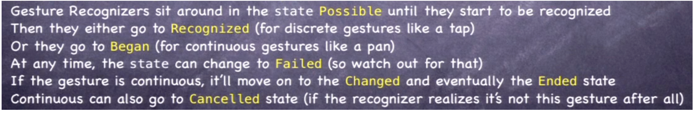

UIPanGestureRecognizer methods -

velocityInView:
translationInView:
setTranslation:inView:

- (CGPoint)translationInView:(UIView *)view;
It gives the point (CGPoint) where the pan ended compared to where from it had started (i.e. the point where the finger first went down). The argument is the view in whose coordinate system the translation of the pan gesture should be computed. This CGPoint can then be used to calculate the distance of the point where the pan ended compared to the point where it started. (Any CGPoint has an x and an y coordinate.)

- (void)setTranslation:(CGPoint)translation inView:(UIView *)view;
This is used to set a new point. this can always be set to 0 whenever translationInView: is used and the incremental distance calculated so that the total distance covered by the pan can be determined.

- (CGPoint)velocityInView:(UIView *)view;
This gives the instantaneous velocity of the pan in points moved per second (the return value is a CGPoint).

The UIGestureRecognizer class has an important property called state which is used by all the abstract gesture recognizers (i.e. pan, pinch, tap, etc.). It corresponds to the ivar _state which is of the UIGestureRecognizerState enum type that is defined in UIGestureRecognizer.h file itself. It shows the current state of the gesture. It can have following values -

UIGestureRecognizerStatePossible
UIGestureRecognizerStateBegan
UIGestureRecognizerStateChanged
UIGestureRecognizerStateEnded
UIGestureRecognizerStateCancelled
UIGestureRecognizerStateFailed
UIGestureRecognizerStateRecognized = UIGestureRecognizerStateEnded .. 'recognized' corresponds to discrete gestures like tap.

The following snapshot briefly explains when the above enum values are attained by the _state ivar.

********************

UIPinchGestureRecognizer properties -

@property (nonatomic) CGFloat scale;
This corresponds to the scale relative to the initial touch point coordinates of the two fingers. For pinch-in, it goes below 1 and for pinch-out, it goes above 1. It is a writeable property, so it can be set to any value (such as 1) at anytime.
@property (nonatomic,readonly) CGFloat velocity;
This gives the velocity of the pinch in scale factor/second and is obviously a readonly property.

********************

UISwipeGestureRecognizer properties -

@property(nonatomic) NSUInteger numberOfTouchesRequired;
The default is 1.
@property(nonatomic) UISwipeGestureRecognizerDirection direction;

The swipe direction that should be considered. It corresponds to a ivar called _direction of the enum type UISwipeGestureRecognizerDirection. Following are it's possible values -
UISwipeGestureRecognizerDirectionRight -- This is the default.
UISwipeGestureRecognizerDirectionLeft
UISwipeGestureRecognizerDirectionUp
UISwipeGestureRecognizerDirectionDown
