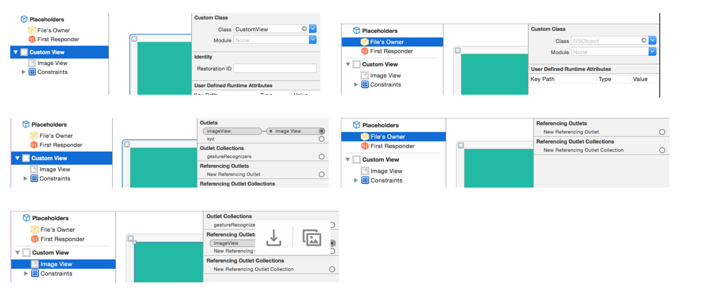
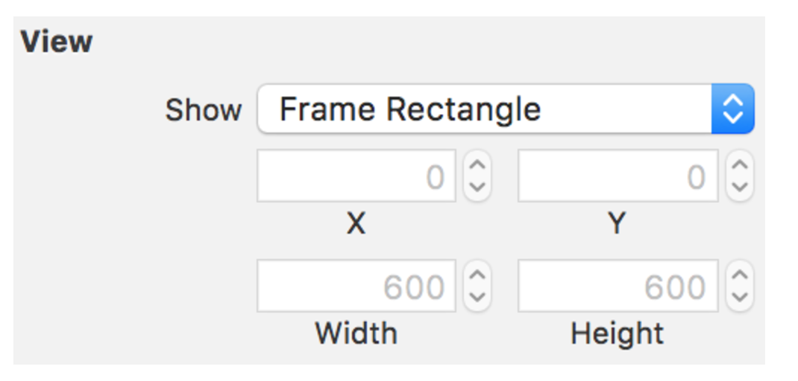
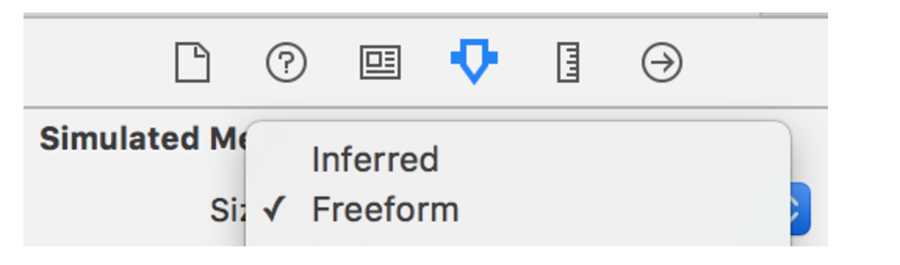
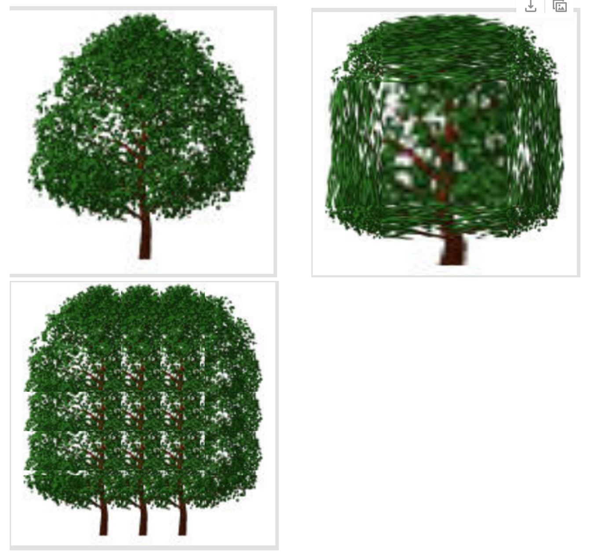

UIView -> intrinsicContentSize (It gives the CGSize of the view without considering the superview it will be added to, i.e. the size of the view had there been nothing else affecting it. For example if an 400*400 image is returned from the server and rendered on an image view whose final size will be 320*200 due to the constraints in place, then the intrinsicContentSize of the imageView will be 400*400 but the frame.size of the image view will be 320*200.

Using custom fonts -

1. Add the font file (usually .ttf or .otf) to the target. Ensure that it shows up in 'bundle resources' as well.
2. Include the font's exact file name with the extension in the target's info.plist under the key 'Fonts provided by application'.
3. Check the font's name by printing all available fonts, then use this font in the interface builder, code, etc. as needed. ([link](http://codewithchris.com/common-mistakes-with-adding-custom-fonts-to-your-ios-app/))
for (NSString* family in [UIFont familyNames]) {
     for (NSString* name in [UIFont fontNamesForFamilyName:family]) {
        NSLog(@"%@ - %@", family, name);
    }
}
Using a font such as font-awesome once it has been installed. ([Font](http://fortawesome.github.io/Font-Awesome/), [Font cheat sheet](http://fortawesome.github.io/Font-Awesome/cheatsheet/), [iOS category](https://github.com/alexdrone/ios-fontawesome))
[[[UILabel alloc] initWithFrame:CGRectZero] setText:@"\u<<4 digit code>>"];
self.label.text = @"\uf001";

Inserting emoji or symbol as text - 

Its pretty simple, they can be inserted by menu option (or the keyboard shortcut Cmd + Ctrl + Space). For example, 
userRatingLabel.text = String(count: 5, repeatedValue: Character("★"))

How much area does the root view occupy - 

Entire. It include the status bar and navigation bar too. Confirmed with Reveal as well, that's how it is.

Adding a custom view xib -

When a custom UIView subclass is created, there isn't an option to create an xib too. The xib needs to be created separately. And then it needs to be programmatically added this way.
self.customViewXIB = [[[NSBundle mainBundle] loadNibNamed:@"CustomView" owner:self options:nil] objectAtIndex:0];
[self.view addSubview:self.customViewXIB];

Also if any outlets are created to the xib, it must be ensured that the xib's file owner is NSObject and the custom class is instead for the root view of the xib.
And hence any outlet should show up for root view (in addition to that subview), and not in the file owner. All this sometimes does not happen automatically. In fact this also holds true for custom collection view header and footer cells (UICollectionReusableView) and it should be ensured that it follows the same set up.

Further if a custom view is initialized using an xib and not using an initWithFrame, then initWithCoder is called and not initWithFrame. Hence in above code snippet, initWithCoder: will be called and not initWithFrame:.

Changing the view’s size in xib -

A custom UIView in xib has a fixed size with the width and height attributes grayed out, and whatever size it has will be used in the view controller if no specific frame or constraints are assigned to it programatically.

To actually change the size, the size in attributes inspector -> simulated metrics should be changed from ‘Inferred’ to ‘Freeform’. And then the size becomes customizable.

Adding subviews to a view programmatically - 

While addSubview is the simplest way, it always adds the subview at the end of the view's subviews existing array and hence this subview gets shown on top of all other subviews. If this is not what you want, then methods such as insertSubview:atIndex: and insertSubview:belowSubview: can be used.
[self.view addSubview:self.customViewXIB];
[self.view insertSubview:self.customViewXIB atIndex:0];
[self.view insertSubview:self.customViewXIB belowSubview:self.button];

Similarly there are other methods such as bringSubviewToFront:, sendSubviewToBack:, exchangeSubviewAtIndex:withSubviewAtIndex:.

In case of custom views there are even methods that can be overridden to know when subviews are added or removed. These methods are willMoveToSuperview:, willMoveToWindow:, willRemoveSubview:, didAddSubview:, didMoveToSuperview, or didMoveToWindow. These are all UIView methods and can hence be overridden in case of custom views so that these events are intercepted.

UIImage's resizableImageWithCapInsets method -

resizableImageWithCapInsets: methods can be used to get a new image from an existing image by not touching its edges unto the specified mark, but then making the remaining portion of the image fit into the remaining size. This can be done by stretching the image or repeating fixed sub-portions of the image as tiles. There are some further rules which determine when stretching happens and when tiling happens. 

resizableImageWithCapInsets:resizingMode: whereas can be used to clearly specify if the image should be stretched or tiled. It is recommended though to use this method only if stretching is needed, for tiling resizableImageWithCapInsets: should be used.

In below screenshots, 1st image is the original image, 2nd is an image obtained by stretching, 3rd is an image obtained by tiling.
UIImage *image = [self.image1 resizableImageWithCapInsets:UIEdgeInsetsMake(50,50,50,50) resizingMode:UIImageResizingModeTile];
self.customViewXIB.imageView.image = image1;

I think what actually happens is that the 4 rectangles at the edges specified by the passed edge insets are left untouched and then the remaining part of the image is stretched out or tiled to cover the entire image and then placed such that the 4 rectangular edges still show above everything else. (Natasha blog [link](http://natashatherobot.com/ios-stretchable-button-uiedgeinsetsmake/#))
Such repurposing of an image can probably even be done using image assets catalog, its explained in a WWDC 2013 video on Xcode 5 features.

Test Project - 20.Views/TestViews (git commit no. 9add9e1c1638)

Printing a point, etc. - 

Methods such as NSStringFromCGPoint, CGPointFromString, CGRectFromString, CGSizeFromString, CGVectorFromString can be used to work with points, rect, vectors and their string representations.    
NSStringFromCGPoint(square.center)

UIOffsetMake can be used to make an offset. A UIOffset just has two components, a horizontal and a vertical.
UIOffsetMake(0, 39.0)

*******

For performance reason, it is always advised to keep views as opaque.

When scrolling is done, there is often a chance for the scroll view to get sluggish if it had lot of custom views and every time a lot of redrawing is being done. It is instead advised to not do all the necessary redrawing every time a scroll is done.  Instead content mode, etc. can be changed temporarily. (need to understand this better.)

Subviews should not be explicitly added to controls (i.e. UIControl objects) even though it is possible to do so. For example, do not add any subview to a UIButton.

It normally has properties that allow to do common tasks. For example, a title label to configure the button's title. A separate UILabel should not be explicitly added for the button.

Constraints are not as per correct screen dimensions in viewWillAppear -

If the root view's size is printed in viewWillAppear, it gives the correct size based on the device size. 
However any subview whose size depends upon constraints, does not show the correct size in viewWillAppear, it instead seems to be based on iPhone 5S (i.e. 320 width) device size. But if the subview's size is printed in viewDidLayoutSubviews or viewDidAppear, by that time the correct size is shown.

In iOS8, setNeedsLayout needs to be called in viewWillLayoutSubviews -
In iOS8, [self.view setNeedsLayout] should be called in viewWillLayoutSubviews or else the changes made in viewWillLayoutSubviews do not take effect.

Whereas in iOS9, even if [self.view setNeedsLayout] is not called the changes still take effect. So always call [self.view setNeedsLayout] in viewWillLayoutSubviews.

The default implementation of viewWillLayoutSubviews does not do anything so there is no need to call [super viewWillLayoutSubviews] in viewWillLayoutSubviews.
