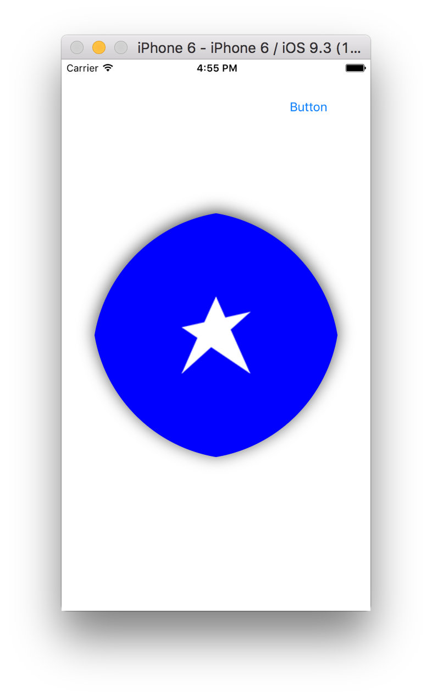
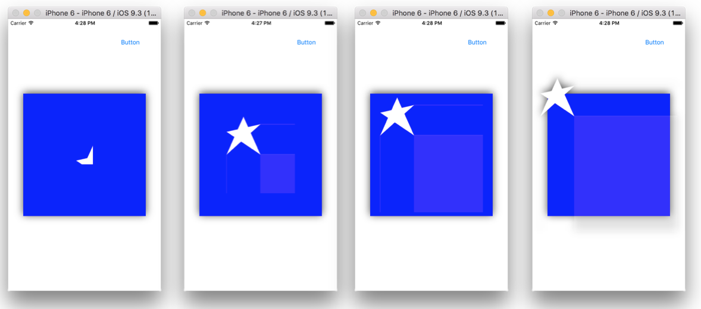

Various properties -

It has several properties such as backgroundColor, borderWidth, borderColor, shadowOpacity, shadowRadius, contentsGravity, contents, cornerRadius, etc.
contents property has the contents of the layer. If a static image needs to be there, a CGImageRef can be used. If the layer is tied to a view, it is advised though not to set this property directly as it can be replaced in a subsequent update.

layer.contents = UIImage(named: "star")?.CGImage
(Can contents be anything other than an image?)

contentsAreFlipped method tells if the contents are being eventually flipped by the system. Hence, if geometryFlipped for a layer is false this method returns true.

contentsGravity determines how should the contents be positioned (i.e. center, right, etc.). The default value is kCAGravityResize which resizes the contents to fit the entire bounds (it does not account for any border though). kCAGravityCenter positions the content right at the center and does not cause any resizing.

In iOS, if geometryFlipped is not specifically set as true then a different coordinate system is used where top and bottom are used interchangeably. For example, with kCAGravityTopRight the content actually gets placed at bottom right.

Adjusting the cornerRadius doesn’t clip the layer’s contents (i.e. it does not apply to the contents property) unless the layer’s masksToBounds property is set to true. A cornerRadius of side/2 (i.e. 100 if a square layer’s edge is 200) even helps achieve a perfect circle in case of square views. For other values of cornerRadius, the resulting structure is something like a circle but not exactly a circle.

(cornerRadius of 180 for a UIView with each side 400)

magnificationFilter determines the scaling filter used when resizing the contents (which happens with kCAGravityResize, etc.). It has possible values as kCAFilterLinear, kCAFilterNearest, kCAFilterTrilinear (what are these). There are some other filter related properties too, filters, compositingFilter, backgroundFilter, etc.

contentsScale indicates the multiplication factor between the points and rendered pixels (i.e. 1x, 2x, 3x, etc.). It corresponds to the contentsScaleFactor property of UIView and usually needs to be modified only when drawing using OpenGL ES for custom created layers.

contentsRect determines what portion of the contents itself will be used to show in the layer. If its 0.5,0.5 just half of it will be shown. If its 2.0, 2.0 an expanded portion of it will be shown (and that may cause the contents to go beyond the layer’s bounds). It too is an animatable property.
(contentsRect - 0.5, 0.5  :  2.0, 2.0  :  3.0, 3.0  :  4.0, 4.0)

contentCenter is a CGRect property which has got something to do with how the scaling happens if the contents need to be resized (which happens with some contentsGravity modes such as kCAGravityResize).

In case the contents go outside the bounds of a layer (which can happen if masksToBounds is false, i.e. the default), any shadow applies across the overflowing part as well.

shadowOffset determines how much should the shadow be moved. Its a CGSize. A value of -20, 20 will move it by about 20 points towards upper right.

opacity is the equivalent of alpha property of UIView. It is an animatable property.

zPosition is a property that indicates the layer’s position on z axis. If two views are in the same place (i.e. same frame rectangles), the one with higher value of zPosition shows on top. This also overrides the position of these views in the document outline in interface builder (may be this property automatically modifies the subviews array).

There is a property called drawsAsynchronously which if set to true can improve the performance a little bit as it defers the drawing commands and processes them asynchronously in a background thread. However it should not be assumed that it will necessarily improve the performance a lot and a testing should be done.

shouldRasterize is another property that indicates whether the layer is rendered as a bitmap before compositing. Its default value is false and it is an animatable property. When the value of this property is true, the layer is rendered as a bitmap in its local coordinate space and then composited to the destination with any other content. (what does it mean and how does it matter?)

**************

Animating CALayer properties - 

When it is said that a CALayer property is animatable then what it means is that it can be animated using CABasicAnimation, etc. (and necessarily not using UIView.animationWithOptions methods as well) and addAnimation:forKey: method of CALayer. For example shadowRadius is animatable, contentsGravity is not.

let animation: CABasicAnimation = CABasicAnimation.init(keyPath: "shadowRadius")
animation.fromValue = 1.0
animation.toValue = 100.0
animation.duration = 4.0
self.layer.addAnimation(animation, forKey: "shadowRadius")

contentsRect too is an animatable property.

let animation2: CABasicAnimation = CABasicAnimation.init(keyPath: "contentsRect")
animation2.fromValue = NSValue(CGRect: CGRectMake(0, 0, 1.0, 1.0))
animation2.toValue = NSValue(CGRect: CGRectMake(0, 0, 4.0, 4.0))
animation2.duration = 1.0
self.layer.addAnimation(animation2, forKey: "contentsRect")

**************

Adding sublayers -

Just like a view can have subviews, similarly a layer too can have sublayers. The relevant methods are 
addSublayer(_:), removeFromSuperlayer(), insertSublayer(_:at:), replaceSublayer(_:with:), etc. 

It really works a lot like how it work with subviews.

let l3: CALayer! = CALayer()
l3.backgroundColor = UIColor.grayColor().CGColor
l3.frame = self.view2.frame
self.view.layer.addSublayer(l3)

Adding a layer to another layer does not mean that another entry will also be made in that layer’s corresponding view’s subviews array.

**************

Miscellaneous -

layerClass is a UIView method that gives the layer class for a view. It can be overridden for custom views.
override class func layerClass() -> AnyClass {
    return CAScrollLayer.self
  }

OS X apps do but iOS apps do not support layer-based constraints. That is, in OS X there can be constraints associated with layers as well and not just with views alone.

The frame property of CALayer or UIView always gives the frame in its immediate super layer or superview coordinate system, and not in that of the view controller’s top level view or its layer.

Setting the frame changes the center and size in bounds as well.

hitTest is a CALayer method that returns the farthest descendant of the receiver in layer hierarchy that includes the specified point. It returns nil if the pointless outside the receiver layer’s bounds.

The thing about a layer’s mask is that the portion within the layer’s mask is transparent (or has the specified opacity) and the portion outside the mask is not.

If layer’s mask has opacity of 0.1, the layer’s actual content is barely visible (as if the mask layer is sitting on top of the actual layer and is opaque).

**************

Properties and methods - 

frame
anchorPoint
zPosition
opacity
contents
contentsGravity
geometryFlipped
cornerRadius
borderWidth
borderColor
backgroundColor
shadowOpacity
shadowOffset
shadowRadius
magnificationFilter
contentsRect
contentsCenter
contentsAreFlipped
contentsScale
style
bounds
origin
frame
anchorPoint
position
transform
zPosition
addAnimation:forKey:
