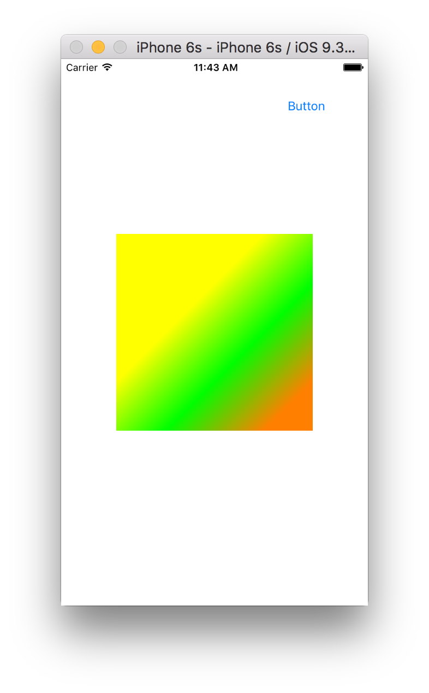

CAGradientLayer is used to create a layer where the color changes gradually. it probably even colors the rounded corners (i.e the cornerRadius portion). An array of CGColors is assigned to the colors property. If nothing else is specified, the color changes uniformly across the layer vertically. Hence, if colors specified are blue, green, red then blue will be at y unit position 0, green at 0.5 and red at 1.0 and blending will happen in between. startPoint and endPoint can also be specified which together in turn specify the axis along which the color changes. 

Also, locations array can be used to specify the custom points for gradient stops (i.e. the points where the precise colors will be there) instead of just having uniform gradience. (What exactly happens when the locations array has less elements than the no. of color? What seems to be happening is that the later colors are not even used then. Only as many colors as there are location points are used. Remember that an end location point of 1.0 is automatically used, so its basically no. of elements in locations array + 1)

let colors = [UIColor.yellowColor().CGColor,
                      UIColor.greenColor().CGColor,
                      UIColor.orangeColor().CGColor]
let l6: CAGradientLayer! = CAGradientLayer()
l6.colors = colors
l6.startPoint = CGPoint(x: 0.5, y: 0.25)
l6.endPoint = CGPoint(x: 1.0, y: 0.75)
// l6.locations = [0.25, 0.99]
self.view.layer.addSublayer(l6)

The gradience begins from the startPoint and goes towards the endPoint. Hence if startPoint is below the endPoint the gradience will happen in an upwards direction.

There is also a property called style but it can have only one value right now, i.e. kCAGradientLayerAxial.
