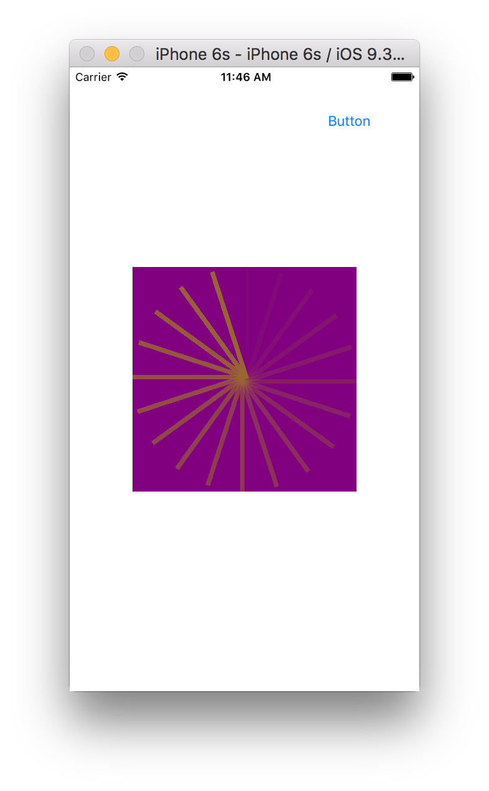
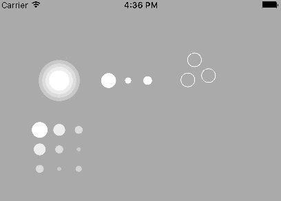

CAReplicatorLayer creates multiple copies of a specified sublayer and alters their geometry, the time scale they use, etc. Its actually fun. And very useful.

A layer (say a CALayer) is added to a replicator layer and then replicated by the replicator layer as specified.

instanceCount specifies how many instances should be created. All instances are created practically together, its not that there is any delay in creating the instances.

instanceTransform specifies how should one instance be modified when compared to the preceding instance.

Here every next instance is rotated by the specified angle.

let angle = Float(M_PI * 2.0) / 20
l7.instanceTransform = CATransform3DMakeRotation(CGFloat(angle), 0.0, 0.0, 1.0)

Here every next instance is translated (i.e. moved) by the specified no. of points.

l7.instanceTransform = CATransform3DTranslate(CATransform3DIdentity, 10, 0, 0)

instanceDelay alters the time scale of every instance. Hence this is useful as if an animation (say CAAnimation) is applied to the the sublayer, each of them use a different time scale and hence it can seem as if there is added animation happening.

l7.instanceDelay = CFTimeInterval(1 / 20.0)

Remember that the layer that needs to be repeated by the replicator layer should be added to the replicator layer. This though doesn’t mean that the no. of sublayers in the replicator layer becomes equal to the instanceCount.

Also, any animation should be applied to that layer that has been added and not the replicator layer itself.

let fadeAnimation = CABasicAnimation(keyPath: "opacity")

fadeAnimation.fromValue = 1.0
fadeAnimation.toValue = 0.0
fadeAnimation.duration = 1
fadeAnimation.repeatCount = Float(Int.max)       
l8.addAnimation(fadeAnimation, forKey: "FadeAnimation")

//l7 is replicator layer and l8 is the sublayer to be replicated
l7.instanceCount = 20
l7.instanceDelay = CFTimeInterval(1 / 20.0)
l7.addSublayer(l8)

(The above screenshot is actually a gif. Just does not animate here.)

Understand what really is preservesDepth, instanceRedOffset, instanceGreenOffset, instanceBlueOffset, instanceAlphaOffset.

link for some simple animations - http://iostuts.io/2015/10/04/the-power-of-careplicatorlayer/
