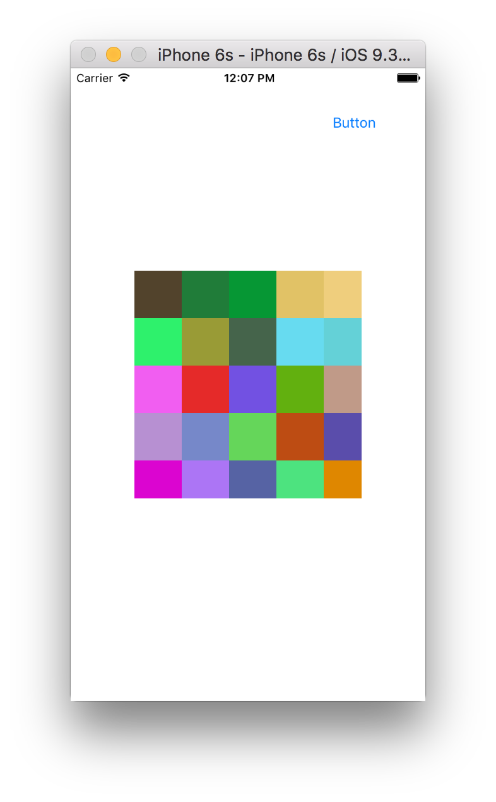

CATiledLayer allows the content to be rendered asynchronously in tiles and not just one at a time. This is especially useful when the contents have some large image which will otherwise take a lot of time to load in full. 

This is typically done by creating a custom UIView and then overriding its layerClass to return a CATiledLayer. An init method, such as init(frame:) of this custom view can then used to configure the tile layer. This includes things such as tileSize, etc.

Hence the drawRect for a view backed by such a layer is called multiple times with different rects (i.e. tiles). Regions of the layer may be invalidated using the setNeedsDisplayInRect: method however the update will be asynchronous. While the next display update will most likely not contain the updated content, a future update will.

tileSize specifies the maximum size of each tile. The default is 256,256 pixels. Its important to keep in mind that this property is specified in pixels. Hence when specifying a custom size, if what you have in mind is points it must be converted to pixels and then returned.

let scale = UIScreen.mainScreen().scale
layer.contentsScale = scale
layer.tileSize = CGSize(width: 50 * scale, height: 50 * scale)

The drawing can then be done in drawRect.

let context = UIGraphicsGetCurrentContext()
CGContextSetRGBFillColor(a random color)
CGContextFillRect(context, rect)

The contents property of a CATiledLayer object should not be directly modified. Doing so disables the ability of a tiled layer to asynchronously provide tiled content, effectively turning the layer into a regular CALayer object.

There are also properties levelOfDetail and levelOfDetailBias which come into picture when the layer is being zoomed in. They specify the detail level or clarity to be shown for the contents when zoomed in.

*************

There is a Swift library called UIImage+TileCutter which provides an extension to cut an image into several rects of specified dimensions. It puts these images in the caches directory.
https://github.com/scotteg/LayerPlayer/blob/master/LayerPlayer/UIImage%2BTileCutter.swift

UIImage.saveTileOfSize(size, name: fileName)

let filePath = "\(cachesPath)/\(fileName)_\(column)_\(row)"
imageSlice = UIImage(contentsOfFile: filePath)

So this library can be used along with CATiledLayer to asynchronously render huge images in scroll view as tiles. LayerPlayer - TilingViewForImage.swift has the sample code.
