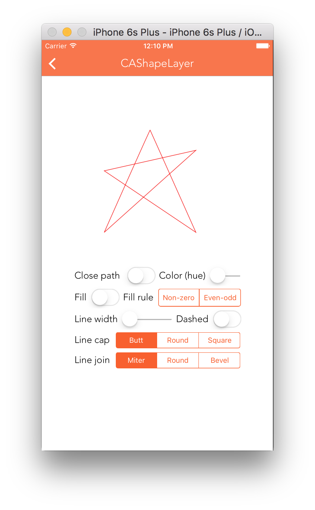

CAShapeLayer allows to assign a bezier path to its path property and then draws that bezier path. This generated shape is composited between the layer's contents and its first sublayer.

path is not an animatable property, but can be animated using CAPropertyAnimation subclasses (need to see an example). If the path extends outside the layer bounds it is not automatically clipped to the layer if the normal layer masking rules cause that (what are those masking rules).

It also has properties such as fillColor, fillRule, lineCap, lineDashPattern, etc. and some of them are also animatable.
