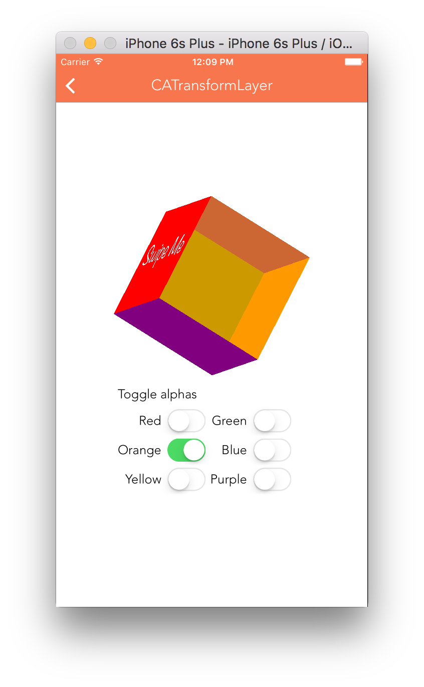

Even though CALayer has zPosition property, it actually just creates flattened hierarchies and hence if is rotated the true 3D rotation does not happen.

To create a true 3D hierarchy, CATransformLayer needs to be used. As a result some of the CALayer properties are ignored by CATransformLayer. Some of these CALayer properties that are ignored by CATransformLayer are backgroundColor, contents, border style properties, stroke style properties, filters, backgroundFilters, etc.

Also, opacity is applied to each sublayer of the transform layer individually. They all can have their own opacities.

ough?) should not be called on a transform layer as they do not have a 2D coordinate space into which the point can be mapped.

Its API does not seem to be having any methods or properties of its own! So a CATransformLayer is like a CALayer, it can have sublayers but does not flatten their 3D hierarchy.

Try it out properly.

CATransform3DTranslate
CATransform3DRotate
hitTest
anchorPointZ
TrackBall utility from Bill Dudney to apply 3D transforms based on user gestures.

****************

CAEmitterLayer provides a particle emitter system, every emitted particle is of type CAEmitterCell.

Various properties of emitter layer and emitter cell. How to control the direction in which the emitted particles go.

The direction of emission can be controlled using emitter cell’s xAcceleration and yAcceleration properties.

Multiple emitter cells can be added to an emitter layer.
