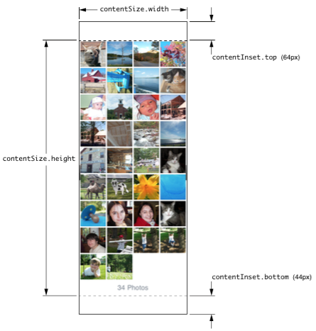
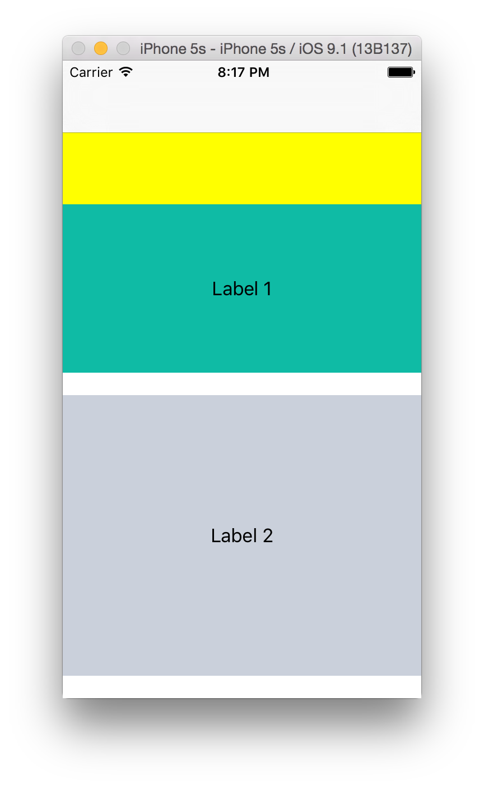
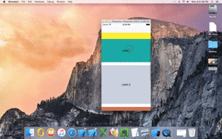

The first set of things to understand about scroll views are - contentSize, contentInset, scrollIndicatorInsets, contentOffset.

	• contentSize is the area that the scroll view's actual content encompasses. 

	• contentInset is the area surrounding the content area on the four sides, It can be thought of as something which practically increases the size of the scroll view without affecting its contentSize. The content still exists only in the content area. On scrolling the scrolled content though still goes through the inset area too.

	• scrollIndicatorInsets indicate the point where the scroll indicators start. If they have a non-zero value then the scroll indicator insets start accordingly. A negative value means they start further outside from the scroll view. Usually scroll indicator insets matches the content area, if it does not then it needs to be adjusted.

contentOffset indicates the top left point of the currently visible area.

**********

How contentInsets matter -

Here scroll view starts right from the yellow area but the content area starts only from green area. The yellow portion indicates the top content inset (the content inset is not zero here).

**********

How scroll indicator insets matter -

Here scroll indicator insets have been manually set a top value of -32. Hence scroll indicators start 32 points above content area and thereby even show up in an area which is not in content area. 

(This gif is actually not working in OneNote.)

**********

Safe Area and Scroll View -

adjustedContentInset -

New UIScrollView readonly property which is the sum of scroll view's safeAreaInsets and contentInset.

contentInsetAdjustmentBehavior -

Of an enum type with possible values automatic, never, always (safe area insets are automatically includes in content adjustment), scrollableAxes (the insets are adjusted only in scrollable direction). The default value is automatic.

It indicates how the safe area insets modify the content area of scroll view. From what I have seen this automatic inset seems to be happening when in a navigation controller you push from a view controller having a scroll view. In that case, while pushing the first view controller's scroll view's content inset is adjusted automatically.

Even though this a scroll view property it is quite relevant for table views, etc. too. For example, the automatic adjustment also seems to happen when 'presenting' a table view controller (which obviously has a table view as scroll view). The table view's contentInset.top was automatically being set as safeAreaInsets.top. In such case if the automatic adjustment is not needed, the contentInsetAdjustmentBehavior must be set to never. In fact, in case of table views this property is already configurable in storyboard.

Yet to understand though that when and how does the OS adjust the content inset if needed.

iOS 11 onwards automaticallyAdjustsScrollViewInsets property has been deprecated. And this is the new property that should be used instead if needed.

UIViewController.automaticallyAdjustsScrollViewInsets -

Sometimes contentInsets are automatically adjusted by the OS even though there are appropriate auto layout constraints already in place to take care of navigation bars, etc. In such cases, the automaticallyAdjustsScrollViewInsets property of UIViewController should be set as NO.

self.automaticallyAdjustsScrollViewInsets = NO;

For example, in above screenshots the view had a constraint to top layout guide and the OS is again separately adding a content inset to account for the navigation bar. That's why the content insets (yellow portion) are actually visible. Hence, here the automaticallyAdjustsScrollViewInsets actually needs to be set as NO and then the yellow insets will not be visible.

This property has been deprecated in iOS 11 though.

Misc. -

When I created constraints to safe area and put a scroll view inside the root view (which itself was in a navigation controller), it showed up fine in iOS 11. However on iOS 10, the scroll view was automatically getting a non-zero contentInset. To fix it, I did this in viewWillLayoutSubviews and it worked.

scrollView.contentInset = .zero
scrollView.scrollIndicatorInsets = .zero

In fact, doing this would have also worked.
automaticallyAdjustsScrollViewInsets = 0

Until iOS 10, if the root view controller of a navigation controller had a scroll view at the beginning, a contentInset used to be automatically applied to it. In fact this probably happened for all view controllers in the navigation controller, not just the root view controller. This does not happen iOS 11 onwards.

**********

Scrolling programmatically -

setContentOffset:animated: automatically scrolls the scroll view to the indicated offset.

scrollRectToVisible:animated: scrolls the scroll view such that the passed rect is visible.

setZoomScale:animated: zooms the scroll view about the center of the visible area as per the passed zoom scale.

zoomToRect:animated: zooms the scroll view so that the passed rect occupies the entire visible area. (what if the passed rect is already smaller than the visible area or if its bigger to show it completely would require a zoom scale greater than the max zoom scale of the scroll view?)

[self.scrollView setContentOffset:CGPointMake(0, 150) animated:YES];
[self.scrollView scrollRectToVisible:CGRectMake(0, 650, 320, 100) animated:YES];
[self.scrollView setZoomScale:0.8 animated:YES];
[self.scrollView zoomToRect:CGRectMake(0, 680, 5, 50) animated:YES];
