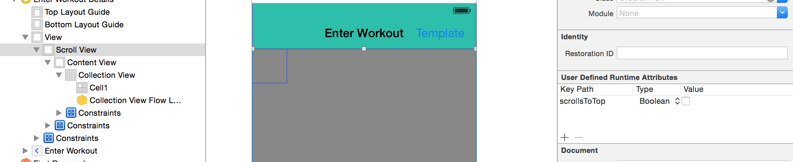
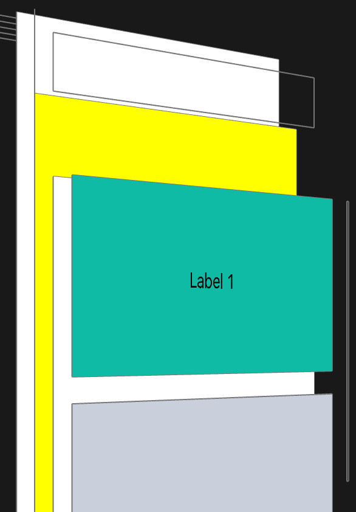
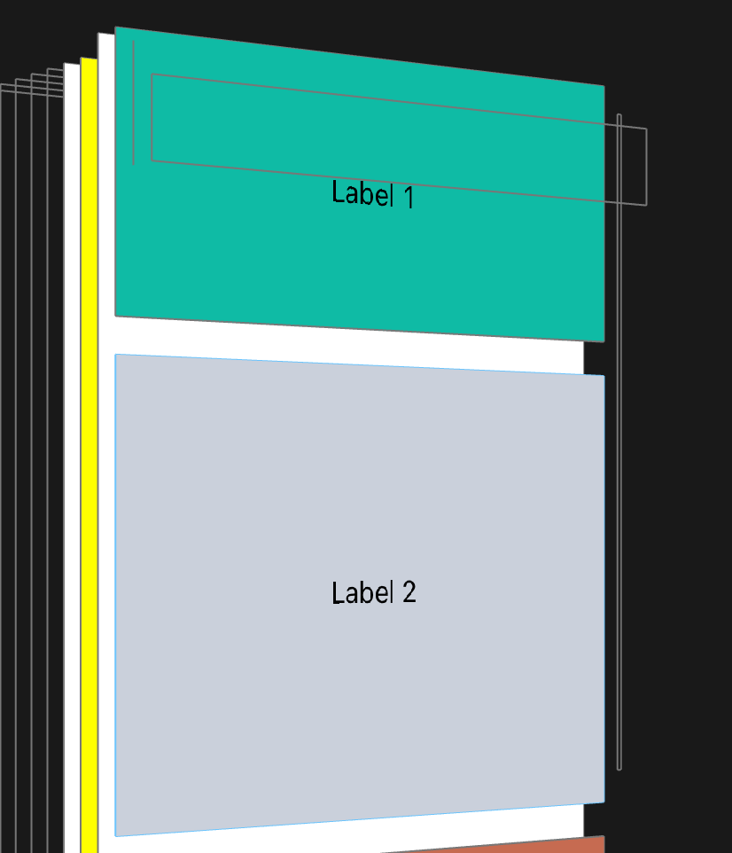

Scrolling the screen so that keyboard does not overlap with anything -

For situations where a keyboard is shown when a textfield or textview becomes the first responder and the keyboard may show up and hide the textfield, the only solution is to put the entire view in a scroll view. And then when the keyboard shows up the scroll view should move up by an amount equal to keyboard’s height (this can be done by setting an inset for the scroll view with its bottom dimension being same as keyboard height). When the keyboard is about to hide, the scroll view’s offset should be made zero (also even though its is not needed, the inset too can be reset back to zero).
```
- (void)keyboardWillShow:(NSNotification *)notification {
     self.scrollViewOffsetBeforeKeyboardIsShown = self.scrollView.contentOffset;
     CGRect keyboardRect = [[[notification userInfo] objectForKey:UIKeyboardFrameEndUserInfoKey] CGRectValue];
     keyboardRect = [self.view convertRect:keyboardRect fromView:nil];

     UIEdgeInsets contentInset = self.scrollView.contentInset;
     contentInset.bottom = keyboardRect.size.height;
     self.scrollView.contentInset = contentInset;
}

- (void)keyboardWillHide:(NSNotification *)notification {
     UIEdgeInsets contentInset = self.scrollView.contentInset;
     contentInset.bottom = 0;
     self.scrollView.contentInset = contentInset;
     self.scrollView.contentOffset = self.scrollViewOffsetBeforeKeyboardIsShown;
}
```
Also the keyboard notifications should be registered to for the above methods to trigger. A code such as below can be put in viewDidLoad.

```
[[NSNotificationCenter defaultCenter] addObserver:self
                                         selector:@selector(keyboardWillShow:)
                                             name:UIKeyboardWillShowNotification
                                           object:nil];

[[NSNotificationCenter defaultCenter] addObserver:self
                                         selector:@selector(keyboardWillHide:)
                                             name:UIKeyboardWillHideNotification
                                           object:nil];
```
**********

Supporting scroll to top -

A scroll-to-top gesture on status bar is applied to that scroll bar closest to the status bar which has the value for its scrollsToTop as YES. If there is a scroll view with that value Y which has another scroll view  within it (let's say actually a collection view or table view again with that value being Y), the scrollsToTop gesture applies only to the parent scroll view. The trick then for letting the scrollsToTop actually apply for the collection view or table view is to set the parent scroll view's scrollsToTop as NO.



This is particularly needed when a scroll view has to be put at very top just to make auto layouts work well for situations when a textfield will be eventually there in a subview.

**********

Scroll indicator insets usually start with content inset (and not content area) -

The scroll indicators (i.e. the scroll view's scrollIndicatorInsets) do not necessarily start from the scroll view's top and left but instead from the portion after the scroll view's top and left contentInset. Hence if the scroll indicator's do not seem to be starting with the scroll view's edges, apart from checking the scrollIndicatorInsets also check what are the scroll view's contentInset. 



If weird content insets are showing up, below should be done (this especially happens when a scroll view appears in a navigation controller and the scroll view has a constraint to the top layout guide, if the scroll view instead has a constraint to the top container margin this does not happen). This is also suggested when there are more than one scroll views in a view controller. 
self.automaticallyAdjustsScrollViewInsets = NO;

This UIViewController property indicates if the view controller should automatically adjust its scroll view insets (weird, not every view controller has a scroll view). 

**********

Scroll indicators can probably never show up above navigation bars -

No matter where the contentArea of a scroll view starts and what the scrollIndicatorInsets are, the scroll indicators can probably never appear on top or even below of a navigation bar or tab bar. They automatically get shifted accordingly.

In the below screenshot, even though the scroll view extends below the navigation bar the scroll indicators appear only after the navigation bar ends and then seem to have the usual length (even though that does not seem to be the case from Reveal, in simulator that's how it appears to be).



But the scroll view programming guide (and its last update date shows 2011) says that if scroll indicator insets are not proper then they can show above navigation bar as well. Don't think its true anymore.

**********

frameLayoutGuide, contentLayoutGuide in iOS 11 -

frameLayoutGuide - New scroll view property of type UILayoutGuide. Constraints made to it cause the view to be fixed to the scroll view's frame and not moved as scroll view's content is scrolled. And that view is still a subview of the scroll view. So its pretty cool. However one thing that I did notice about it is that when bouncing effect is happening, any views created using this layout guide are not visible anymore.

contentLayoutGuide - New scroll view property of type UILayoutGuide. Constraints made to it cause the view to be fixed to the scroll view's content. So its pretty much like creating constraints to the contentView, but not there is a layout guide too for it.

TestXand11 - commit 4e0b7e2e0.
