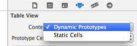
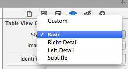
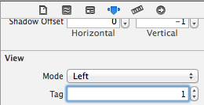

Cells reusable pool -

For performance reasons usually table view cells are pooled from a queue containing all the cells that have already been formed. Before creating a new table view cell, the code usually checks if any cell with the passed reuse identifier exists in the pool and if it does it dequeues it and reuses that dequeued cell. If it does not exist however, then a new cell is created by passing a reuse identifier.

static NSString *identifier = @“identifier";
UITableViewCell *cell = [tableView dequeueReusableCellWithIdentifier:identifier];
if (cell == nil) {
     cell = [[UITableViewCell alloc] initWithStyle:UITableViewCellStyleDefault reuseIdentifier:identifier];
}

When creating a cell defined in storyboard, the method dequeueReusableCellWithIdentifier:identifier always returns a valid cell. Even if there is no queued cell existing, the method creates a new one and returns it. Hence, with cells defied in storyboard there is no need to check for nil and create one manually if its nil.

Editing a table view -

1. A table view enters editing mode when it receives setEditing:animated: message. This message is often sent through an action configured for an edit button added in a navigation bar. 
For configuring a button in navigation bar as standard edit button item, following should be done. If done this way  things such as sending setEditing:animated: message, changing the button’s label and the tableView’s editing property are automatically taken care of. Otherwise, all that needs to be done with custom code.
self.navigationItem.rightBarButtonItem = self.editButtonItem;

2. Every row has an editing style configured for it through the tableView:editingStyleForRowAtIndexPath: method of its delegate (by default it returns delete style when the cell is in editing state). Once a table view enters editing mode, its cells show the controls configured for them. Whether a row can be edited or not can be configured through tableView:canEditRowAtIndexPath: method.

3. Once a delete or insert button is pressed in a cell (which button is shown depends on its editing style) when it is in editing mode, tableView:commitEditingStyle:forRowAtIndexPath: method is called. In this method, the corresponding data model should be modified before deleteRowsAtIndexPaths:withRowAnimation: or insertRowsAtIndexPaths:withRowAnimation: methods are called. If this is not done, an exception gets thrown when the table view display is refreshed following the deletion or insertion.

4. When a row is swiped, if the tableView:commitEditingStyle:forRowAtIndexPath: method is implemented then only that cell’s delete control is shown. And then of course the method gets called when the delete button
is pressed.

setEditing:animated: should not be called from within its implementation of tableView:commitEditingStyle:forRowAtIndexPath:. If it really has to be called, it should be invoked after a delay using the performSelector:withObject:afterDelay: method.
beginUpdates and endUpdates begin and conclude a series of method calls that insert, delete, select, or reload rows and sections of the table view. 

For batch(?) insertion, deletion and reloading the methods must be called in a block defined by calls to beginUpdates and endUpdates. Only at the conclusion of the block and endUpdates call should the table view query its datasource and delegate for reloading the table view.
Usually when doing batch updates, a table view does the required deletions first and only then does the required insertions. This helps avoid ambiguity for some reason.

Reordering of cells -

1. The reordering control is shown for a cell when the table view entered editing mode if the tableView:moveRowAtIndexPath:toIndexPath: method of datasource protocol is implemented and that cell allows itself to be moved. By default cells can be moved when the table view is in editing mode but this can be configured selectively for cells using tableView:canMoveRowAtIndexPath: method.

2. When a reordering is attempted, every time a row is dragged over a destination tableView:targetIndexPathForMoveFromRowAtIndexPath:toProposedIndexPath: method is sent to check if the current destination can be shifted. It may be allowed or an alternative row may be suggested. Probably by default, it returns the proposed destination’s index path.

3. Finally moveRowAtIndexPath:toIndexPath: is called for moving when the long press that initiated the reorder is released. Here, the associated data model must also be reordered appropriately.

Table View Cells -

As a UITableViewCell inherits from UIView, UIView properties and methods can also be used with it.
accessoryView property can be used to specify a custom accessory view such as slider, switch, etc. Otherwise, the default accessory views can be used through the accessoryType property.
contentView property is the default superview for the content displayed by the cell.

The accessory type and view shown for a cell during editing can also be customized through editingAccessoryType and editingAccessoryView properties. The default editingAccessoryType is UITableViewCellAccessoryNone.
If table view is specified as static in storyboard, all the sections and rows can be configured separately in the storyboard itself. Whereas if it is specified as of the type dynamic prototypes, i.e. dynamic just a single prototype cell is specified and then all the selective customization is done from the code.

Customizing table view cells -

If an appearance other than those provided by the default styles is needed for table view cells, either custom subviews can be added (either directly in storyboard or programmatically) to the cell’s content view or a custom subclass of UITableViewCell created and used. For both the cell style in storyboard should be selected as Custom.
Controls such as button, text field, etc. can be added to the cells in storyboard if the cell style is Custom (it is not allowed if the cell style is one of the standard ones). Then either these controls can be given their own tags in Attributes inspector and then referred using these tags in the code or straight away outlets can be drawn from these controls to the a custom UITableViewCell subclass in which case this subclass must then be imported in the table view controller’s datasource implementation and used to create the table view cell in cellForRowAtIndexPath: instead of the usual UITableViewCell.

Programmatically adding subviews to cells -

While adding controls programmatically to cell’s contentView, care must be taken in a few things. It is better not to have these controls set as transparent as transparent subviews affect scrolling performance. Also, they should typically have same background color as the cell, and if the cell is selectable the content should be highlighted appropriately when selected.
The controls can either be added straight away in cellForRowAtIndexPath: method or in a custom subclass of UITableViewCell. In either case, tags should be assigned to these controls while creating them from the scratch (if the reusable pool does not return any cell) and then these controls should be accessed using contentView’s viewWithTag: property (if the reusable pool returns a cell). (Link)
