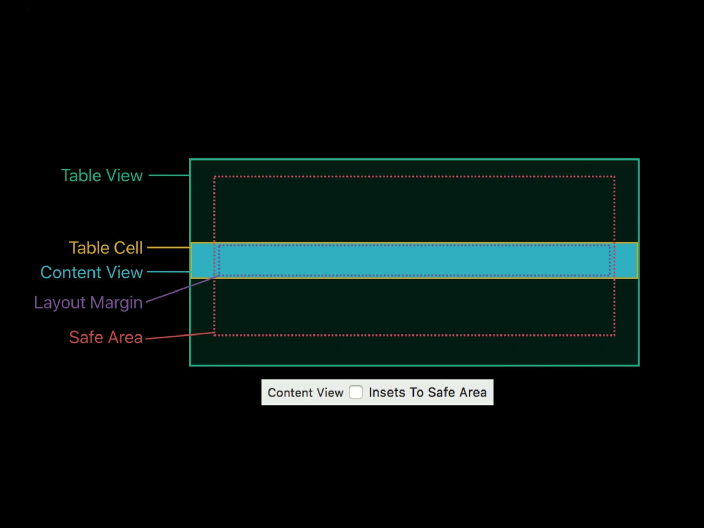
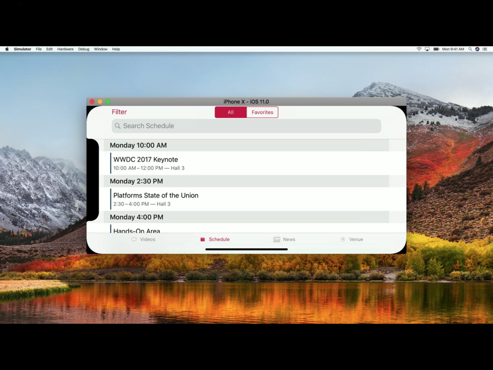
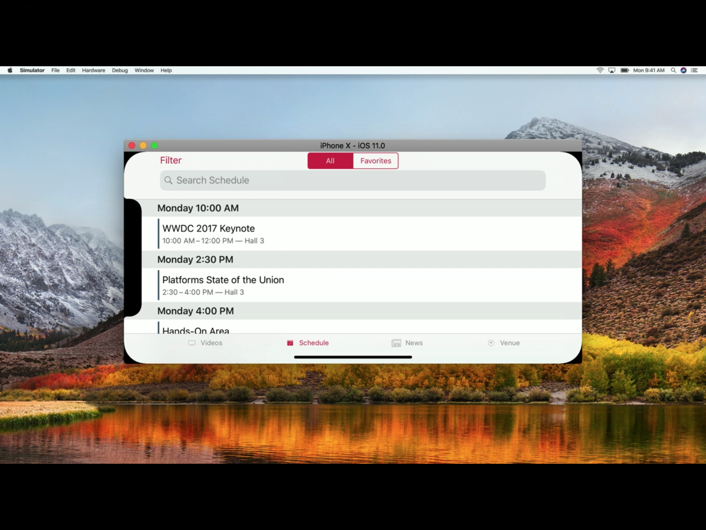
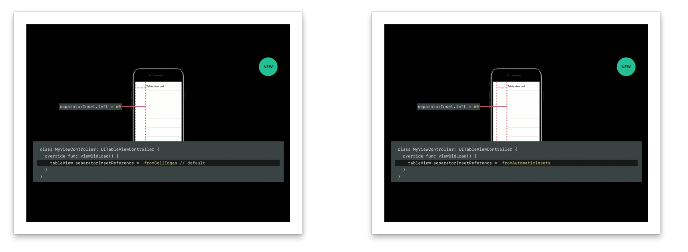

If a value is assigned to a table view’s restorationIdentifier property, it attempts to preserve the currently selected rows and the first visible row.
How is an indexed list shown if section names are long?
A table view cell can also have an image in addition to main and detail labels, how and where is it shown?
How to specify a different layout for each cell in case of a table view with static cell?
How to use UILocalizedIndexedCollation?
Go through all the properties and methods of UITableView and its related classes and protocols.
NSHipster article on using UILocalizedIndexedCollation.

*****************

Reusable cells -

If there was no reuse pools and reusable cells, separate cells would have been created for every row in the table view. This led to memory and hence performance issues, especially in the case when a table view has a high number of rows.

The reuse pools overcomes this problem by actually creating cells only for the rows visible on the screen for the first time and then reusing those for the remaining rows. Only the cells that are structurally same should use the same reuse identifier.

There are two aspects in checking whether reusable cells have been properly implemented.

1. Scroll the table view a lot, fresh cells should be created only for those rows which were initially visible on screen (provided none of the later cells have a different ruse identifier). This can be typically checked by logging message in debug console from (if cell == nil) block if cells are actually created using a method such as [UITableviewCell new] or loadNibName:owner:options:.

2. Make all the cells have different data for testing purpose and then ensure that none of the cells data get messed up when a lot of scrolling is done.


Sample implementation -

```
- (UITableViewCell *)tableView:(UITableView *)tableView cellForRowAtIndexPath:(NSIndexPath *)indexPath {
    static NSString *reuseIdentifier = @"Deals Table Item";
    DealsTableViewCell *cell = (DealsTableViewCell *)[tableView dequeueReusableCellWithIdentifier:reuseIdentifier];
    if (cell == nil)
    {
        NSArray *nib = [[NSBundle mainBundle] loadNibNamed:@"DealsTableViewCell" owner:self options:nil];
        cell = (DealsTableViewCell *)[nib objectAtIndex:0];
    }
    cell.deal = self.deals[indexPath.row];
    return cell;
}
```

If `registerClass:forCellReuseIdentifier:` and `registerNib:forCellReuseIdentifier:` methods of `UITableView are` called to register a table view cell class or nib file for the specified identifier, `dequeueReusableCellWithIdentifier:` is sufficient to create new table view cells and there is no need to check for nil in case there was no cell in the reuse pool. The table view goes ahead and creates one automatically or in other words `dequeueReusableCellWithIdentifier:` never returns nil in such a case.

Also, if an existing cell is available for reuse,` dequeueReusableCellWithIdentifier:` calls `prepareForReuse` method before returning the cell.

*****************

Table view cell with dynamic height -

If the appropriate constraints have been set, (iOS8 onwards) just implementing the below methods takes care of adjusting the height to fit the content.

```
- (CGFloat)tableView:(UITableView *)tableView estimatedHeightForRowAtIndexPath:(NSIndexPath *)indexPath {
    return UITableViewAutomaticDimension;
}
```

The below method might also need to be implemented (but it seems to work even without it).

```
- (CGFloat)tableView:(UITableView *)tableView heightForRowAtIndexPath:(NSIndexPath *)indexPath {
    return UITableViewAutomaticDimension;
}
```

It's really important though that the cell's xib uses auto layouts. For instance, even if just a separator table view cell with a small height needs to be created, a UIView should be added to it and a height assigned to it. (Also, if the contents of a cell exceed its content view's height, the interface builder often shows an error. In such a case, one conflicting constraint should be removed, the height adjusted and then the constraint re-added).


Note - iOS 11 onwards Headers, footers and cells on iOS self size by default. It does not need to be done explicitly. If this is not needed, then the table view's estimatedRowHeight, estimatedSectionHeaderHeight and estimatedSectionFooterHeight should each be explicitly set to 0. Doing so automatically turns off self sizing.

*****************

The general philosophy of clean table view code is to have as less code as possible in the table view delegate and datasource methods. Whatever can be managed by the table view cell itself, should be put in the table view cell's code. cellForRowAtIndexPath: should be as clean and short as possible.

*****************

Content view and safe area -

Table views can get tricky with iPhone X. Probably this is what happens. By default, table view extends from edge to edge but all the content views (those of table view cells as well as section headers and footers) are inset by the safe area. So this can cause some weird behavior and should be dealt with appropriately.

There is already a UITableView property called insetsContentViewsToSafeArea withe default value true. It can be set to false if needed.

Another thing to make note of is that layoutMargins of content views continue to be relative to safe area regardless of the content view's insetting.

The backgroundView property in each of UITableView, UITableViewCell and UITableViewHeaderFooterView though probably spans from edge to edge regardless of the contentView's width.

All these things have been explored well in 'Building apps for iPhone X' video from Fall 2017 Apple videos. Here is a relevant screenshot from that video.




Without any tweaks (see how the header color is not edge to edge).



With tweaks (see how the header color is now properly edge to edge).



*****************

`separatorInsetReference` - New tableView property iOS 11 onwards. It's of an enum type and its possible values are fromCellEdges (default) and fromAutomaticInsets. It's used to initiate the point after which separator insets are applied.

Keep in mind that the automatic separator insets are relative to safe area insets.




*****************

iOS 11 supports full swipe to delete in table view cells. Also swipe can be done from either left or right edges. There are two delegate methods that are required for the implementation -

tableView(_:leadingSwipeActionsConfigurationForRowAt:)
tableView(_:trailingSwipeActionsConfigurationForRowAt:)


In addition, more customized background images are allowed to be placed when swiping.
