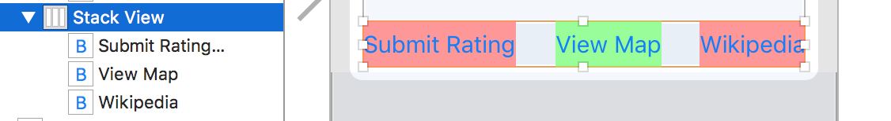
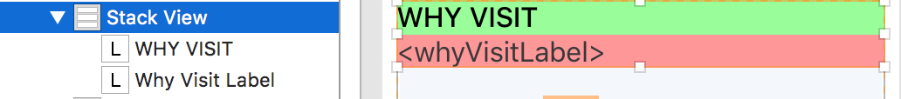

##### Underlying philosophy of Stack Views

The basic idea behind stack views is that there should be no need to create constraints for the views contained in it. Just the views need to be specified along with how they should be aligned and distributed.

The stack view automatically creates the constraints at runtime.

There are 4 key things -  
`axis`  
`alignment`  
`distribution`  
`spacing`  

###### Axis
It can be `vertical` or `horizontal`.

Horizontal axis stack view 

Vertical axis stack view 

###### Alignment
It's a pretty simple thing and says how the views should be aligned.

Alignment options for horizontal axis stack view.

1. `Fill` (The view fills the entire height of the stack view)

2. `Top` (The view’s top is aligned with the stack view’s top and then the view has a height which probably corresponds to its own intrinsic content size or any specified height)

3. `Center` (The stack view is aligned along its axis. The vertical stack view is horizontally center aligned center along the stack view and also gets to keep its intrinsic content size width.)

4. `Bottom ` (The view’s bottom is aligned with the stack view’s bottom and then the view has a height which probably corresponds to its own intrinsic content size or any specified height)

5. `First Baseline` (All subviews have their first baseline aligned and probably they are all towards the top)

6. `Last Baseline` (All subviews have their last baseline aligned and probably they are all still towards the top)

Top | Bottom | Center | Fill | First Baseline | Last Baseline
--- | --- | --- | --- | --- | ---
 |  |  |  |  | 

Alignment options for vertical axis stack view.

1. `Fill` (The view fills the entire width of the stack view)

2. `Leading` (The view’s leading edge is aligned with the stack view’s leading edge and then the view has a width which probably corresponds to its own intrinsic content size or any specified width)

3. `Center` (The view’s horizontal center is aligned with the stack view’s horizontal center and then the view has a width which probably corresponds to its own intrinsic content size or any specified height)

4. `Trailing` (The view’s trailing edge is aligned with the stack view’s trailing edge and then the view has a width which probably corresponds to its own intrinsic content size or any specified width)

Leading | Trailing
--- | ---
 | 

###### Distribution
It specifies how much of space a view should take along the axis. For example, if it's a vertical stack view what should be the height of each view or if it's a horizontal stack view what should be the width of each stack view.

Following are the possible options.

1. `Fill` (The views fill up the entire stack view’s axis. If they would require more than available space then they are shrunk based on compression resistance priority. If they do not fit the available space, then they are expanded based on content hugging priority. If there is still an ambiguity, then it is based on arrangedSubviews array, that is probably the first view gets expanded or compressed.)

2. `Fill Equally` (The views are resized so that they are all the same size along the stack view’s axis.)

3. `Fill Proportionally` (The views are resized proportionally based on their intrinsic content size along the stack view’s axis.)

4. `Equal Spacing` (All the views should have equal spacing between them. If arranged views do not fill the stack view, the spacing between the views is padded evenly. If the views do not fit within the stack view instead, the views are shrunk based on their compression resistance priority. index in the arrangedSubviews array is used in case of any ambiguity).

5. `Equal Centering` (The views have an equal center-to-center spacing along the axis. If the arranged views do not fit within the stack view, the spacing is shrunk until it reaches the minimum spacing defined by its spacing property. If the views still do not fit, the views are shrunk according to compression resistance priority and their index in arrangedSubviews property).

Fill | Fill Equally | Fill Proportionally | Equal Spacing | Equal Centering
--- | --- | --- | --- | ---
 |  |  |  | 

###### Spacing
Specifies the desired minimum spacing between the views along the axis. 
