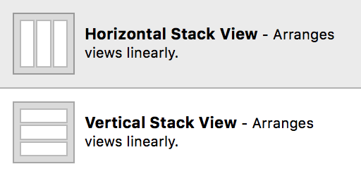
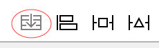
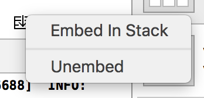

###### Adding stack view

Either they can be dragged on to canvas from the object library. The object library has a vertical stack view and a horizontal stack view.

Or the selected views in canvas can be embedded in a stack view using the stack button at the bottom of the canvas. The interface builder automatically takes care of setting the stack view's axis (vertical or horizontal) based upon the relative positioning of its views.

###### Un-embedding views from stack view -

Once a stack view has been added, it's constituent views can be moved out of the stack view by selecting the stack view in canvas, holding down the option key and clicking on the Stack button. Then a context menu appears which has Unembed as an option.

