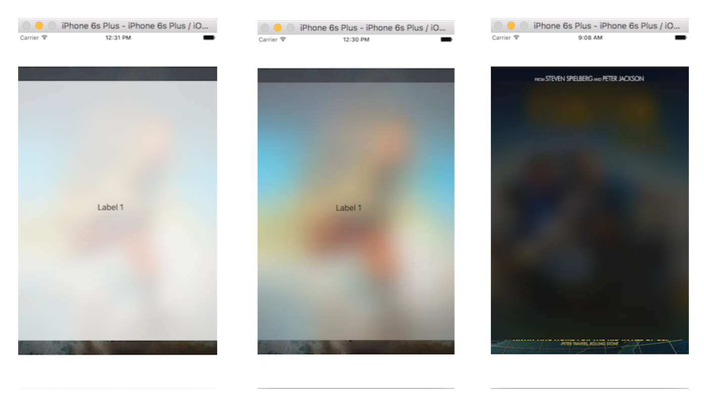
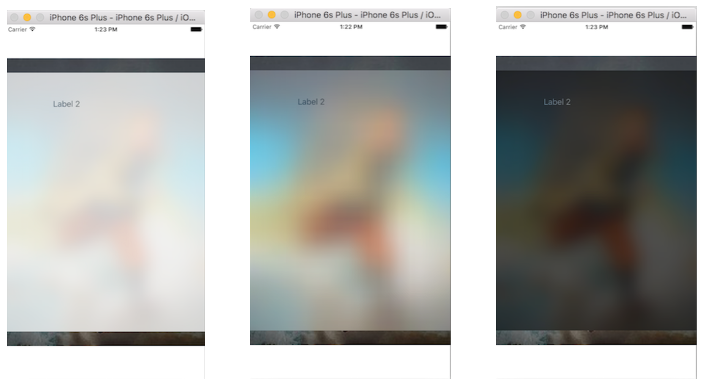

What is it -

What a visual effect view primarily does is to add a blur on the content underneath it. Vibrancy comes into the picture when something (typically text) should not be blurred and yet have its color properly altered according to the blur style.
A visual effect view can affect the content layered behind the view or the content added as subviews to its contentView.

Blur effect and Vibrancy effect -

The effect of the visual effect view can either be a blur effect or a vibrancy effect. It can be changed programmatically as well.

In case of blur effect, just the style (dark, light, extra light) needs to be specified. The blur effect style tells how light or dark should the blurring be.
self.visualEffectView1.effect = UIBlurEffect(style: .Dark)

In case of a vibrancy effect, it needs to be specified that the intended vibrancy is for what style of blur, i.e. light, dark or extra light. Then depending upon the type of blur specified, the font color of any label, etc. in its contentView changes. 

Usually a vibrancy effect is specified only for a visual effect view which in turn is nested inside another visual effect view having blur effect. When visual effect view with blur and vibrancy is dragged and dropped in the interface builder, it automatically contains nested visual effect views in which the top one does not have vibrancy checked and the nested one has got the vibrancy checked.

(Blur effect - Extra light, Light, Dark)

(Vibrancy effect - Extra light, Light, Dark)

It is advised not to have an alpha of less than 1 on a visual effect view or any of its superviews.

Any subviews that are added to the contentView of a visual effect view that has vibrancy must implement the tintColorDidChange method and update themselves accordingly. UIImageView objects with images that have a rendering mode of UIImageRenderingModeAlwaysTemplate as well as UILabel objects update automatically.

The bounds of the visual effect view can be animated. 

The blur effect of the visual effect view can also be animated. The blur effect animation should typically be done on the top level visual effect view and not the nested visual effect view (the one that has the vibrancy specified).

UIView.animateWithDuration(0.5) {
  self.visualEffectView2a.effect = UIBlurEffect(style: .Light)
}

Offscreen pass is when a blur has to be applied. The system captures the part that needs to be blurred, takes it offscreen, applies the blur and then brings it back on screen. There is also a debug method which can be used to check if the blue effect is not rendering properly.

UIVisualEffectView - _whatsWrongWithThisEffect (lldb only)

Test codes - 30. UIKitDyamics/TestUIKitDynamics
Visual effect with blur - TestUIKitDynamics - commit no. 5841efa
Visual effect with blur and vibrancy - TestUIKitDynamics - commit no. 18244a

*********

Classes and methods - 

UIVisualEffectView: UIView
UIVisualEffect: NSObject
UIBlurEffect, UIVibrancyEffect: NSObject
UIVisualEffectView - effect
UIVisualEffectView - _whatsWrongWithThisEffect (lldb only)
UIBlurEffect
UIVibrancyEffect - init(forBlurEffect:)
