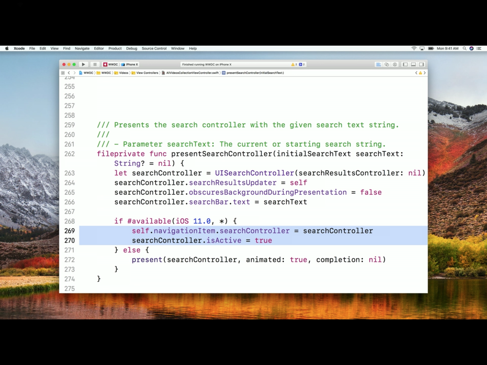
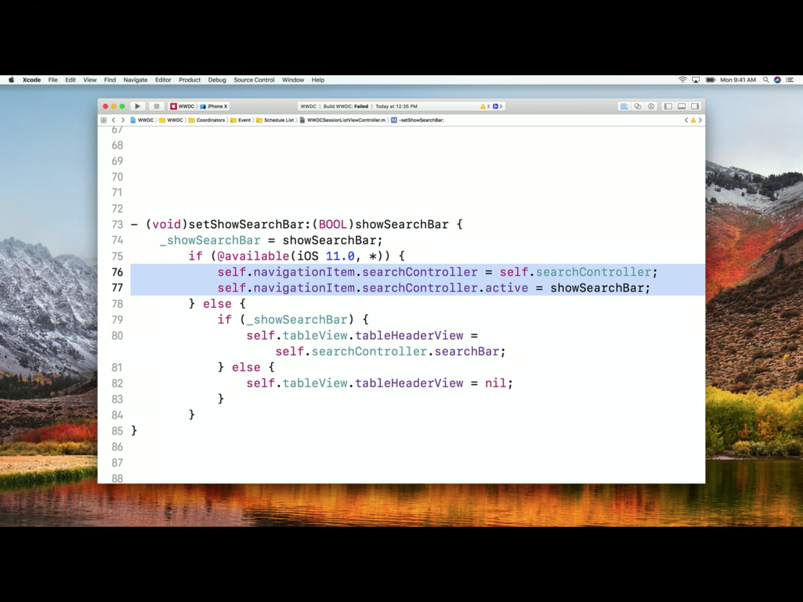

UISearchController - (Yet to try it myself)

It was introduced in iOS 8 and it brings up a search bar. It is typically used with table views.  It works with two custom view controllers that you provide. The first view controller displays your searchable content and the second displays your search results.

Apparently until iOS 10, the way to bring up a search controller was to present it but since iOS 11, that is not the recommended way to show a search controller. (Need to try all this.) In case of a navigation controller, it should be assigned to the new searchController property of navigationItem in navigation bar. This way, a lot of things (such as taking care of background color and safe area layout guides) are automatically taken care of. It also makes the search bar when there is a scroll view show up only when the scroll view is actually scrolled. However this can be controller by a new navigationItem property called hidesSearchBarWhenScrolling. Its default value is true.

Here is one relevant code snippet from an Apple video.

So if there is a search bar in a UI having navigation bars, then the search bar should be added particularly this way in iOS 11.

Even when a search bar UI is needed on table view's header (we are not talking about the section headers here), a searchBar should be assigned to the table view's tableHeaderView.

