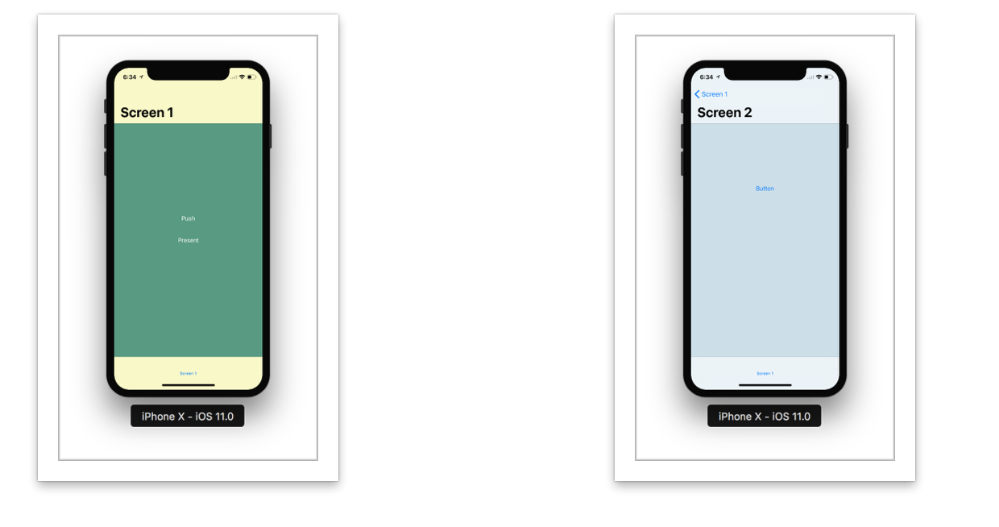

A navigation controller manages a stack of view controllers to provide a hierarchical content. Each view controller provides a distinct view hierarchy. Programmatically most of the work is needed on the custom content. However, often the code also needs to interact directly with the navigation controller object to push or pop views and also configure the navigation bar. The navigation bar is the view at the top, it contains a back button and some more buttons that can be customized.

A navigation controller sends some notifications during its transitions and these can be received by the methods of the navigation controller's delegate.

A navigation controller should be thought of as a stack growing from bottom to up. Hence, the root view controller should be thought of lying at the bottom of the stack. The root view controller is never popped off the stack. The topViewController and visibleViewController are not necessarily the same things. If a view controller is presented modally, it is the visible view controller but the top view controller is still the the previously shown view controller.

A navigation controller should only be used in these specific ways -

1. Directly as a window's root view controller.
2. As the view controller of a tab in a tab bar controller.
3. As one of the two view controllers of a split view interface in iPad.
4. When presented modally from another view controller.
5. Within a popover in iPad.

Typically (at least until iOS 6) navigation controller's custom content was displayed between the navigation bar at top and the toolbar at bottom. However, if required the custom content can also be displayed in a full-screen layout in which case the content underlaps the navigation bar, toolbar and status bar as appropriate. This depends upon a few factors though - the underlying window should be sized to fill the entire screen bounds, the navigation bar/tool bar should be set as translucent.

The content view needs to have autoresize subview attribute enabled (by default it is) as only then can the resizing for underlapping can be done appropriately if needed.
Whether the navigation bar and tool bar should be translucent or not can be controlled by their translucent property. In iOS 7, they are by default set as YES.
Hence, in iOS7 these factors do not hinder underlapping of the content view.

Following is a sample sequence of methods called during push or pop operation. The new view controller is the view controller that is about to become the topmost view controller on the navigation stack. If several view controllers are pushed or popped at once, only the view controller that was visible and the view controller that is about to be come visible have the methods called.

In a navigation bar, the content is provided by one or more navigation items which are stored in a stack data structure known as navigation item stack. In a navigation interface, each content view controller in the navigation stack provides a navigation item as the value of its navigationItem property. The navigation stack and the navigation item stack are always parallel to each other. For each content view controller on the navigation stack, its navigation item is in the same position as in the navigation stack.

When a navigation bar is used with a navigation controller, the navigation controller is automatically set as the delegate of the navigation bar and attempting to change it raises an exception.

In a navigationItem -

1. If a leftBarButtonItem is specified it replaces the default back button. This left item is created using the navigation item of the previous controller in the navigation stack.
2. If a custom left bar button item is not specified and the navigation item of the previous element in the navigation stack has a valid value in the backBarButtonItem property, the navigation bar uses that. If neither the left bar button item nor a back button item is specified, a default back button is used.
3. If a titleView for a navigation item is not specified the navigation bar displays a custom title view using the title string of the navigation item.
4. An array of custom bar button items can also be specified for the left and right position using leftBarButtonItems and rightBarButtonItems. If there isn't enough space for displaying all the buttons, some of they are not displayed. A custom view can be put in a UIBarButtonItem, i.e. the required type for left and right bar button items.

The content view controller in a navigation interface can also have a toolbar. It is specified by setting the toolbarHidden property of navigation controller to YES and configuring the toolbarItems property of each view controller as appropriate. toolbarItems is an array of UIBarButtonItem objects.

A view controller can also change its existing set of toolbar items dynamically using setToolbarItems:animated: method.

*************************

Generating a navigation controller programatically as window's root view controller.

In AppDelegate's didFinishLaunchingWithOptions: -

self.window = [[UIWindow alloc] initWithFrame:[[UIScreen mainScreen] bounds]];
self.window.backgroundColor = [UIColor whiteColor];

ViewController1 *vc1 = [[ViewController1 alloc] init];
UINavigationController *navigationController = [[UINavigationController alloc] initWithRootViewController:vc1];    

self.window.rootViewController = navigationController;
[self.window makeKeyAndVisible];

Generating a navigation controller from storyboard.

A navigation controller can be dragged from the object library onto the canvas. By default it creates a navigation controller and a view controller (treated as root) and creates a relationship between them. Then if needed this navigation controller can be set as the initial view controller.

Showing a navigation bar as completely translucent.

navigationController.navigationBar.translucent = YES;
[navigationController.navigationBar setBackgroundImage:[UIImage new] forBarMetrics:UIBarMetricsDefault];
navigationController.navigationBar.shadowImage = [UIImage new];

Showing and hiding navigation bar.
(Should not be done directly by using the hidden property of navigation bar. Also, hiding a navigation bar disables the slide for back gesture of iOS7.)
[self.navigationController setNavigationBarHidden:YES animated:NO];

Getting the kind of operation (push or pop) -

iOS7 onwards the system reports the navigation controller operation that is about to happen to the delegate. It is reported as an argument in the method navigationController(_:animationControllerFor:from:to:) and is of the enum type UINavigationControllerOperation with possible values as None, Push and Pop.

******************

Large titles in Navigation bars -

UINavigationBar.prefersLargeTitles - A new property iOS 11 onwards which indicates if the title should be displayed in a larger font and out of line. The default value is false. As it is a navigation bar property it impacts all the view controllers in the navigation controller.

navigationController?.navigationBar.prefersLargeTitles = true

iOS 11 introduced large titles in navigation bars. If largeTitles are enabled this is how it looks. The view controller's title appears in large fonts below the back item. Also, there is an animation that happens on the title of first view controller as a push happens on it and the previous title now becomes the back button in small fonts.

Now if the large title needs to be selectively enabled, disabled for some view controllers in the navigation stack it can be done using viewController's navigationItem.largeTitleDisplayMode property. Its possible values are automatic, never and always with the default being automatic.

Whatever value the view controller has for that is what is always maintained when that view controller shows up. The thing to note is that it also impacts the prefersLargeTitles value for subsequent view controllers that will be pushed to the navigation stack but once a pop on it is done to go to the previous view controller, the existing value of navigation bar's prefersLargeTitle is once into effect.

So navigationItem.largeTitleDisplayMode does not impact navigationController?.navigationBar.prefersLargeTitles. It does affect the new view controllers being pushed though.

******************

Misc. -

Search bars are now shown in the navigation bar with iOS 11.
