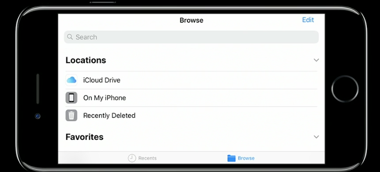
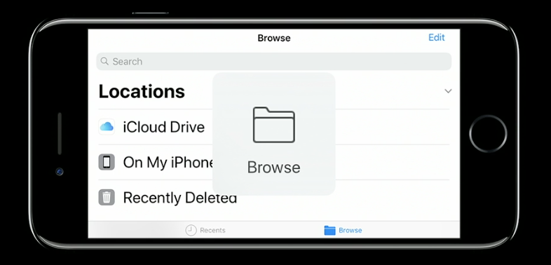

A tab bar controller is composed of views that the tab bar controller manages directly and views that are managed by content view controllers that are provided. The interface consists of a tab bar and the content area. Each content view controller manages a distinct view hierarchy.

When a tab bar view is part of a tab bar interface, it must not be modified. If the list of tabs needs to be changed, it must be done using the methods of tab bar controller itself.

Each view controller in the tab bar controller's viewControllers property is a view controller for the corresponding tab. If there are more than 5 items in the viewControllers property, the tab bar controller automatically inserts a special view controller (moreViewController) to handle the display of the additional items. The moreViewController cannot be customised and is not included in the viewControllers list. It appears automatically in the UI when needed.

Each button in a tab bar is called a tab bar item.

UIViewController has a property called tabBarItem which is used to configure the tab bar. The tabBarItem property of every view controller must be configured before displaying the tab bar interface. If the interface is created using interface builder, this is very easy to do and just the title and image need to be specified. If the interface is created programatically, a new UITabBarItem must be created for each of the content view controllers. In the below illustration, each of the arrows point to a tab bar item.

A tab bar interface should only be used in these scenarios.
1. Directly as a window's root view controller.
2. As one of the two view controllers in a split view interface in iPad.
3. Presented modally from another view controller.
4. In a popover in iPad.

A UITabBarItem can be created programmatically using the method initWithTitle:image:tag:.

There are essentially two types of user initiated changes that occur on a tab bar - the user can select a tab or the user can rearrange tabs. Activities pertaining to both these types of changes are reported to the tab bar controller delegate. For example, the delegate provides methods which allows to determine if a view controller or tab should be selectable.

If the tabs are added or removed and need to be shown in a way that is obvious to the user, it can be done using the method setViewControllers:animated:.

The more view controller allows to rearrange tabs. If there are certain tabs that should not be allowed to be rearranged, they should not be included in the customizableViewControllers property. View controllers not in this property are not displayed in the the configuration screen and cannot be removed from the tab bar if they are already there.
Adding or removing view controllers from the tab bar interface also resets the array of customizable view controllers to the default value. Hence, customizableViewControllers should be re-populated whenever viewControllers is modified.

Tab bar controllers do not switch to landscape orientation unless all of the contained view controllers support landscape orientation.

*************************

Generating a tab bar controller programatically as window's root view controller.

In AppDelegate's didFinishLaunchingWithOptions: -

self.window = [[UIWindow alloc] initWithFrame:[[UIScreen mainScreen] bounds]];
self.window.backgroundColor = [UIColor whiteColor];

ViewController1 *vc1 = [[ViewController1 alloc] init];
ViewController2 *vc2 = [[ViewController2 alloc] init];

UITabBarController *tabBarController = [[UITabBarController alloc] init];
[tabBarController setViewControllers:[NSArray arrayWithObjects:vc1, vc2, nil]];

self.window.rootViewController = tabBarController;
[self.window makeKeyAndVisible];

******************

Large or dynamic size tab bar icons in iOS 11 -

iOS 11 onwards tab bar icons are shown to the left of tab bar title in landscape mode.

Also, if 'large items' are enabled in device settings, then long pressing any icon in tab bar, navigation bar, tool bar is shown as a big image in the center.

UIBarItem, the existing superclass of UITabBarItem and UIBarButtonItem

UIBarItem.landscapeImagePhone - a new property for having a custom image in tab bar item, etc. in landscape mode on iPhone. Would also be settable from storyboard

UIBarItem.largeContentSizeImage - The large image shown if 'Large Text' is enable on phone and a long press done on the tab. If the icon is coming through a pdf and 'Preserve Vector Data' option in assets catalog is checked, then this image is generated automatically.

It is best to manage assets through pdf, it just needs to be ensured that an option called 'preserve PDF data' is checked on.

UIToolbar and UINavigationBar, both have intricate support for Auto Layout now. Keep constraints only within the view though. intrinsicContentSize can also be implemented for them.

Rubber banding experience is the term used for that effect whe large titles become even larger when scrolled down and then become small again when scrolled up.

******************
