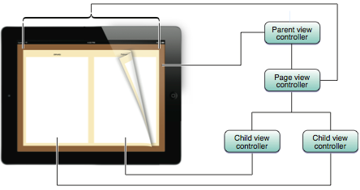

A page view controller is used to present the content in page-by-page manner. It allows the transition animation between the pages to be either appear as a scroll or a page curl. While initialising it only some of the initial view controllers need to be specified and not all as the later view controllers are specified by its datasource when needed.

Usually the view controllers passed during initialisation are those that will be displayed when the animation has completed. The view controllers that need to be specified also depend upon the spine location if the transition style is page curl.

'Navigation orientation’ implies the direction of page controller, i.e. its view controllers are shown horizontally or vertically.

'Navigation direction’ implies the direction of page turn transitions, i.e. forward or reverse. For a horizontal transition, ‘forward' implies a right to left page turn whereas ‘reverse’ implies left to right page transition. For a vertical transition, ‘forward' implies a bottom to top page turn whereas ‘reverse’ implies top to bottom page transition.

‘Transition style’ implies the style of transition, i.e. scroll or page curl.

‘Spine locations’ are none (which is not allowed for ‘page curl’ transition), min (left or top edge of screen), mid (middle of screen, two view controllers displayed at a time), max (right or bottom edge of screen).

A page view controller can be initialized from storyboard.

If it however has to be initialized entirely from the code, initWithTransitionStyle:navigationOrientation:options: method should be used. The options dictionary can be used to specify the spine location and inter page spacing. The navigation direction, spine location and transition style are accessible only as read-only property after initialisation. A completion block can also be specified which is called when a page turn animation completes.

Once the page view controller has been initialized, its view controllers are set using setViewControllers:direction:animated:completion:  method.

The page view controller’s delegate can do things such as return the spine location for the current device orientation, have its methods called when page transitions are about happen, etc.

Most likely, only if a datasource is specified the usual gestures (tapping, flicking, dragging) are added to the page view controller. If a datasource is not specified, the appropriate gestures would need to be custom created and added to the views.

In case of horizontal transitions with scroll transition, probably a page control is automatically shown by the page view controller if two of its datasource methods (presentationCount, presentationIndex) are implemented.

Sometimes the gesture recognizers of the page view controller cause an issue by overlapping the gesture recognizers in the content view controller. In such cases, the workaround in this link can be used.

************************

UIPageViewController
UIPageViewControllerDataSource
UIPageViewControllerDelegate

UIPageViewController -
dataSource
delegate
spineLocations
transitionStyle
gestureRecognizers
-setViewControllers:direction:animated:completion:
-initWithTransitionStyle:navigationOrientation:options:

UIPageViewControllerDataSource -
-pageViewController:viewControllerAfterViewController:
-pageViewController:viewControllerBeforeViewController:
-presentationCountForPageViewController:
-presentationIndexForPageViewController:

UIPageViewControllerDelegate -
-pageViewController:willTransitionToViewControllers:
-pageViewController:spineLocationForInterfaceOrientation:

UIPageViewControllerNavigationDirection
UIPageViewControllerNavigationOrientation
UIPageViewControllerTransitionStyle
UIPageViewControllerSpineLocation

************************

Initializing and showing a page view controller in storyboard.

self.pageViewController = [self.storyboard instantiateViewControllerWithIdentifier:@"PageViewController"];
self.pageViewController.dataSource = self;

PageContentViewController *startingViewController = [self viewControllerAtIndex:0];
NSArray *viewControllers = @[startingViewController];
[self.pageViewController setViewControllers:viewControllers direction:UIPageViewControllerNavigationDirectionForward animated:NO completion:nil];

// Change the size of page view controller
self.pageViewController.view.frame = CGRectMake(0, 0, self.view.frame.size.width, self.view.frame.size.height - 30);

[self addChildViewController:_pageViewController];
[self.view addSubview:_pageViewController.view];
[self.pageViewController didMoveToParentViewController:self];
