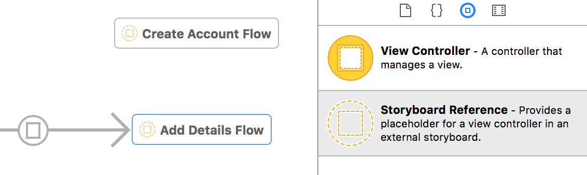

Storyboard references (refactoring storyboards) -

It is possible to refer to another storyboard from a segue in one storyboard. The way this can be done is by including a storyboard reference from the object library or by selecting existing view controllers and then selecting Editor -> Refactor to Storyboard (and then a new storyboard can be created).

Methods such as + storyboardWithName:bundle: and - instantiateViewControllerWithIdentifier: can be used for programmatically accessing different storyboards and view controllers in them.

Main storyboard and Main nib file -

An app can either have a main storyboard file or a main nib file but it cannot have both. The name of the main storyboard file is specified in the UIMainStoryboardFile key of the Info.plist file and the name of the main nib file is specified in the NSMainNibFile key.

UIStoryboard methods -

- instantiateViewControllerWithIdentifier: (Instantiates and returns a view controller in the storyboard. This returned view controller can then be added to the current view controller so that it can be displayed.)

self.pageViewController = [self.storyboard instantiateViewControllerWithIdentifier:@"PageViewController”];
self.pageViewController.view.frame = CGRectMake(0, 0, self.view.frame.size.width, self.view.frame.size.height - 30);
[self addChildViewController:_pageViewController];
[self.view addSubview:_pageViewController.view];
[self.pageViewController didMoveToParentViewController:self];

+ storyboardWithName:bundle: (Creates and returns a storyboard object)

- instantiateInitialViewController (Instantiates and returns the initial view controller, i.e. initial view controller of the receiver storyboard will be displayed on the screen.)

Accessing a view controller in the storyboard from the code -

self.createLogViewController = [self.appDelegate.window.rootViewController.storyboard instantiateViewControllerWithIdentifier:NSStringFromClass([CreateLogViewController class])];
