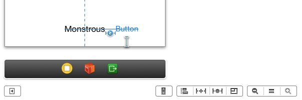

When added from Interface Builder, a constraint can be added by control dragging from the controls (either using the views in the canvas or using the corresponding objects in the document outline) as well as from the options towards at the bottom of the canvas.

One a constraint has been added, its attributes can be seen in the attributes inspector. These attributes include the items or views involved, the relationship between them, the multiplier, constant value, as well as the constraint's priority.

The ‘menu’ options shown at the bottom are ‘Align’, ‘Pin’, ‘Resolve Auto Layout Issues’, ‘Resizing Behavior’.  Constraints are mainly added using the first two options. Any constraint which sounds like an alignment related constraint is added through ‘Align’ and any fixed space kind of constraint is added through Align’. 

While adding Pinning constraints, the nearest neighbor means the nearest sibling in the specified direction. If there is no sibling in that direction, then it implies the nearest superview in that direction. Whereas, ‘Add Missing Constraints’ only adds appropriate constraints that are missing. It does not delete any existing constraint.

'Add and Update Frames’ in Pinning Constraints popover adds the constraints as well as repositions the frames accordingly in the canvas. ‘Add Constraints’ whereas just adds the constraints.

All the constraints of a control are also shown in its Size Inspector. In size inspector, there is also a field for Intrinsic Content Size. It can be set to
Placeholder to indicate to Interface Builder that the specified value should be treated as intrinsic content size for now. The exact size will be informed by the system during runtime. This is useful when removing any width and height constraint shows ambiguity in the Interface Builder and you do not want that to show as an ambiguity.

Double clicking on spacer constraints allows to change its relation type (=, >=, <=) and priority.

Selecting an area in a view controller in xib, shows all its subviews and their constraints. The subviews are shown with a square having 8 dots along its edges.

The issue resolving options in interface builder allows to various things. One of them is 'Reset to suggested constraints’ which clears the existing constraints on the selected view and applies suitable constraints on its own. It has options to work on the selected view as well all views in the current
scene (or topmost view controller).

Doing a 'shift + right' click over anything in interface builder shows everything that is there under that area. This is a general interface build feature.

Priorities are important and changes made to priority can even reflect straight away in the interface builder if they are significant enough.

Some container views such as a stack view depend on the size of their content to determine their own size at run time, which implies the size is unknown at design time. To address this, a placeholder constraint can be specified for that constraint in the attributes inspector. It is automatically removed at build time.

If constraints of a control are shown in orange lines, it indicates that the constraints are not yet sufficient. Once all the constraints have been defined, the orange lines change to blue.

A red disclosure icon shown in the document outline does not necessarily mean that it will cause a build error too. But it often indicates something that should be paid heed to.

For example, adding an inequality horizontal spacer constraint between two controls can show a red mark if a more precise positioning for both the controls is not known. But in such a case appropriate priorities must also be set on the constraints to ensure there is no conflict.

The preview of a view controller in different iOS versions, device size, portrait or landscape orientation can be seen at the same time by going to preview - (Option + Shift) click - select assistant editor and then another editor below it.

For previewing a view controller in different iOS version, preview can be used.

It is important to remember that outlets can be created for constraints too and then used in the code as needed.

Attributes of an item in case of a horizontal spacer constraint - Leading, CenterX, Trailing
Attributes of an item in case of a vertical spacer constraint - Top, CenterY, Baseline, Bottom
(Check the screenshots in Dropbox. iOS Dev -> User Experience -> UIKit -> Auto Layout Constraints)

Scroll views often pose unique cases with regards to auto layout. One common scenario is when a scroll view is supposed to have an anchor kind of view within which it should not move when a scroll happens inside the scroll view. To do this first a container view (UIView) should be created, the scroll view dragged on top of it, the anchor positioned on top of it too and then a constraint created between the anchor and container view.

To position several views proportionally in a line, spacer views can be used. These spacer views are probably just ordinary views that are marked as hidden. They are placed between all the views and even to its left and right (or top and bottom). The constraints are set to be all equal in width and also appropriate constraints are set between them and the edges and visible views with appropriate inequality relations and priorities.

An aspect ratio constraint can also be used to create constraints based on aspect ratio, for example if a square has to be made and constraints already exist for one of the dimensions.
