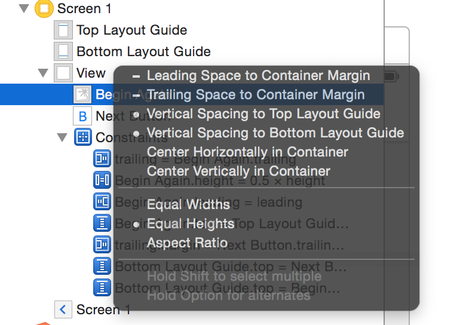
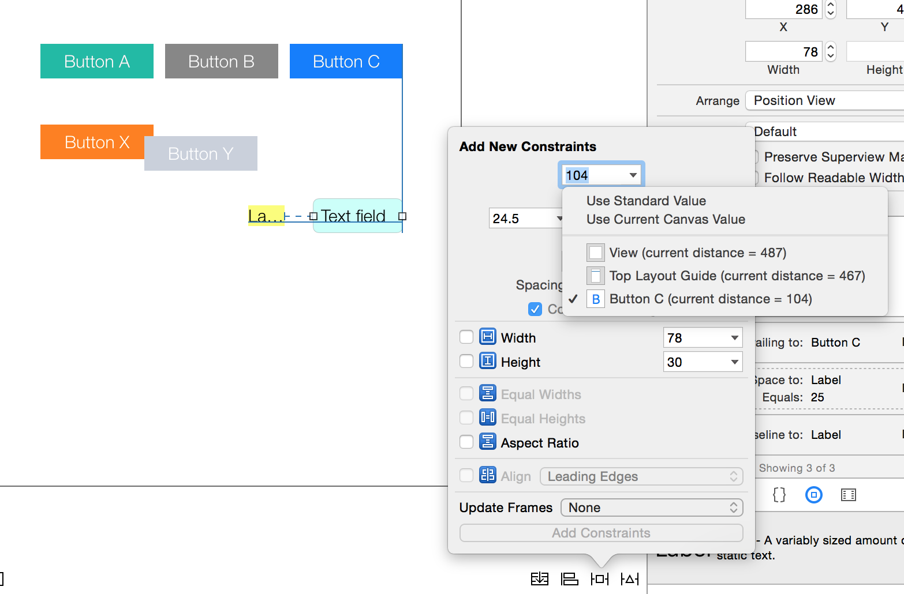
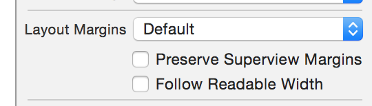
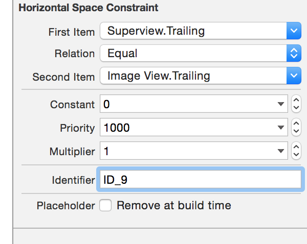

###### UILayoutGuide type in iOS 9

iOS 9 essentially introduced a way to create custom layout guides. `UILayoutGuide` represents rectangular areas that can be created programmatically and treated almost like views. They however are not views and are hence not a part of the view hierarchy. They however do participate in auto layout. Hence they are useful when a UIView would have been otherwise required just for creating some spacer views. In such situations just layout guides can be created programmatically and used.

In fact they can also be set up in such a way that they include several other views so that these views are encapsulated together.

Some of its properties -

`bottomAnchor`, `centerXAnchor`, etc. <br>
`owningView` (if the layout guide is associated with a UIView, then that view) <br>
`layoutFrame` (its frame in owning view's coordinate system)  <br>

[Reference](https://developer.apple.com/documentation/uikit/uilayoutguide?language=objc)

> Keep in mind though that UILayoutGuide can only be created programmatically and not from Interface Builder.

###### Margins of a view

Every view has got margins defined for it, it encompasses a portion totally within the view. It specifies the desired amount of space (measured in points) between the edge of the view and its subviews. The default margins for non root-views are 8 points on each side. For root views, then the system sets and manages the margins and it cannot be changed. The top and bottom margins are set to 0 points and the side margins vary depending on the current size class, but can be either 16 or 20 points. In the below screenshot Button Y begins at Button X's trailing margin.


Programmatically, `layoutMargins` is UIView property of type `UIEdgeInsets` and it can indeed be changed, it is not a readonly property. It shows what are the default margins of a view on each of the four sides. While creating constraints you deal with just one side of a margin at a time. layoutMargins is hence not the exact same thing as a layout attribute margin such as left margin (`NSLayoutAttributeLeftMargin`).

When the edge of a custom subview is close to the edge of the superview and the `preservesSuperviewLayoutMargins` property is YES, the layout of the subview may be adjusted to prevent content from overlapping the superview’s margins. This default value of this property is NO. It is also configurable from interface builder (but it isn't always showing up).

The concept and all relevant API for margins is available only from iOS 8 onwards.

`layoutMargins` of root view in iPhone X landscape for a screen that does not have any navigation bar, etc. The top and bottom edges align with the safe area insets and the left and right edges are offset 16 points from the safe area.

```
view.layoutMargins - UIEdgeInsets(top: 44.0, left: 16.0, bottom: 34.0, right: 16.0)
```

###### systemMinimumLayoutMargins, viewRespectsSystemMinimumLayoutMargins in iOS 11

A get only property of `UIViewController` that gives the minimum `layoutMargins` that must be maintained for the root view. If a `layoutMargins` lesser than this is set for root view's `layoutMargins`, it is ignored unless `viewRespectsSystemMinimumLayoutMargins` (another UIViewController property introduced in iOS 11) is explicitly set to false.

`viewRespectsSystemMinimumLayoutMargins` should indeed be changed to false only when absolutely necessary.

###### layoutMarginsGuide in iOS 9

`layoutMarginsGuide` is a UIView property of type `UILayoutGuide` that indicates the area within the layout margins of the UIView. It's a readonly property (keep in mind though that `layoutMargins` is not a readonly property and can be changed). This obviously is a computed property that depends upon view's layoutMargins and frame.

###### Top and bottom layout guides

> Both `topLayoutGuide` and `bottomLayoutGuide` have been deprecated in iOS 11 and safeAreaLayoutGuide needs to be used instead.

It's a UIViewController thing and was introduced in iOS 7.

The top and bottom layout guides represent the upper and lower edge of the visible content area for the currently active view controller. It is useful to not let the content extend under transparent or translucent UIKit bars (for example, a status bar, navigation bar, or tab bar).

Irrespective of the fact it is drawn from storyboard, xib or done programmatically, top and bottom layout guides can only be drawn from a subview and not from the main view. This is probably because a main view of the view controller is always the entire screen, it even includes the status bar.

While creating a vertical constraint to the root view in storyboard, if you press option key you can switch between options to create constraint to the layout guide and container margin. (Can't take screenshot of other, but if you press option key it does happen.)



Also while using the Pin tool in interface builder to create constraint, the disclosure triangle has the relevant options such as whether it should be created to a layout guide or to the root view to to some other nearby view, etc.



###### readableContentGuide in iOS 9

iOS9 onwards UIView has a new property of the type `UILayoutGuide` called `readableContentGuide`. It is supposed to give the optimal width of any possible text objects within it. This guide is always centered inside the view’s layout margin and never extends beyond those margins. The size of the guide also varies depending on the size of the system’s dynamic type. The system creates wider guides when the user selects larger fonts, because users typically hold the device farther from them while reading.

For most devices however there is little or no difference between the readable content guides and the layout margins. The difference becomes obvious only when working on an iPad in landscape orientation. And testing this on an iPhone really appeared to confirm this. It appears to be rather relevant for iPad (especially in landscape mode while having split-screen apps?).

```
2015-10-31 19:19:57.046 TestRandom[91044:6358962] View: Width - 320.000000
2015-10-31 19:19:57.047 TestRandom[91044:6358962] View readableContentGuide: Width - 288.000000

2015-10-31 19:33:21.560 TestRandom[93237:6390839] Button A: Width - 69.500000
2015-10-31 19:33:21.561 TestRandom[93237:6390839] Button A readableContentGuide: Width - 53.500000
```

In Interface Builder, there is an option in size inspector to set whether the view’s margins represent the layout margins or the readable content guide.



###### directionalLayoutMargins in iOS 11

`directionalLayoutMargins` is a UIView property that allows to express `layoutMargins` in term of leading and trailing and not left and right. Probably helps in case of right-to-left languages. Is in sync with `layoutMargins`. So in left-to-right language, left is same as leading.

It is of type `NSDirectionalEdgeInsets`, which is a new type that takes into account language direction.


###### semanticContentAttribute in iOS 9

`semanticContentAttribute` is a new UIView property in iOS9 which determines if the view's (or the view's content's) position should flip when switching between left-to-right and right-to-left languages. If the value is Unspecified, the view’s content flips with the reading direction. If it is set to `Spatial`, `Playback`, or `Force Left-to-Right`, the content is always laid out with the leading edges to the left and trailing edges to the right. Force Right-to-Left always lays out the content with the leading edges to the right and the trailing edges to the left.

###### Anatomy of available classes, protocols, etc.

`UILayoutSupport` (iOS7 +) - A protocol adopted by topLayoutGuide and bottomLayoutGuide. It has properties for length.

`UILayoutGuide` (iOS9 +) - Represents the rectangular area (like UIView which is capable of interacting with the auto layout system. That's all, it doesn't have anything to do with the topLayoutGuide, bottomLayoutGuide or any area enclosed by them. Has properties for leadingAnchor, topAnchor, layoutFrame, owningView, etc.

`layoutMarginsGuide` (iOS 9 +) - A readonly UIView property of type UILayoutGuide that can be straight away used in constraint equations. It represents the area within the margins of the view. It is available only iOS9 onwards though.

`readableContentGuide `(iOS 9 +) - A readonly UIView property of type UILayoutGuide that gives the optimal width of any possible text objects within it. Until iOS10, separator insets were relative to readableContentGuide. iOS 11 onwards they are relative to the table view's safe area insets.

`safeAreaLayoutGuide` (iOS 11) - The safe area that takes into account navigation bar, status bar, toolbar, tabbar, etc. and the sensor area in iPhone X.

`topLayoutGuide`, `bottomLayoutGuide` of UIViewController (iOS 7, deprecated in iOS 11) - UIViewController properties that conform to `UILayoutSupport` protocol. They are not of the type `UILayoutGuide` (which itself was introduced only in iOS 9). Both of them have however been deprecated in iOS11 and safeAreaLayoutGuide should be used instead.

###### Misc.

A constraint can also be marked as a placeholder. These constraints exist only at design time. By temporarily adding the constraints needed to create a non-ambiguous, satisfiable layout, any warnings or errors in Interface Builder can be cleared out. This might be sometimes helpful.

As soon as you create your first constraint, the system removes all the prototyping constraints for the affected views. Eventually there should not be any prototyping constraints.

The constraint’s identifier property lets you provide a descriptive name so that it can be easily identified while debugging. Its actually quite useful and can be set in the interface builder and programmatically as well.



heightConstraint.identifier = @"ID_5";

If a view has `accessibilityIdentifier` assigned, then probably that shows up too in debug console.

It is possible to have more than one constraints between the same two views and attributes as long as their priorities are kept different.
