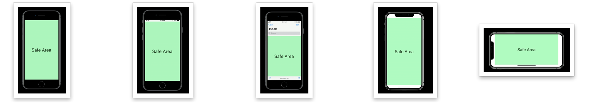
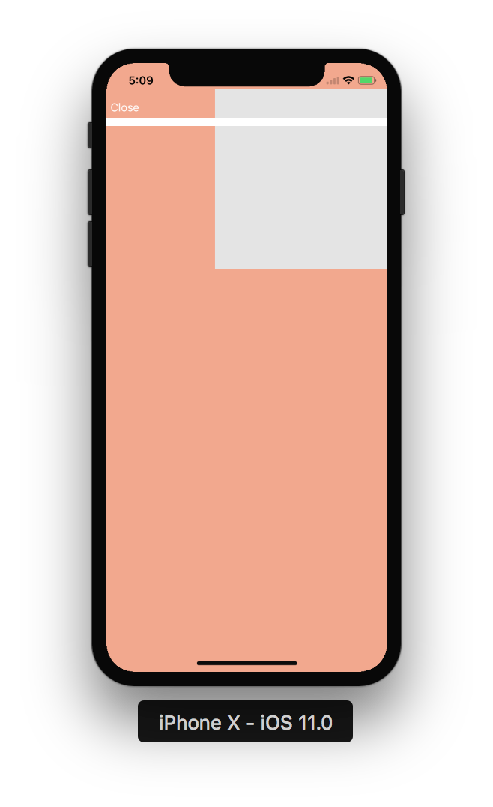
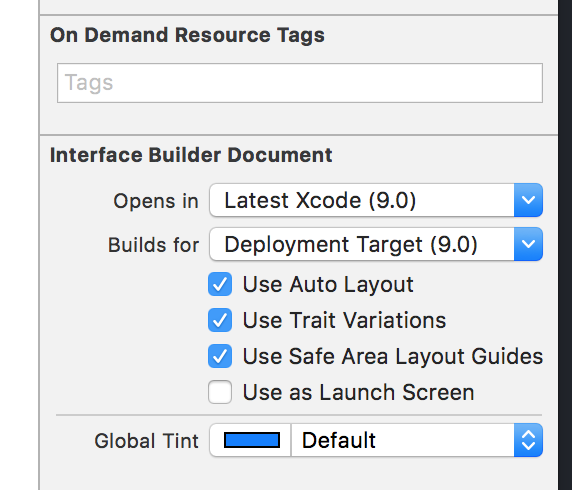

###### Safe Area in iOS 11

iOS 11 onwards every view has something called a Safe Area. It indicates the portion of the view that is not obscured vertically by status bar, navigation bar, tool bar or tab bar. It does not seem to be accounting for any horizontal underlap.

It is especially pertinent for the root view in iPhone X as iPhone X has the sensor area and full length screen with round edges.

###### Root view safe area

iPhone 8 portrait - No status bar, navigation bar, etc. - Same as viewport <br>
iPhone 8 portrait - Status bar, navigation bar, etc. - Does not include bars <br>
iPhone 8 landscape - ? <br>
iPhone X portrait - Regardless of bars - Inset from top and bottom edges even if the bars are not present (helps in avoiding elements getting clipped from curved edges, sensors or home indicator) <br>
iPhone X landscape - Inset from left and right edges of screen as well as the home indicator. But not inset the top edge.(From what I have seen the left and right insets are 44 points each. The bottom inset is 21 points.) <br>

From what I have seen, safe area position on X landscape -

Navigation bar not present, Tab bar present - 44 points from the top, 34 points above bottom. <br>
Navigation bar present with small title, Tab bar present - 88 points from top, 83 points from bottom. <br>
Navigation bar present with large title, Tab bar present - 140 points from top, 83 points from bottom. <br>



> Keep in mind that safe area exists not just for root view, but all views.

###### safeAreaLayoutGuide

It is a UIView property called `safeAreaLayoutGuide` of the type `UILayoutGuide` and every view has one. It denotes the portion of the view that is not obscured by bars and other ancestor views.

If I read it literally, for non root view it does not account for a view stretching out from the device horizontally. Hence in below screenshot, SimpleView (i.e. the grey view) is actually of dimension 240*230. The `safeAreaLayoutGuide` does account for vertical underlap, but not horizontal underlap. See how the frame's width is 240 and not 230 even though the view was is positioned in such a way that its right 10 points are outside the screen space.

```
<UILayoutGuide: 0x6040001b59a0 - "UIViewSafeAreaLayoutGuide", layoutFrame = {{0, 10}, {240, 230}}, owningView = <UIView: 0x7fac9ba03580; frame = (145 34; 240 240); autoresize = RM+BM; layer = <CALayer: 0x60000002cec0>>>
```



On iPhone X, it seems the coordinate system literally starts from the top left. Even beyond the rounded corner. That's why in above screenshot root view's frame is still (0, 0, 375, 812). The root view's safeAreaLayoutGuide.layoutFrame though is (0, 44, 375, 812).

###### safeAreaInsets

A UIView readonly property of type `UIEdgeInsets`. It basically corresponds to the safe area layout guide. What it means is that it gives the insets from all the four sides of a view from which the safe area layout guide is drawn. So on a iPhone X, the root view of a landscape screen that does not have any navigation bar, tab bar, etc. the safeAreaInsets are as following .

```
UIEdgeInsets(top: 44.0, left: 0.0, bottom: 34.0, right: 0.0).
```

For other usual subviews it is typically the are not overlapped by any bars. So if a subview is full visible, its safeAreaInsets will be 0 on each side.

###### additionalSafeAreaInsets

A UIViewController property of type UIEdgeInsets. It is a settable property and can be used to add/reduce some extra padding around the default safe area. So it basically changes the default safe area of the root view.

root view's `safeAreaInsets` with default `additionalSafeAreaInsets` (i.e. all 0s) -
```
UIEdgeInsets(top: 44.0, left: 0.0, bottom: 34.0, right: 0.0)
```

root view's `safeAreaInsets` with `additionalSafeAreaInsets (50, 0, 0, 0)` -
```
UIEdgeInsets(top: 94.0, left: 0.0, bottom: 34.0, right: 0.0)
```

The documentation seems to suggest that it affects the `safeAreaInsets` of all the subviews of the view controller. But that does not seem to be true. It directly affects only the rootView's insets.


Now any time a view controller changes its `safeAreaInsets` using this property (or in any other hypothetical way), its child view controllers are informed about it in two ways. The child view controllers get a `viewSafeAreaInsetsDidChange` callback and the views get a `safeAreaInsetsDidChange` callback.

Existing UIView `layoutMargins` property should also be used in conjunction with safeAreaLayoutGuide as appropriate. There are times when a constraint should be created to safe area layout guide while accounting for view's `layoutMargins` too. Keep in mind that every view also has layoutMarginsGuide property (which is of course of the type UILayoutGuide) and constraints can be created to that.

###### insetsLayoutMarginsFromSafeArea

UIView property which indicates if the layout margins should respect safe area. Its default value is true. If however it is set to false, the view's layoutMargins are not curtailed even though they go across the view's safe area. Can be needed sometimes.

###### Misc.

Storyboard and xibs created prior to Xcode 9 do not have Safe Area Layout Guide checked on by default. They need to be explicitly checked. In case of storyboards, doing this  automatically updates the existing vertical constraints to top and bottom layout guide and existing horizontal constraints to leading and trailing edges of superview to use safe area layout guide instead. (So if there are existing vertical constraints to superview, they are not updated?)



There are a few things specific to safe areas and scroll views in particular though. I have them in my Scroll View notes.

When working with child view controllers, take care of setting the correct additionalSafeAreaInsets for the child view controllers if necessary. It sometimes so happens that the container (i.e. parent) view controller has its own subviews which need to be positioned on top of the child view controllers. In such cases, the child view controllers should adjust their safeAreaInsets accordingly by setting additionalSafeAreaInsets. The system already does it for built-in container view controllers such as navigation controllers (the safe area of child view controllers accounts for the navigation bar). [link](https://developer.apple.com/documentation/uikit/uiview/positioning_content_relative_to_the_safe_area)


Test codebase - TestXand11
