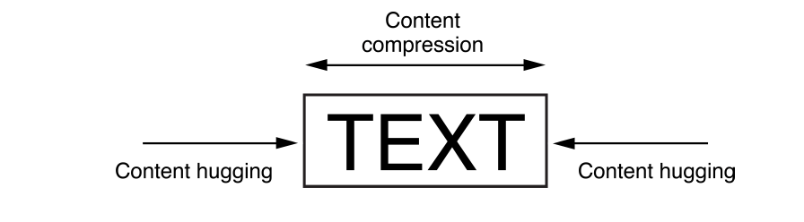
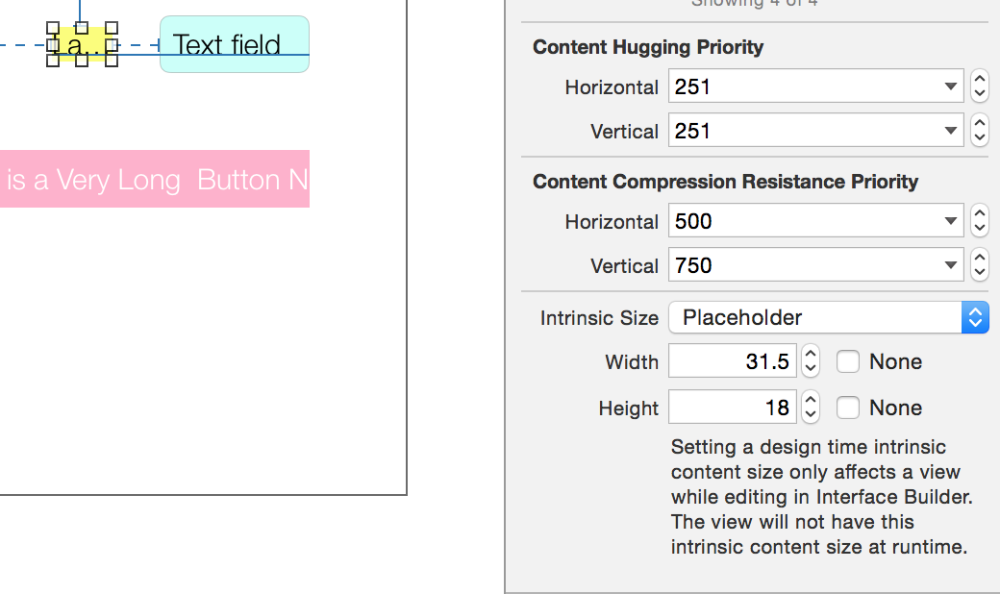
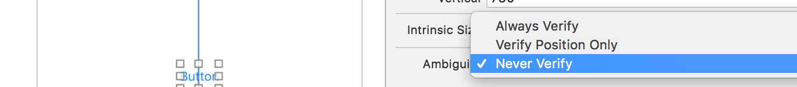

###### Only some views have an intrinsic content size

It is the natural size that some views automatically have. For example, a button’s intrinsic content size is the size of its title plus a small margin. For views that have intrinsic content size, it can define the view’s height, its width, or both.

UIView and NSView - No intrinsic content size.
Sliders - Defines only the width.
Labels, buttons, switches, and text fields - Defines both the height and the width.
Text views and image views - Intrinsic content size can vary. Empty image view does not have an intrinsic content size. As soon as you add an image, though, its intrinsic content size is set to the image’s size (both width and height are set as that of original image). Text view’s intrinsic content size varies depending on the content, on whether or not it has scrolling enabled, and on the other constraints applied to the view. For example, with scrolling enabled, the view does not have an intrinsic content size. With scrolling disabled, by default the view’s intrinsic content size uses the widest, shortest possible size that holds all the view’s content.

###### System automatically creates constraints for intrinsic content size

The thing to understand about views having intrinsic content size is that the system automatically creates a couple of constraints called content hugging and compression resistance constraints (CHCR constraints) in each of the dimensions (provided the view has an intrinsic content size in that direction). So what it also means is that if there is a view that has an intrinsic content size for any dimension, then it is not mandatory to specify a size constraint for that view in interface builder. It still works out without any errors or warnings.
These constraints then work along with all other constraints that are set by you. And it can matter, as shown in this link.

The content hugging pulls the view inward so that it fits snugly around the content. The compression resistance pushes the view outward so that it does not clip the content.



```
// Compression Resistance
View.height >= 0.0 * NotAnAttribute + IntrinsicHeight
View.width >= 0.0 * NotAnAttribute + IntrinsicWidth
```
```
// Content Hugging
View.height <= 0.0 * NotAnAttribute + IntrinsicHeight
View.width <= 0.0 * NotAnAttribute + IntrinsicWidth
```
By default, views use a 250 priority for their content hugging, and a 750 priority for their compression resistance. This can be changed though from interface builder and also programmatically using methods `setContentHuggingPriority:forAxis:` and `setContentCompressionResistancePriority:forAxis:`.



###### CHCR priorities for contiguous views should usually not be the same

Whenever possible, a view’s intrinsic content size should be used in the layout. It allows the layout to dynamically adapt as the view’s content changes. However their content-hugging and compression-resistance (CHCR) priorities must be handled properly.

When stretching a series of views to fill a space, if all the views have an identical content-hugging priority, the layout is ambiguous. Hence when there are several views next to each other and they are using intrinsicContentSize, they should not have identical CHCR priorities.

Interface Builder automatically takes care of a few common scenarios, for example it sets the content-hugging priority for all labels to 251 and not the usual 250. This is needed as it should have a higher CH priority than any text field that might be next to it.

CHCR priorities should not be of mandatory denomination (i.e. 1000). It’s usually better for a view to be the wrong size than for it to accidentally create a conflict. If a view should always be its intrinsic content size, it should have a very high priority (999) instead.

###### Changing the intrinsic content size

If for any reason a different intrinsic size is needed for a view at design time, it can be set by changing the intrinsic size type in interface builder to placeholder and specifying the appropriate values. This placeholder affects the size of the view only in Interface Builder. It does not have any effect on the view at runtime.

To actually change the intrinsicContentSize at runtime for a custom view, two things need to be done - override intrinsicContentSize to return the appropriate size for the content, and call invalidateIntrinsicContentSize whenever something changes which affects the intrinsic content size.

There is no setter which can be used to have a custom intrinsicContentSize. (Sample link)
```
@implementation UIButton (CustomIntrinsicContentSize)
- (CGSize)intrinsicContentSize {
    CGSize intrinsicContentSize = [super intrinsicContentSize];
    return CGSizeMake(intrinsicContentSize.width + 15,intrinsicContentSize.height);
}
@end
```
If the view only has an intrinsic size for one dimension, `UIViewNoIntrinsicMetric` should be returned for the other one.

Intrinsic content size must be independent of the view’s frame. For example, it’s not possible to return an intrinsic content size with a specific aspect ratio based on the frame’s height or width.

###### Changing the ambiguity verification in Storyboards

If needed, the ambiguity verification in storyboards can be changed on a per-view basis. This way the red warnings do not show up in storyboard even though that view does not have sufficient constraints.

This should be done only if needed though.



What is the 'Verify Position Only' option.

###### Misc.

Baseline constraints work only with views that are at their intrinsic content height. If a view is vertically stretched or compressed, the baseline constraints no longer align properly.

Some views, like switches, should always be displayed at their intrinsic content size. Their CHCR priorities should be increased as needed to prevent stretching or compressing.
