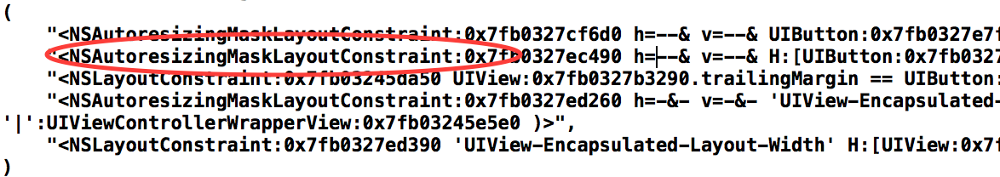
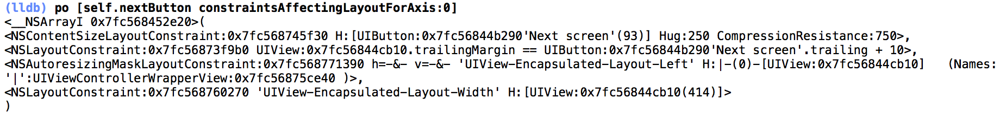
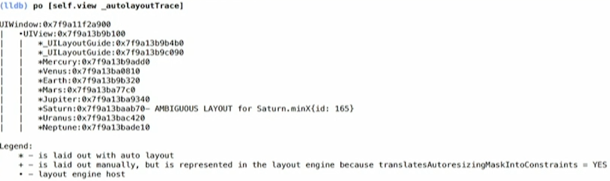
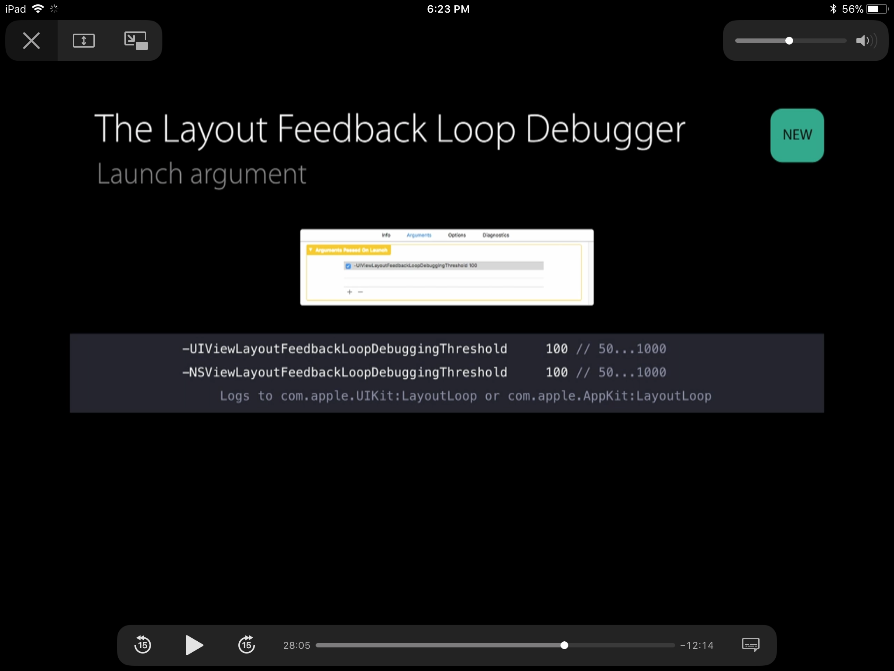
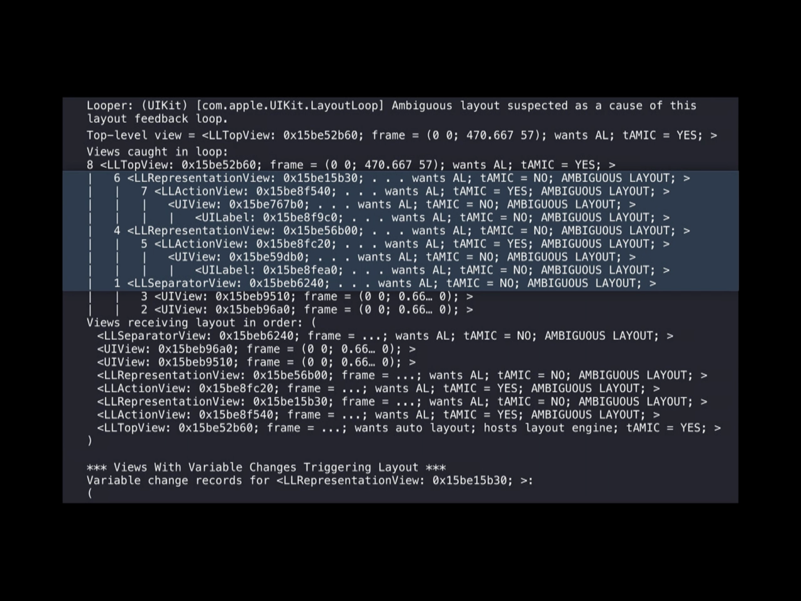

###### Three kinds of errors

There can be 3 kinds of errors when using auto layouts
1. Unsatisfiable layouts (conflicting constraints)

2. Ambiguous Layouts (more than one arrangements possible with the constraints, say there no constraint for one of the axes)

3. Logical Errors

Unsatisfiable Constraints are shown in red in interface builder.
Interface Builder detects conflicts only at the canvas’s current size; however, some conflicts occur only when the root view is stretched or shrunk beyond a certain point (or when the content expands or shrinks beyond a certain point). Interface Builder cannot detect these errors.
To help ensure that you catch non-obvious errors during testing, set a symbolic breakpoint for UIViewAlertForUnsatisfiableConstraints

Unsatisfiable constraints often occur when programmatically adding views to the view hierarchy.
Unsatisfiable constraints often occur when a view hierarchy is presented in a space that is too small for it. So have appropriate priorities (say 999 instead of a required 1000).

When an ambiguous layout occurs at runtime, Auto Layout chooses one of the possible solutions to use and there are no warnings written to the console.

For example, after the breakpoint halts execution, type call `myView.hasAmbiguousLayout()` into the console window to call the hasAmbiguousLayout method on the myView object. Similarly, type `po myView._autolayoutTrace()` to print out diagnostic information about the view hierarchy containing myView.

iOS8 onwards constraints have active property and setting them as YES or NO is same as calling addConstraint or removeConstraint: on the view that is the closest common ancestor of the items managed by this constraint. addConstraint and removeConstraint: need not be explicitly called anymore.

Everything in self.view.constraints should never be deactivated though. The self.view.constraints array also contains constraints that they system has created itself and might be using.

###### translatesAutoresizingMaskIntoConstraints left as YES -

If there is any view that had `translatesAutoresizingMaskIntoConstraints` left as YES and that created a problem, then the debug console error does point to a class called `NSAutoResizingMaskLayoutConstraint`. This is the class that the system uses to create constraints for views that have `translatesAutoresizingMaskIntoConstraints` as YES.



###### constraintsAffectingLayoutForAxis

At runtime, `constraintsAffectingLayoutForAxis:` can be used in debug console to just view the constraints at work for a particular view along just a specific axis (i.e. x or y). Argument 0 specifies horizontal axis (`UILayoutConstraintAxisHorizontal`) and 1 specifies vertical axis (`UILayoutConstraintAxisVertical`).



There is also a similar method called `constraintsAffectingLayoutForOrientation:` which can be used.

###### Printing view hierarchy with autolayoutTrace

At runtime it is also possible to print the view hierarchy (probably this is what auto layout trace means) and see if any view has ambiguous layouts. Any view having ambiguous layouts is shown with a message next to it in caps. (But sometimes it did not show inspire of constraint having ambiguity in interface builder).
 ```
(lldb) po [self.view _autolayoutTrace]
(lldb) expr -l objc++ -o -- [[UIWindow keyWindow] _autolayoutTrace] (in Swift, as Swift probably does not give access to private API yet)
```



There are also further methods such as `hasAmbiguousLayout`, `exerciseAmbiguityInLayout:` to find ambiguous layouts in runtime and even change it. (Need to try them).

###### Layout feedback Loop Debugger

It does not happen very often but sometimes a crash can happen due to recursive `setNeedsLayout` calls in a view hierarchy.

These can be debugged using the launch argument `UIViewLayoutFeedbackLoopDebuggingThreshold`. Its value should be within 50 and 1000. It counts layoutSubview calls for every view that runs layout. And if any of them run more than that threshold within the same turn of the run loop, it allows the cycle to continue for a little bit more and then throw an exception and dump that information into logs (com.Apple.UIKit subsystem). Setting an exception breakpoint too lets you see the logs. The thing to be printed in debug console then is this.
```
po [_UIViewLayoutFeedbackLoopDebugger layoutFeedbackLoopDebugger]
```

This is explained in WWDC 2015 video 236 - What's New in Auto Layout.




