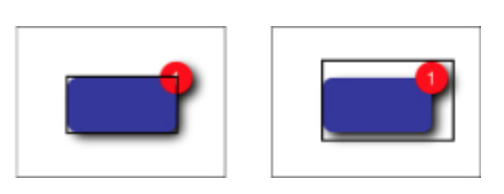
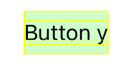
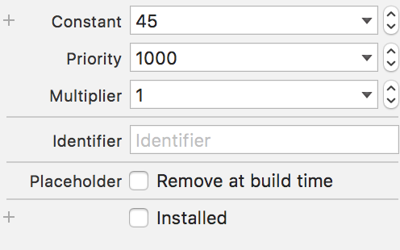

###### When working with navigation controllers

In a navigation bar, create space constraints relative to the top layout guide and bottom layout guide instead of the superview or else the navigation bar is not accounted for and clips the views that it overlaps with.

###### Making auto layout work in a scroll view

After doing this more and more, here is what is needed - There should be zero separation between the top-most view and scroll view, there should be zero separation between scroll view and content view. And now the content view's height as well as width should be completely determinable from end to end. It cannot be assumed that the content view just simply begins and ends along the scroll view.
For example, in case no horizontal scroll is needed then just setting an equal centerX with scroll view is enough for the width part as then centerX, left edge and right edge are known and thats enough to get the width and position of the content view in the scroll view. In case a vertical scroll is needed, then if there is a continuous chain right up to the bottom (for which usually a bottom space constraint is needed between the bottom most subview and the content view) its enough to get the height and position of the content view in the scroll view.

Test app - 14. Auto Layout and Scroll Views/TestScrollViewAndAutoLayout (2nd commit, i.e. 6806f3671757 for storyboard. 3rd commit, i.e. 77920746124b for xib.).

Take care though not to have any error or warning messages regarding layout even in the debug console, if a message does show up find and remove it.

Doesn't matter to be paid special attention to if the above is done, but still good to know -
Constraints between the edges or margins of the scroll view and its content attach to the scroll view’s content area.
Constraints between the height, width, or centers attach to the scroll view’s frame.

###### Making a keyboard show up properly -

This typically requires the view to be put in a scroll view so that the contents can be shifted appropriately so that they do not get covered when the keyboard shows up. The usual procedure of scroll view and auto layouts need to be followed with the only additional step being adjusting the scroll view's content insets appropriately when the keyboard shows up or goes off.

link which shows this for a very simple view that otherwise does not require a scroll view, i.e. all its contents fit in a screen. Sample project - [PillCap ScannerViewController]

***********

Always take care to not have any auto layout related errors in the debug console or document outline even if the views seemed to have finally rendered properly in the app. For example, in an error message such as this in the debug console its even saying that this issue could be resolved only by removing a vertical constraint (V) which involved the scroll view. So look for all vertical constraints involving a scroll view and see which one might be causing the problem.
```
Unable to simultaneously satisfy constraints.
Probably at least one of the constraints in the following list is one you don't want.
    "<NSLayoutConstraint:0x7a348e90 V:|-(0)-[UIView:0x7a348630]   (Names: '|':UIScrollView:0x7a348230 )>",
    "<NSLayoutConstraint:0x7a34a020 V:[_UILayoutGuide:0x7a349640]-(0)-[UIScrollView:0x7a348230]>",
    "<NSLayoutConstraint:0x7a34a080 V:[_UILayoutGuide:0x7a349640]-(-64)-[UIView:0x7a348630]>"
Will attempt to recover by breaking constraint
<NSLayoutConstraint:0x7a348e90 V:|-(0)-[UIView:0x7a348630]   (Names: '|':UIScrollView:0x7a348230 )>
```
There is some analysis that can also be done using `recursiveDescription` at the symbolic breakpoint for UIViewAlertForUnsatisfiableConstraints. However for this you will need to keep on stepping over and finally identify the address of a view whose `po recursiveDescription` does seem to give something useful.

###### Hiding or showing views with auto layouts so that the separations also adjust

The cleanest way to achieve this is not to programmatically alter the constraint's constant or multiplier, but instead to have multiple constraints which together take care of all possible situations and then change their priorities and also hide or show the concerned views. (link)

The priority values that need to be altered between should typically be 999, 998 and nearby. Do not have values such as 1000 or 250, as Xcode throws an error during run time if you try to change a constraint from required to optional or vice-versa. (link)
```
self.topViewLabelImageViewTopSpaceConstraint.priority = 998;
self.topViewLabelSuperviewTopSpaceConstraint.priority = 999;
```

###### Auto Layout and Animations

Animations require rethinking when using Auto Layout. You cannot simply animate a view’s frame anymore. If you do, the view will snap back to its Auto Layout-calculated position and size as soon as the animation finishes.

The above issue seems to be have been there only until iOS7 though. With iOS8, a lot of it was addressed and animations that apply a transform, rotation, scaling (at least these) seem to work well in spite of the views having been rendered using auto layouts (Reveal blog post). So the below seems to be working even though the view has been rendered using auto layout.
```
UIView.animateWithDuration(1.0, delay: 0, options: [.CurveEaseInOut, .Autoreverse, .Repeat], animations: {
            self.viewA.transform = CGAffineTransformMakeScale(0.5, 0.5)
            }, completion: { finished in
        })
```

###### Self sizing table view cells -

Auto Layout can be used to dynamically define the height of a table view cell. However, the feature is not enabled by default. To enable it the below needs to be done.
```
tableView.estimatedRowHeight = 85.0  // Specify an estimated row height (probably a default value)
tableView.rowHeight = UITableViewAutomaticDimension // Configure rowHeight to UITableViewAutomaticDimension
```

Now from constraints perspective, here too a similar logic as to scroll views applies. There needs to be an unbroken chain of constraints and views (with defined heights) to fill the area between the content view’s top edge and its bottom edge.

###### Frame rect and alignment rect

Any view has a frame which is known as the frame rect and then another rect which is called the alignment rect. Usually they are the same, but they can be different. For instance if CoreGraphics is used to add a shadow to a circle, the frame rect is actually larger. Below is an example of different alignment and frame rects when a view has a badge.

Auto Layout uses alignment rects for all its rendering.



With Xcode 7, both can be viewed by selecting the Debug -> View Debugging -> Show View Frames, Show Alignment Rectangles options. Below are the frame rects and alignment rects in a button. The alignment rect has an extra line just at the baseline of the text.



If needed, the alignment rect can be changed by overriding alignmentRectInsets, alignmentRectForFrame: methods or even by using methods such as imageWithAlignmentRectInsets: (in case of UIImage). frameForAlignmentRect: is another relevant method that return the corresponding frame for a given alignment rect.

The intrinsicContentSize is also relative to the alignment rect and not the frame rect.
The attributes inspector in interface builder also gives the option to show the frame rect or the alignment rect, but not sure if a difference in these rects can actually show up interface builder at all.

###### Visual format language

|  indicates superview
H: indicates horizontal orientation


[link](https://www.raywenderlich.com/110393/auto-layout-visual-format-language-tutorial)

###### Misc.

Keep in mind that transform too affects the frame of a view, constraints are not the final thing. And transforms can be translate, rotate, scale. This is what usually used for adding 'swipe with finger' kind of effects.
And if you want to undo all the changes made using transforms, just set the transform to identity transform.

If you quickly want to see what happens if a constraint was not there, there is no need to delete it or reduce its priority. Just uncheck installed option in attributes inspector.



###### Misc.

The official documentation says it does not matter whats on the left side and whats on the right side, the entities in both sides are modified until the equation matches. But I think I have seen that it is the entity on left side that is updated based on whats on the right side. So if something is not working, see if swapping the left hand side and right hand side entities helps.

edgesForExtendedLayout, extendedLayoutIncludesOpaqueBars

Stack views section in the guide.
Debugging Tricks and Tips section in guide.
Two Buttons with Size Class-Based Layouts section in the guide.

Can margins be negative values.
A sample app that supports dynamic type where font size can change.
Check for yourself how a different localization can impact the layouts if auto layout is not used.
A sample app where a view's size depends upon the content.
Autoresizing mask constants
Does semanticContentAttribute pertain to view's position or the view's content's position.
Debugging auto layouts section, test yourself and arrange notes. Simulate Unsatisfiable layouts and ambiguous Layouts.
UIViewAlertForUnsatisfiableConstraints
Try self sizing table view cells
Try tinkering alignment rect and frame rect
Objc.io blog post, everything Baseline Alignment onwards
preferredMaxLayoutWidth


###### Test apps

```
2. Auto Layouts - Aligned Buttons/TestRandom (has margins, inequality constraints, CHCR priorities)
14. Auto Layout and Scroll Views/TestScrollViewAndAutoLayout
19. Auto Layouts - Layout Guides/TestLayoutGuides (has layout anchors, visual format language too).
20. Views/TestViews [git commit - 9eca80b, 5991494] (intrinsic content size of image view, layout anchors, translatesAutoresizingMaskIntoConstraints)
29. View rendering methods/TestAnimations (commit no. f6e6708)
```
