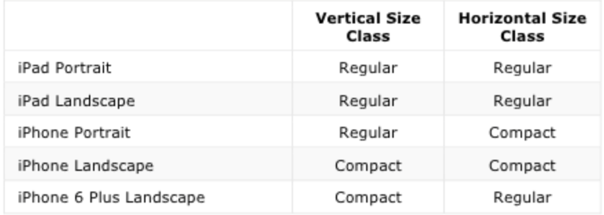
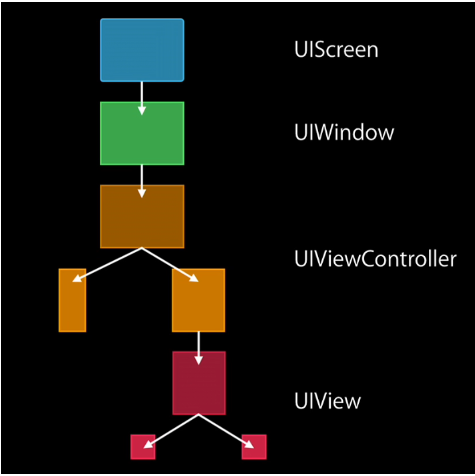

The idea behind adaptive layouts is that usually the UI layout remains same across different devices and orientations in certain situations. For example, a screen in iPhone 6 portrait has a similar layout to as in iPhone 6 Plus portrait (i.e. compact and regular), or the fact that horizontal layout in iPhone 6 Plus landscape is same as that in iPad (i.e. regular). So UI should be made based on these common environments, termed as traits.

Also, with the adaptive layouts all current device information should be retrieved using new API. For instance, the device type (iPhone/iPad) should be accessed using `self.traitCollection.userInterfaceIdiom` and not straight away using `userInterfaceIdiom()` anymore. Similarly `UIInterfaceOrientation` should not be used anymore and instead the size classes should be inspected.

###### Default size classes -

The default size classes used for various devices and orientations



iPad is always regular + regular. iPhone portrait is always regular + compact. iPhone landscape is compact + compact, apart from plus devices in which case it is compact + regular.

iPhone X horizontal size class is compact in both portrait and landscape.

###### UITraitCollection -

The traits collections are represented by the `UITraitCollection` class and it has the following properties.
```
horizontalSizeClass
verticalSizeClass
displayScale (a CGFloat with values such as 2.0 and 3.0)
userInterfaceIdiom
forceTouchCapability
```

`horizontalSizeClass` and `verticalSizeClass` are represented by a `UIUserInterfaceSizeClass` enum of type int that can have values `unspecified`, `compact` or `regular`.<br>
`displayScale` is a CGFloat with values such as 2.0 and 3.0.<br>
`userInterfaceIdiom` is the `usual UIUserInterfaceIdiom` enum with values as unspecified, iPhone, iPad, TV or CarPlay.<br>
`forceTouchCapability` is represented by a  UIForceTouchCapability enum of type int that can have values unknown, unavailable or available.

`The UITraitCollection` property is actually a part `of UITraitEnvironment` protocol. This protocol in turn is adopted by UIScreen, UIWindow, UIViewController, UIPresentationController, and UIView. Anytime the trait collection changes, it is informed using the `traitCollectionDidChange:` delegate method of UITraitEnvironment.


###### Trait Collection inheritance and overriding - 

Trait collections flow from parent to child. That is, a UIView for instance inherits the trait collection of its view controller.



Trait collections can be fully qualified or partially specified (i.e. if they have unspecified traits). If a view or view controller is not in the current view hierarchy, there can be a partially specified trait collection returned. Or if a custom trait collection is created then too there can be a partially specified trait collection.

It is also possible to create custom trait collection using methods such as `+traitCollectionWithHorizontalSizeClass:` and `+traitCollectionWithVericalSizeClass:`.

Two traitCollections can even be compared between each other using the `containsTraitsInCollection:` method. This tells if the specified traits values of one trait collection are also there in another trait collection.

Trait collections can also be added using `traitCollectionWithTraitsFromCollections:` method. The last trait takes precedence over previous trait if there is a conflict.

In case of child view controllers, it is even possible to override the default trait collection generated by the system and use something else instead. This is useful when say a layout similar to compact-regular needs to be used for iPhone 6 landscape (which otherwise has a compact-compact trait collection).

This can be done using methods `setOverrideTraitCollection:forChildViewController:` and `overrideTraitCollectionForChildViewController:`.

###### Animating view controller changes during trait collection change -

Fine grained animation can be done during trait collection change using methods of new UIContentContainer protocol. It has methods such as `willTransitionToTraitCollection:withTransitionCoordinator:` and `willTransitionToSize:withTransitionCoordinator:`.

###### Custom UIAppearance for specific trait collections -

UIAppearance also supports customization for specific trait collections using `appearanceForTraitCollection:` method. 


###### Various methods - 

```
UITraitEnvironment
UITraitCollection
UIContentContainer
traitCollectionDidChange:
traitCollectionWithHorizontalSizeClass:
traitCollectionWithVerticalSizeClass:
containsTraitsInCollection:
traitCollectionWithTraitsFromCollections:
setOverrideTraitCollection:forChildViewController:
overrideTraitCollectionForChildViewController:
appearanceForTraitCollection:
registerImage:withTraitCollection:
unregisterImageWithTraitCollection:
imageWithTraitCollection:
```
