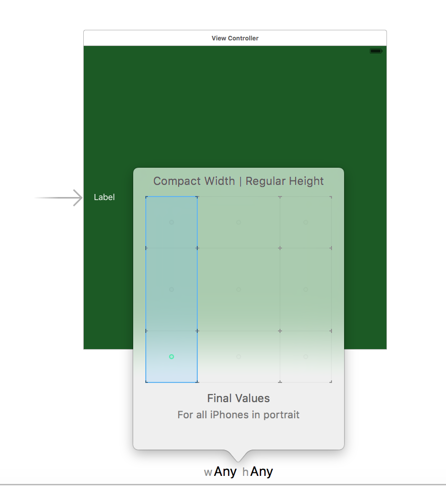
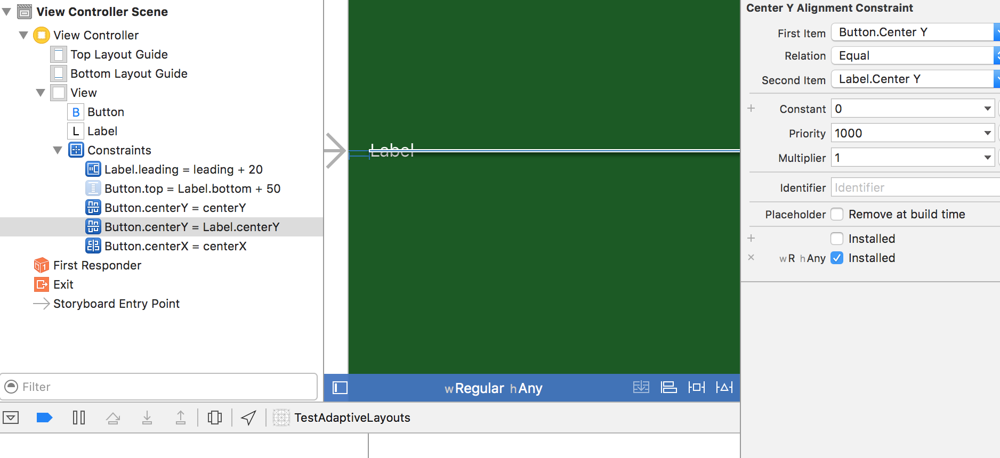
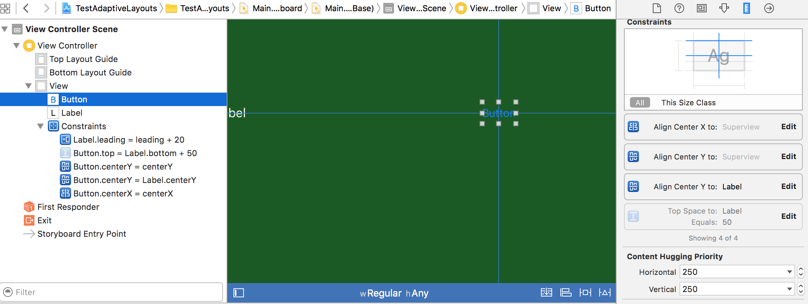
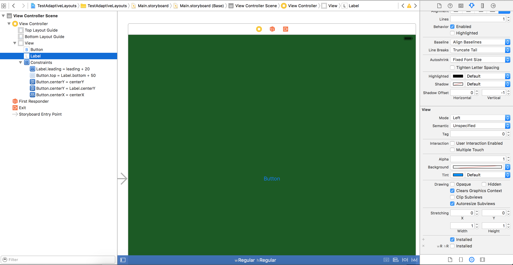
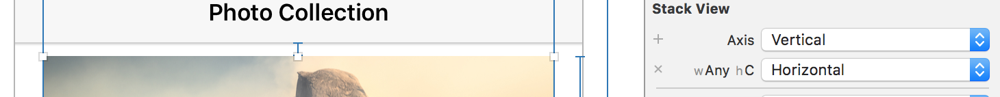
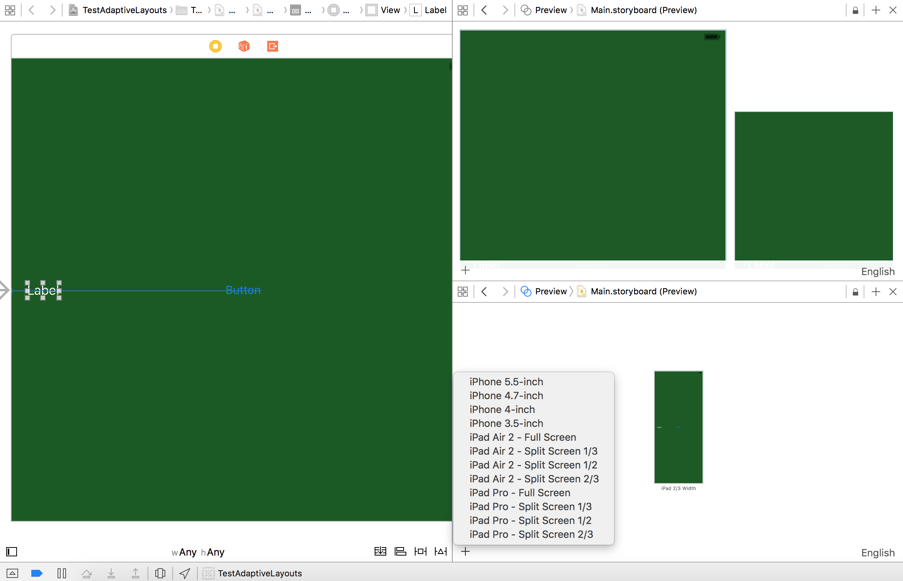

It is possible to have the same Interface Builder document for different size classes. Hence there can even be a single xib or storyboard for a screen in iPhone and iPad.

###### Selecting size class in the canvas - 

By default a view controller is shown in a square layout in interface builder which applies to all the possible size classes. The default layout can be overridden for specific size classes by selecting the required size class from the button in the bottom of the canvas. Each square in the grid corresponds to a vertical and horizontal size class. A selection which says 'compact width' alone implies that it corresponds for all screens that have a compact horizontal size class and any vertical size class. 

###### Having different layouts for different size classes -

It can be done in two ways. Either the intended size class combination should be selected from the canvas and then the appropriate constraint added. Or select the relevant constraint and then selectively mark it as installed or uninstalled for the required size class combinations. It's always important to keep the size class entry in size inspector for which the constraint should not be installed or else the system would not know that the constraint should not be used for that size class.

All the constraints for any item in the document outline are always shown in the size inspector. The 'All' segment shows all the constraints across all the size classes for that item. The 'This size class' segment shows only those constraints that are installed for the currently selected size class in the canvas. The faded constraints in 'All' segment show the constraints that are not installed for the currently selected size class.

In fact it is even possible to remove certain views in some of the configurations (i.e. size classes) by not marking them as installed. They then show up faded in the document outline when the size class for which they are marked as 'not installed' is selected.

The ‘any’ value of a size class can be used quite intelligently. For instance even though 6Plus landscape size classes are ‘regular width - compact height’ and all other iPhone’s landscape size classes are ‘compact width - compact height’, just the fact that the height is compact for both can be used to have the same layout in landscape across all iPhones. The constraints will need to be created for ‘any width - compact height’ combination.

Anytime the app is run, all the installed constraints for that screen are used. If there happens to be any size class constraints that create a conflict then they are just treated like the usual conflicting constraints and the system either breaks one or uses neither. For instance there is a constraint for 'Regular width Any height' size class and yet another constraint for the same items in 'Regular width Regular height' size class, then if the app is run in iPhone portrait there are conflicting constraints. However if the app is run in iPhone landscape, there isn't a conflict between constraints as then 'Regular width Regular height' size class isn't applicable.

###### Previewing in interface builder -

It is also possible to preview the rendering for different device sizes, orientations and OS versions in Interface Builder itself. This can be done by opening the assistant editor and selecting the Preview option. Either multiple assistant editors can be opened by tapping the + button in the top right of the editor or in the same editor multiple interfaces can be added by tapping the + button in the bottom left of the editor.
The target screen size (or device type) can be selected while pressing the + button in the bottom left bar of the editor. The orientation can be changed by tapping the rotate icon just below any target screen.

These can in fact even be changed using the attributes inspector.

###### Thumb rules - 

Select a subview in document outline for default size class (any width any height) and see all its constraints. Tap each faded constraint and see which size classes is it applicable for. 
There can be entire views marked as not installed for certain configurations.
Use previews generously.
Keep in mind that there can be conflicting constraints if similar constraints have been added for overlapping size classes.
For a constraint to be not installed for a size class, it should have an entry with the installed checkbox unchecked.
The faded constraints or views are ones that are not installed for the currently selected size class.

Test Project - 26. Adaptive Layouts/TestAdaptiveLayouts (git commit no. c149d86)
