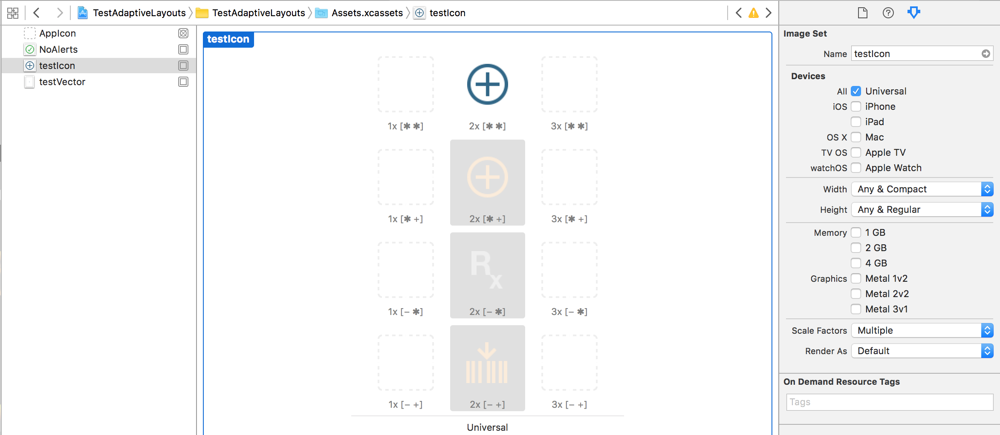

###### Assets catalog -

It's also possible to have different images for different size classes. For the required imageset in assets file, select the width and height size classes for which custom images are needed. For instance, 'any and compact' width implies that a specific custom image will be used for compact horizontal size class and the 'any' image will be used for regular horizontal size class.

Compact is denoted by `-`, regular by `+`, and any by `*`. 

`**` is the default image to be used if no specific image has been specified for the current size class of the device.


The system tries to find the most exact size class match for the image and then gradually gets more generic to find matching images. For example, in below set up for a `+-` combination (i.e. regular width, compact height) the default image will be used as nothing else more precise matches.

Keep in mind that there can only be 4 possible permutations of 2 characters (4P2). So no wonder that 4 rows below are totally sufficient.
Separate images can even be specified for different devices even if the size classes are the same. Hence, there can be a different set of images for 3x in iPhone and yet another for 3x in iPad. If specific images needs to be given for a device type, then that device type should be checked in the attributes inspector.

It should also be kept in mind that any set of images for a particular display scale (i.e. 2x, 3x or in other words a column) are considered only if they have default image (i.e. ** image) specified. Or else, the display scale which has images for default (or preferably all) is considered.

Hence to be safe, specify images for all size classes (including `**`).



While preview does usually show the image also changing correctly  as per size class, sometimes it does not. In above example  the -+ size class did not show the correct image (i.e. the bottom most) in preview, but did show it when run on iPhone 6S portrait.


###### API -

It is also possible to get and modify images for specific trait collections from the image asset using the new imageAsset class which has methods such as registerImage:withTraitCollection:, unregisterImageWithTraitCollection, and imageWithTraitCollection:. UIImage has a new property for getting its associated image asset.

```
registerImage:withTraitCollection:
unregisterImageWithTraitCollection
imageWithTraitCollection:
```

###### Thumb rules - 

In image assets look at 1x, 2x , 3x images vertical lines. And go from most precise size class match to most generic.
