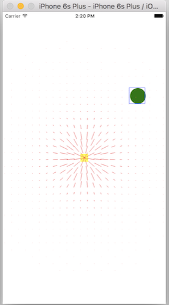

Each dynamic behavior has an action property which is a block that is invoked at every step of animation.
```
collision.action = { println("\(NSStringFromCGAffineTransform(square.transform)) \ (NSStringFromCGPoint(square.center))") }
```

A thing to notice is that probably none of the behaviors animate the size of a view, but only the position and rotation. This also makes sense if you see that in UIDynamicItem protocol center and transform are configurable but bounds is readonly.

CGVector probably specifies a line from the coordinate systems’s origin to a specified point.
```
CGVector(dx: 0.4, dy: 0.2)
```

There is a UIDynamicAnimator method `updateItemUsingCurrentState(_:)` that can be used to inform the dynamic animator that the state (position, transform, etc.) of a dynamic item has been manually changed and the dynamic animator should read it and update itself. Or else the dynamic animator continues to have its own state values for that dynamic item. (Need to try.)

Newton’s second law of motion - a = F/m
s = vt + 0.5at2

For debugging, there is method called debugEnabled available in the lldb. It is not available as an API for the code, but can be used in debug console. In fact, just for debugging there is a way to use it (but this should not be used in the code to be shipped).

In lldb - expr animator.debugEnabled = true (run should be paused)
In code - animator.setValue(true, forKey: "debugEnabled")
What it does is that it shows overlays for various fields, attachments at work and helps visualize the behaviors. Its particularly useful for field behaviors.
There is another debug method called debugInterval which indicates how soon should these overlays be updated. By default they are updated with every frame. If lets say it should instead be updated on every 5th frame (which will be needed when there is a lot of complex Physics involved), it can just be set to 5.

debugAnimationSpeed is a debug method that can be used to slow down the animation.
   


**********


Test apps -

30. UIKitDyamics/TestUIKitDynamics

UIGravityBehavior - git commit  daa6ee6
UICollisionBehavior - git commit  cb1bbfc
UIDynamicItemBehavior - git commit  a6e4e74
UIAttachmentBehavior - git commit  13d4f2a
UIPushBehavior - git commit  599cfd6
UISnapBehavior - git commit  5f40b84
UIFieldBehavior - git commit  5834d6e
UIDynamicItemGroup - git commit 9c15dfd

**********

What if conflicting dynamic item behaviors are added to an item. Added two behaviors with different values for anchored, it worked as if anchored is set as true.
Reference says the below, but cannot validate it yet.

If you add more than one dynamic item behavior to an animator, you effectively create a behavior tree. For a property configured in more than one dynamic item behavior, the last one in the behavior tree, starting from the dynamic animator and going depth first toward the dynamic item, wins.

Remaining methods of attachment behavior, i.e. sliding attachment, etc.

Remaining properties of attachment behavior , i.e. damping, frequency, length, etc.

How to make auto layout work with UIKitDynamics in all situations. Why do constraints not change during or after the behavior. Why does manually assigning the frame back, cause some distortion in shape too.

What is addChildBehavior. Understand better.

How to know all the behaviors added to a subview or even a dynamic animator
The example in this article ([link](http://fancypixel.github.io/blog/2015/06/19/playing-with-uidynamics-in-ios-9/)).
The various field behaviors.
Creating custom subclasses of UIDynamicBehavior.
UIDynamicAnimatorDelegate methods.

Attachment behaviors acting as springs. frequency, damping.
Attachment behavior: length property. It is not often needed. But if used, should be configured only after initial setup. (Need to try these.)

The last code sample in the WWDC 2015 video 229 what’s new in UIKitDynamics and visual effects. (PhotoFun, last 5 mins).
