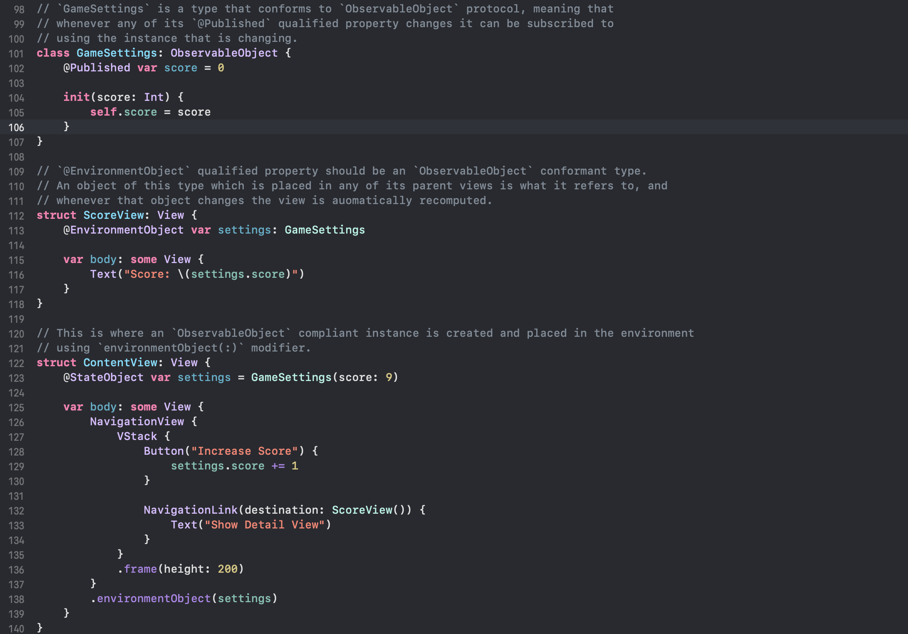
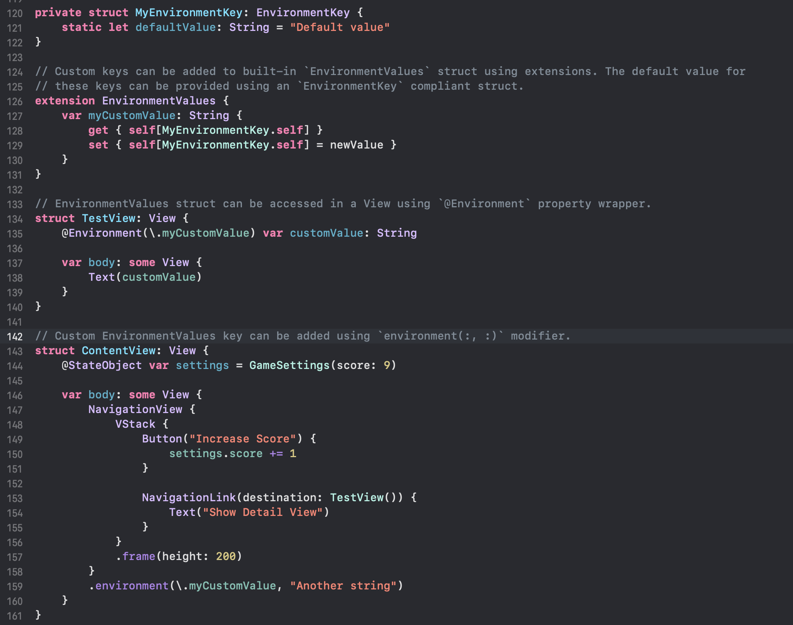

>  @EnvironmentObject   EnvironmentValues, EnvironmentKey, and @Environment  

##### EnvironmentObject

Its possible to inject an intance of any `@ObservableObject` compliant type to a View using the modifier `environmentObject(:)`, and thereon any of its children View can access that instance if that child has a property of that type that is qualifier with `@EnvironmentObject`. Anytime this instance is updated, the child View gets automatically recomputed.

Its an easy way to make some state related data available to all of a view's children without the need of passing the state explicitly to each of them.

In the below example, `GameSettings` is the type whose instance can be injected into environment. An instance of it does gets injected to environment through the modifier on `NavigationView` in `ContentView`. `ScoreView` is the descendant of `NavigationView` that eventually has an `EnvironmentObject` property that accesses the environment.

> Keep in mind that if a View has an `EnvironmentObject` property specified and yet its enviornment does not have any property of that type, there is a runtime exception.

##### Environment

A collection of values is made available to views using the built-in `EnvironmentValues` struct. It has keys for various things, such as `locale` which indicates the current locale. Views can access these environment values using an `@Environment` qualified property, this property wrapper needs to be initialized with the specific environment key that needs to be accessed by that property.

Its even possible to add custom keys to the `EnvironmentValues` struct by adding computed properties to an `EnvironmentValues` extension, and a default value should be provided for it through a struct that conforms to `EnvironmentKey` protocol. This custom key can then be added to a view's environment using `environment(:,:)` modifier.

> In fact the usual environment(:,:) modifier can also be replaced by having an extension function on `View` which basically calls that very modifier. [Reference](https://developer.apple.com/documentation/swiftui/environmentkey) has an example.

> One benefit of using `@Environment` is that there are no crashes. As a default value is always there for even a custom key, its fine even if nothing is set in a parent view using the modifier.
