### Text and Symbols related modifiers

There are several font related modifiers that allow to customize fonts and theor behavior in applicable views. Simple things like using custom fonts or fonts of different sizes can be done with `font()` modifier. `Font` itself is a struct and has various methods and static properties to return system fonts as well as custom fonts. For example, `font(.system(size: 9))` returns a system font of size 9.

`textCase()` allows to automatically show any contained text in a view as per the specified casing. `textSelection()` when specified as enabled, even allows the text to be copied with a long press gesture.

`textContentType()` allows the system to auto-suggest types in text entry fields based on the specified type (for example, emailAddress, addressCityAndState, etc.).

Fonts, Dynamic Types, Text Style | Text Layout, Multiline Text
--- | ---
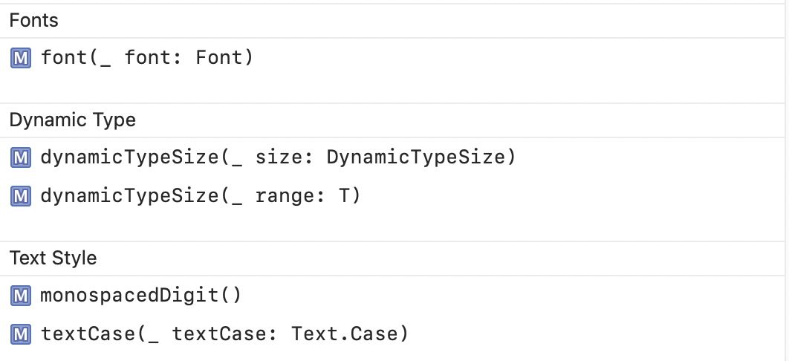 | 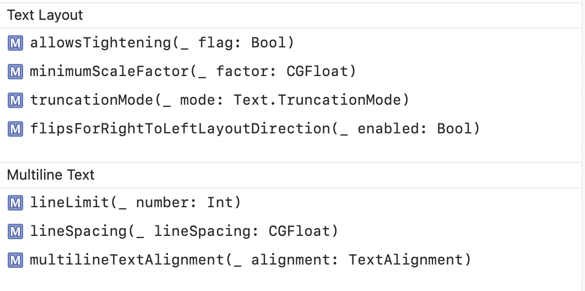

Text Selection, Text Entry | Keyboard shortcuts, Symbol Appearance
--- | --
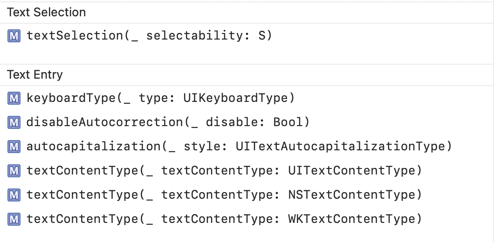 | 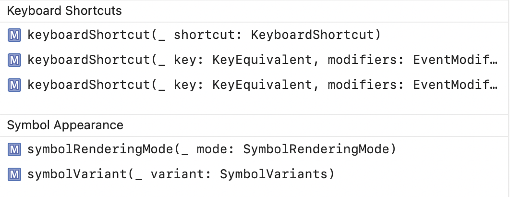

### Auxiliary Views related modifiers

Badges are applicable only in list rows and tab bars.

Badges | Search
--- | ---
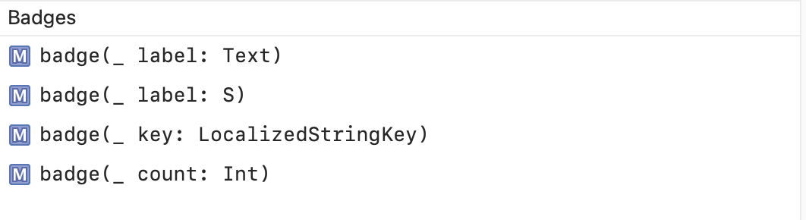 | 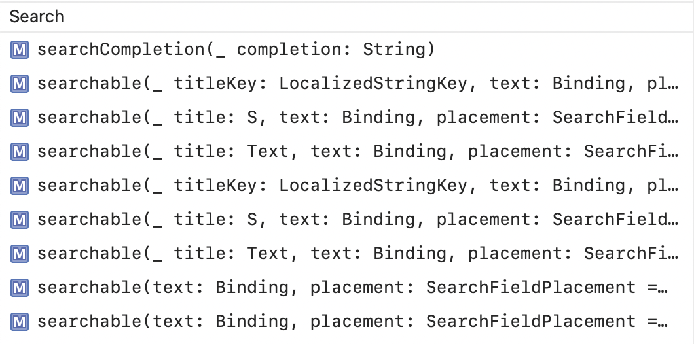

Navigation Titles | Navigation Bars
--- | ---
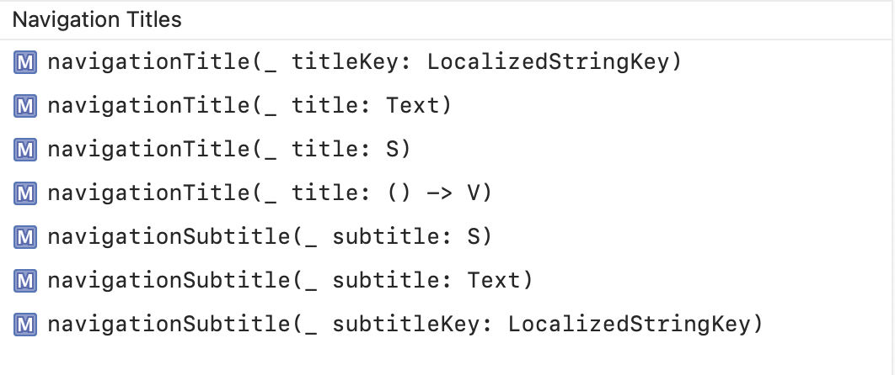 | 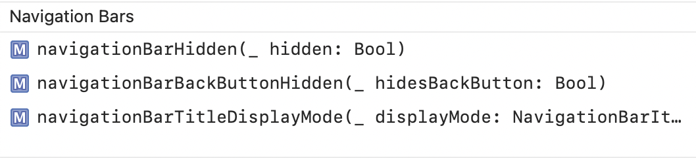

Toolbars | Tab Views
--- | ---
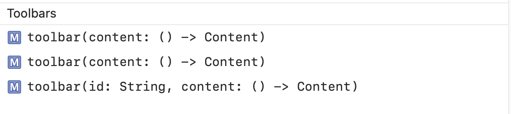 | 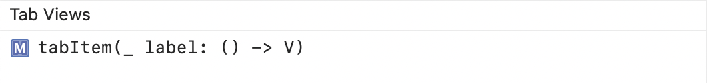

Help Text, Context Menus | Status Bar, Touch Bar
--- | ---
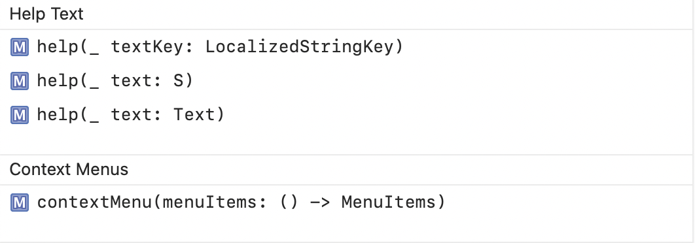 | 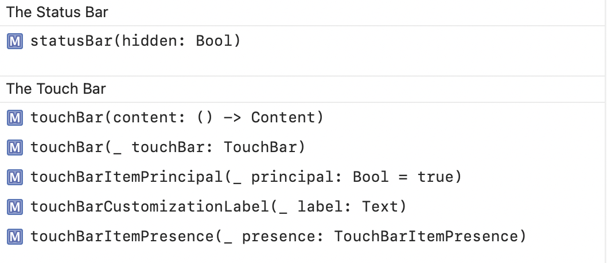
