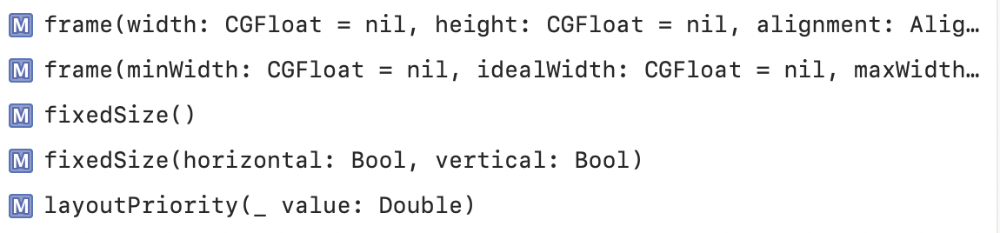
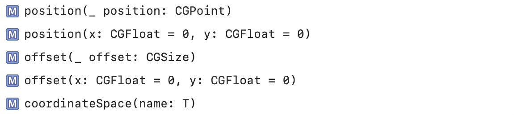
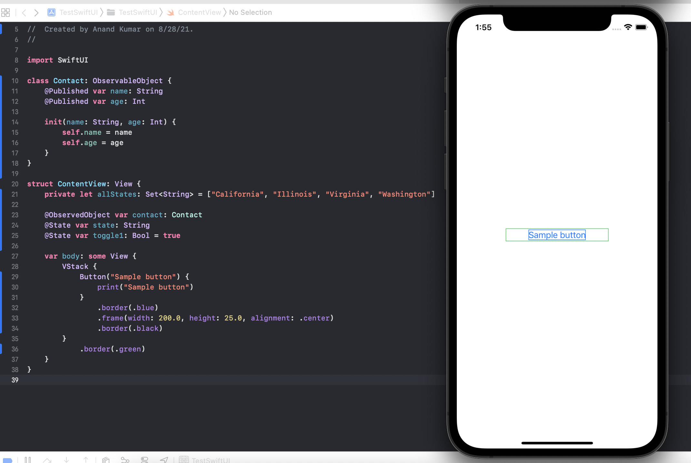
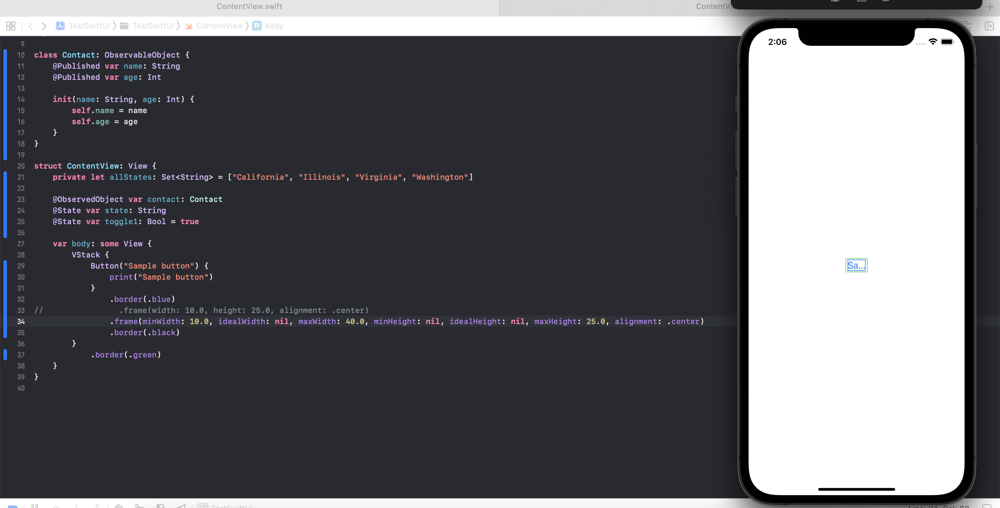
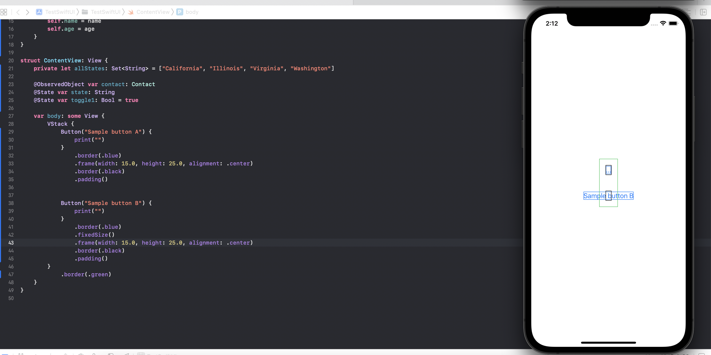
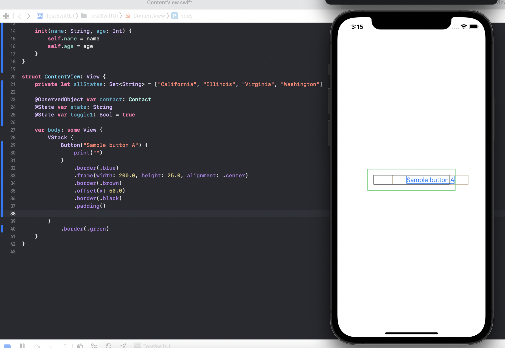
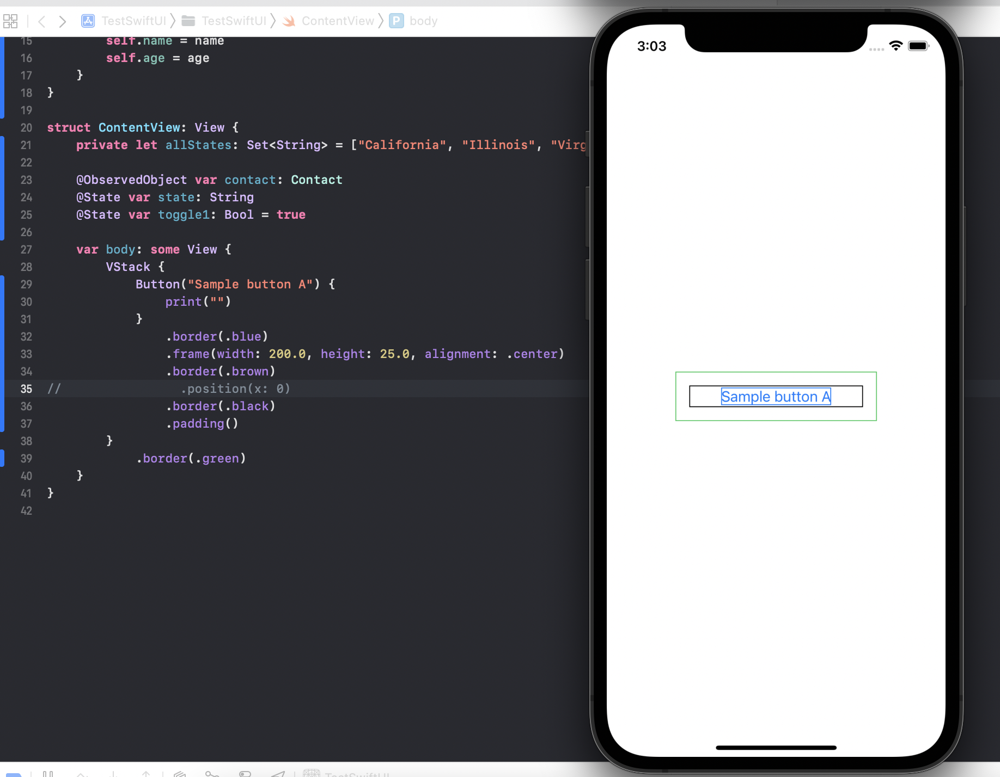
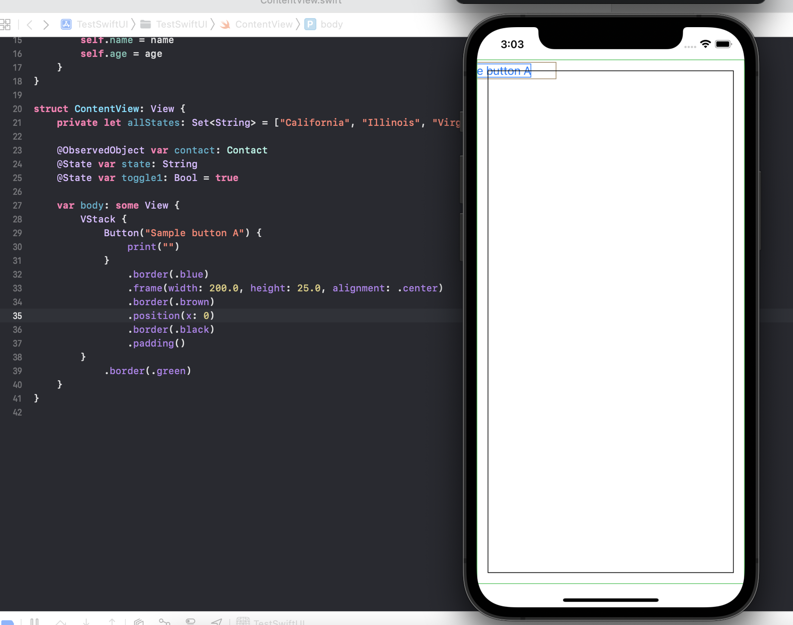

#### Layout and Position related modifiers

When SwiftUI renders a view hierarchy, it recursively evaluates each child view. The parent view proposes a size to the child views it contains, and the child views respond with a computed size. When all child views have reported their size, the parent view renders them. ([Reference](https://developer.apple.com/documentation/swiftui/laying-out-a-simple-view))

There are various kinds of views with regards to how they compute their size -
1. View that expand to fill the space offered by their parent (like `Color`, `LinearGradient`, and `Circle`).
2. Views that have an ideal size that varies according to their contents, like `Text` and the container views.
3. Views that have an ideal size that never varies, like `Toggle` or `DatePicker`.

Layout | Position
--- | ---
 | 

`frame()` modifier can constraint a view to a fixed size. That is, the wrapper view returned by this modifier takes up the specified space. Its not a gurantee still that the child view will be within the new bounds (for example, if a `Toggle` is wrapped by a `frame()` modifier that specifies too small a height the Toggle will still take up its usual space.) but it is indeed a gurantee that this wrapper will take up the specified view. Its not necessary to specify sizes in each of the dimensions.

`.frame(minWidth:idealWidth:maxWidth:minHeight:idealHeight:maxHeight:alignment:)` is a modifier that allows even more control than `.frame(width:height:alignment:)` with arguments such as minSize, idealSize, maxSize along each of the dimensions.

`fixedSize()` modifier can cause a view's frame to be preserved and not be  modified by any other modifier. In the below example, ButtonB preserves its size because of this modifier.

There is also the fixedSize(horizontal:vertical:) variant which allows more control along each of the axes.

> Understand `layoutPriority()` better. Does it come into effect when there isn't adequate space. A parent layout offers the child views with the highest layout priority all the space offered to the parent minus the minimum space required for all its lower-priority children.

`position(x:y:)` modifier positions the center of the view at the specified coordinates in its parent’s coordinate space.
> So the above makes sense, but strangely when `position()` modifier is used it even seems to be causing the parent view's size to increase significantly. Not sure why.

`offset(_:)` modifier offsets the view by the specified horizontal and vertical distances. There is a similar `offset(:CGSize)` modifier too.

Parent view without `position` used on child | Parent view with `position` used on child
--- | ---
 | 

> Undrstand `coordinateSpace(name:)` modifier too.
