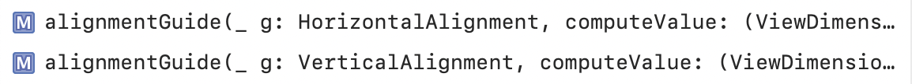
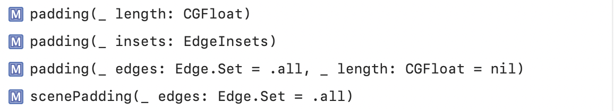
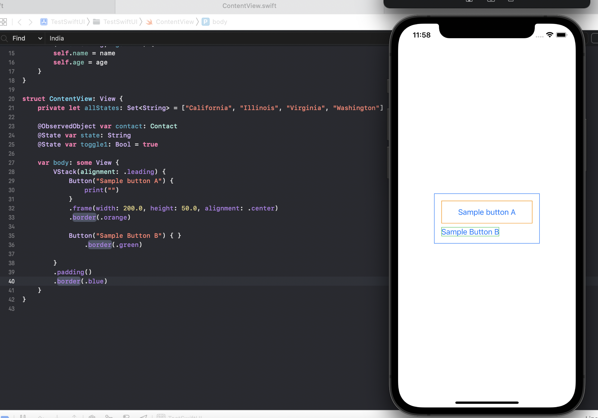
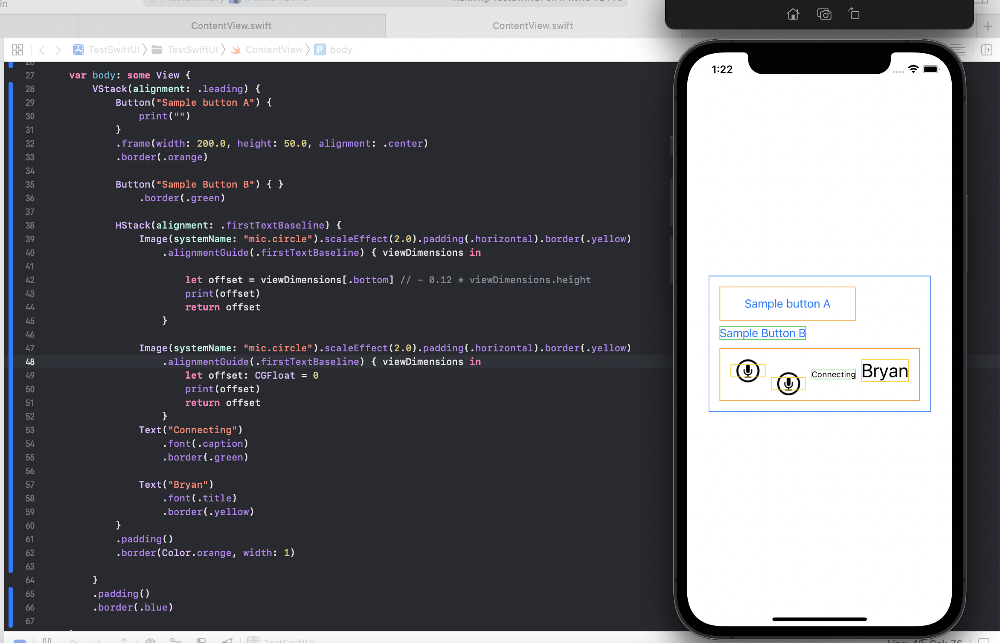
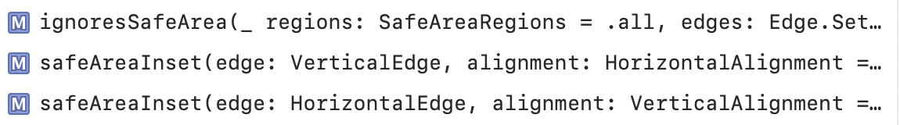
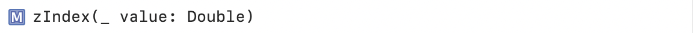

### Alignment and Padding related modifiers

Alignment | Padding
--- | ---
 | 

##### Alignment

Stacks aligns its child views with the default alignment of center, but this can be changed.

`VStack` uses the guides defined in `HorizontalAlignment` (i.e. simple options of leading, center, and trailing). `HStack` uses the guides defined in `VerticalAlignment` (more intricate things like topm bottom, center, firstTextBaseline, lastTextBaseline).

> `Zstack` offers alignment options based on `Alignment` which has 9 options (understand those). [link](https://developer.apple.com/documentation/swiftui/alignment)

`alignmentGuide:computeValue:` modifier returns a View that modifies it alignment as per the passed argument and then also applies any offset to that alignment that may be returned by the closure. The closure is passed as an argument the ViewDimensions struct of the view
`ViewDimensions` is a struct that represents a View's size and alignment guide (across either axes) in its own coordinate space.

> Not really clear on how this function works though. In the below snippet, why is second image in the HStack further down inspite of it specifying an offset of 0.

##### Padding

These look rather simple and just apply a standard (or precise if needed) padding along all axes (or the specified axes).

`padding(:CGFloat)` modifier pads the view along all edges by the specified amount.

`padding(:EdgeInsets)` modifier pads this view using the edges and padding amount specified.

`listRowInsets(EdgeInsets?)` applies an inset to the rows in a list.

### Safe Area and Layer order related modifiers

`ignoresSafeArea(_:edges:)` modifier allows to expand a view out of its safe area (so not the safe area of the super view?).
> `regions` argument is the kinds of rectangles removed from the safe area that should be ignored (i.e. added back to the safe area of the new child view). Need to try this.

`zIndex` modifier controls the display order of overlapping views.

Safe Area | Layer Order
--- | ---
 | 
