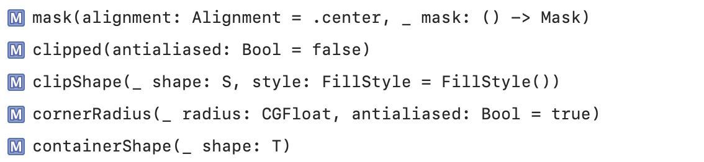
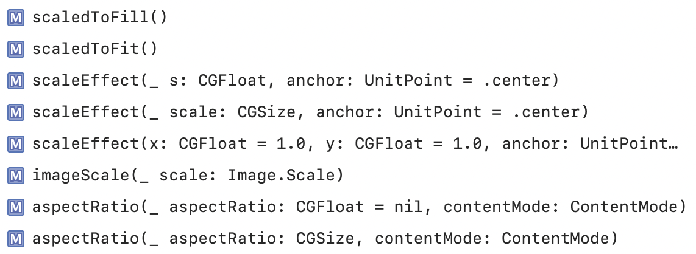
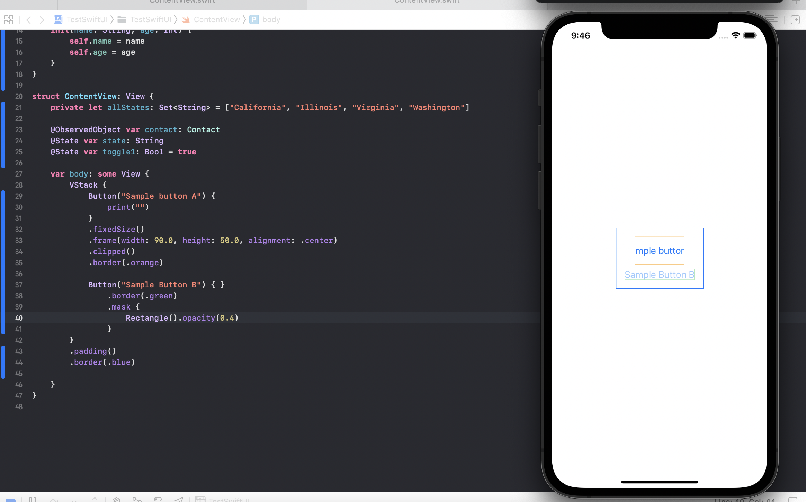
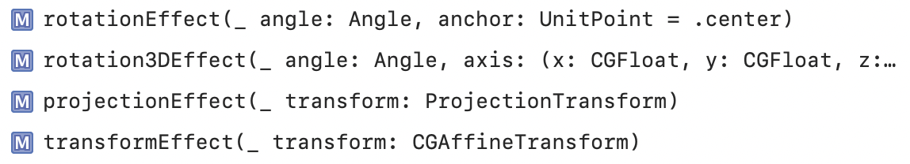
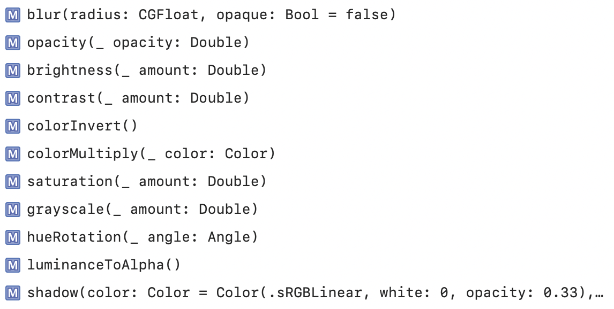
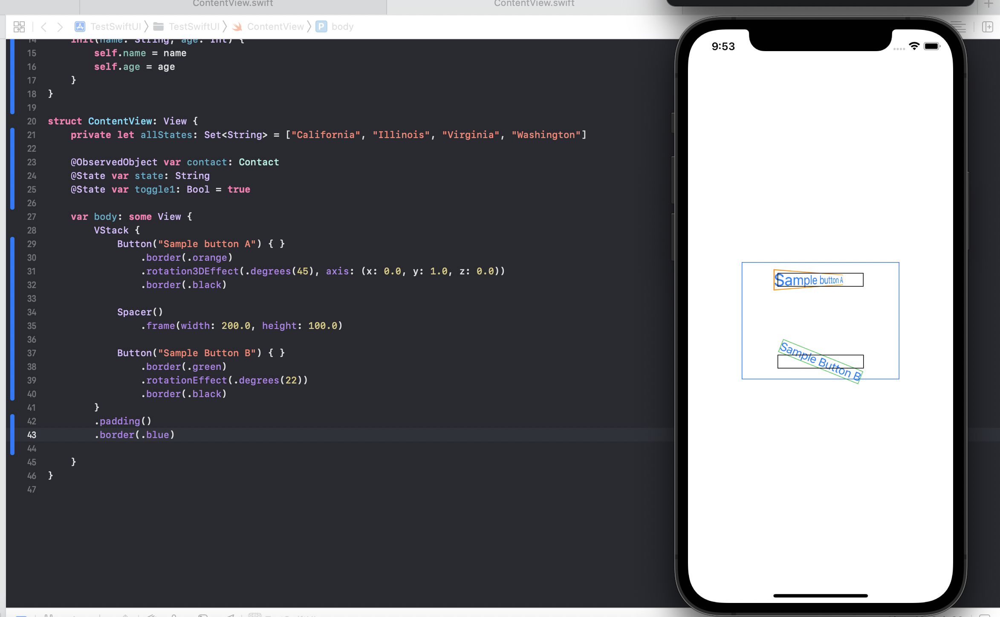
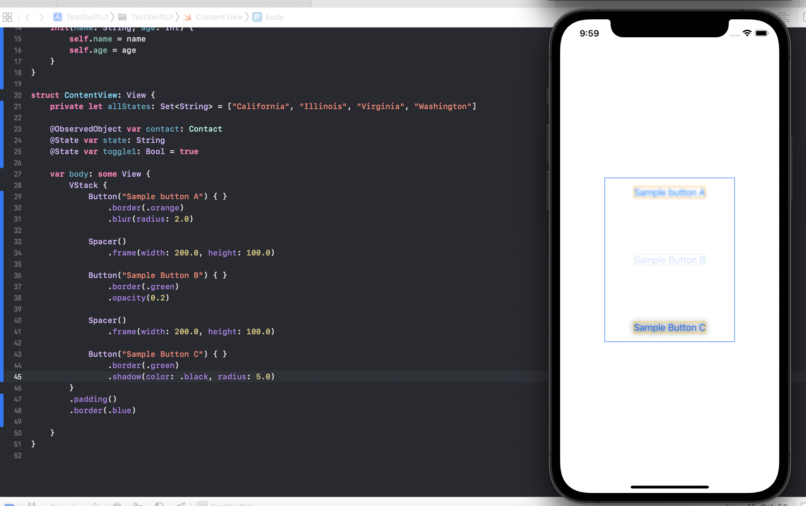
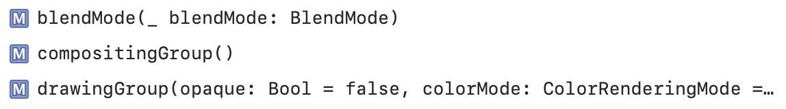
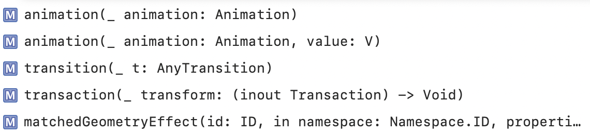

### Masking and Clipping, Scaling modifiers

Masks and Clipping | Scale
--- | ---
 | 

`mask(alignment:_:)` modifier just applies the opacity of another view onto the current view. In more formal words, its a modifier that masks the receiver view using the alpha channel of another view.

`clipped(antialiased:)` clips the view to its bounding reactangle's frame, which otherwise is not the default thing. A view’s bounding frame by default is used only for layout, so any content that extends beyond the edges of the frame is still visible. (What exactly is the antialiased argument though?)

`clipShape(_:style:)` sets a clipping shape on the view, i.e. it only lets through what is within the clipping area (the opposite of masking, that is).

`cornerRadius(_:antialiased:)` clips this view to its bounding frame, with the specified corner radius.

`scaledToFill()` scales this view to fill its parent.

`scaledToFit()` scales this view to fit its parent.

-------

### Rotation, Transformation, Graphical Effects modifiers

Rotation and Transformation | Graphical Effects
--- | ---
 | 

`rotationEffect(_:anchor:)` rotates the view around the specified point.

`rotation3DEffect()` rotates the view in three dimensions around the given axis of rotation. (Clearer if you look at screenshot.)

`transformEffect()` applies an affine transformation to the view’s rendered output.

`blur(radius:opaque:)` applies a Gaussian blur to the view.

`opacity(_:)` sets the view's opacity (the argument specifies how much of the view can be 'seen').

`shadow(color:radius:x:y:)` adds a shadow to the view.

-------

### Composites, Animations modifiers

Composites | Animations
--- | ---
 | 

`blendMode()` sets the blend mode for compositing this view with overlapping views.

> So when two views overlap, the way they show up can be customized and there are more technixalities there. Need to try this more. `BlendMode` enum, that is.

`compositingGroup()` wraps the view in a compositing group. A compositing group makes compositing effects in the view’s ancestor views (such as opacity) and the blend mode take effect before this view is rendered.

> Need to understand compositing group better.

> When it comes to animations, there are functions fot animation, transition, transaction. What are these? There is an `Animation` struct which has properties for several traditional UIKit things like easeIn, repeatCount, etc.
