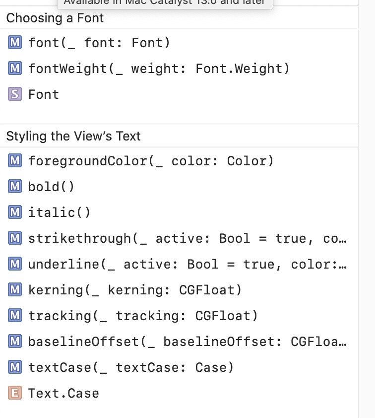
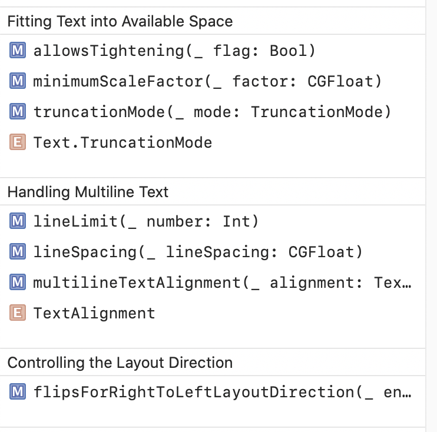
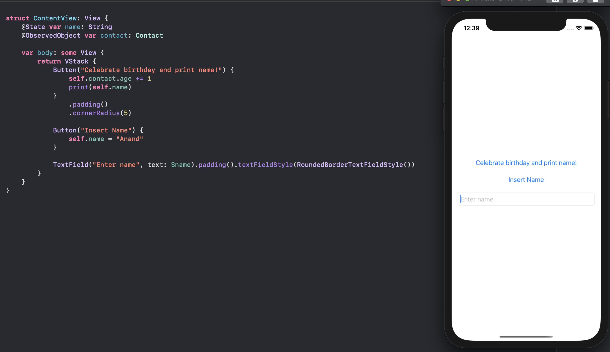
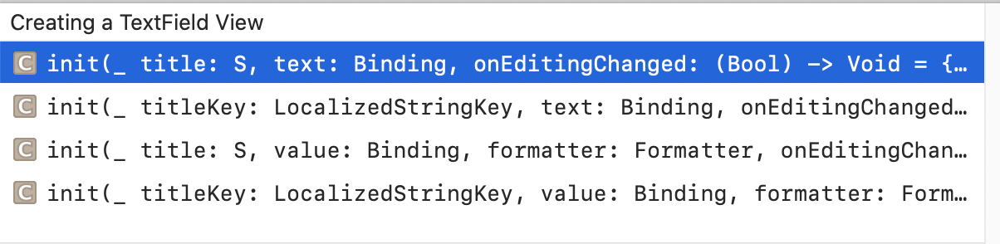

### Text

The equivalent of `UILabel` in UIKit. Shows one or more lines of read-only text.

#### Initializing Text views

Creating a `Text` View can be as simple as this.
```
Text("Current age is \(contact.age).")
```

There are various categories of initializers. <br>

Initializing with strings - (`init(LocalizedStringKey:..)`, `init(verbatim:)`, `init(AttributedString:)`, etc.) <br>

Initializing with an image - (`init(Image:)`). Its possible to provide an image and have it shown inside a `Text`. <br>

Initializing with Date - (`init(DateInterval)`, `init(Date, style: Text.DateStyle), etc,`)

#### Customizing font type, Styling and Fitting Text, MultiLine Text

Functions for customizing the font type, and styling the text | Fitting text, handling multiline text, Controlling layout direction
--- | ---
 | 

Its also possible to combine multiple `Text` views into a single `Text` with `static func + (Text, Text) -> Text`. And in fact, even comparing two Text views is also possible (using their text content) with `==` and `!=`.

#### VoiceOver and Accessibility related functions

And then there are a bunch of VoiceOver and Accessibility related functions.

Configuring VoiceOver -
```
func speechAdjustedPitch(Double) -> Text
func speechAlwaysIncludesPunctuation(Bool) -> Text
func speechAnnouncementsQueued(Bool) -> Text
func speechPhoneticRepresentation(String) -> Text
func speechSpellsOutCharacters(Bool) -> Text
```

Providing Accessibility Information -
```
func accessibilityHeading(AccessibilityHeadingLevel) -> Text
func accessibilityLabel<S>(S) -> Text
func accessibilityLabel(Text) -> Text
func accessibilityLabel(LocalizedStringKey) -> Text
func accessibilityTextContentType(AccessibilityTextContentType) -> Text
```

### TextField

Displays an editable text interface. The text displayed/edited in the textfield can be directly bound to a state property in the view that contains the TextField.

```
struct TextField<Label> where Label : View
```

The thing to note here is that the associated type can be any `View`, not necessarily `Text`.
> Need to see an example of where the associated type is a View other than Text. How it feels, and what is the practical utility.



#### Creating a TextField

There are a bunch of functions that have been there since iOS13, but have been deprecated in iOS15. These conventional functions usuallly take a placeholder text (referred to as title), a `Binding`, and some closures that are invoked when text is being entered or when user performs an action (like by tapping return button). These functions are available when the associated Label is a `Text`. One of the functions also allows the Binding type to be something other than `String`, and also allows to provide a Formatter to convert between entered Text and the binding.



iOS 15 onwards however, the below functions have been made available instead for creating a TextField with a String Value.
```
init(LocalizedStringKey, text: Binding<String>, prompt: Text?) - Available when Label is Text
init<S>(S, text: Binding<String>, prompt: Text?) - Available when Label is Text
init(text: Binding<String>, prompt: Text?, label: () -> Label) - Available when Label conforms to View
```

There are also similar new functions in iOS15 for creating a TextField when the value is of an arbitrary type.

#### Styling text fields

```
func textFieldStyle<S>(_ style: S) -> some View where S : TextFieldStyle
```

There are some predefined styles.
```
automatic, plain, roundedBorder, squareBorder
```

### SecureField

Shows masked entries, the API is lot like TextField's.

### TextEditor

A view that can display and edit long-form text. Like `UITextView`. Allows to display and edit multiline, scrollable text. Again this too has an API lot like TextField's. It does however usually takes lot more real estate by default than TextField.
