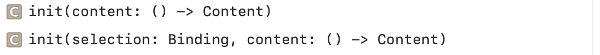
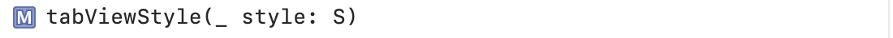

### TabView

A view that switches between multiple child views using interactive user interface elements.

Creating a TabView | Styling Tab Views
--- | ---
 | 

### HSplitView

A layout container that arranges its children in a horizontal line and allows the user to resize them using dividers placed between them.

Its created using `init(content: () -> Content)`.

### VSplitView

A layout container that arranges its children in a vertical line and allows the user to resize them using dividers placed between them.

Its created using `init(content: () -> Content)`.

`TimelineView`

A view that updates according to a schedule that you provide.

Its created using `init(Schedule, content: (TimelineView<Schedule, Content>.Context) -> Content)`.

`TimelineSchedule` is the protocol type that provides a sequence of dates for use as a schedule.

> Is this for watchOS alone.

### Spacer

A flexible space that expands along the major axis of its containing stack layout, or on both axes if not contained in a stack.

Its created using `init(minLength:)`.

### Divider

A visual element that can be used to separate other content. When contained in a stack, the divider extends across the minor axis of the stack, or horizontally when not in a stack.
