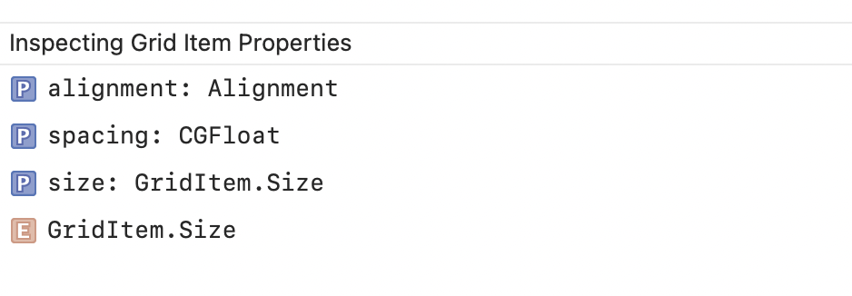

#### LazyHStack -

```
init(alignment: VerticalAlignment, spacing: CGFloat?, pinnedViews: PinnedScrollableViews, content: () -> Content)
```

`PinnedScrollableViews`

#### LazyVStack -

```
init(alignment: HorizontalAlignment, spacing: CGFloat?, pinnedViews: PinnedScrollableViews, content: () -> Content)
```

`PinnedScrollableViews`

#### LazyHGrid -

```
init(rows: [GridItem], alignment: VerticalAlignment, spacing: CGFloat?, pinnedViews: PinnedScrollableViews, content: () -> Content)
```

#### LazyVGrid -

```
init(columns: [GridItem], alignment: HorizontalAlignment, spacing: CGFloat?, pinnedViews: PinnedScrollableViews, content: () -> Content)
```

#### GridItem -

```
init(GridItem.Size, spacing: CGFloat?, alignment: Alignment?)
```


