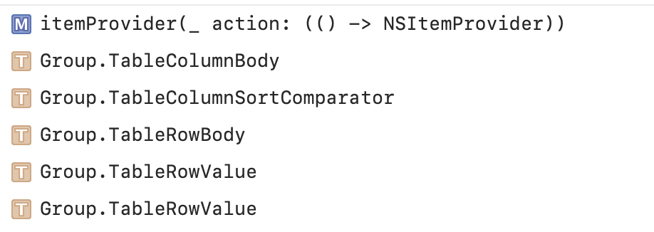
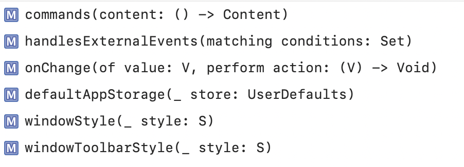
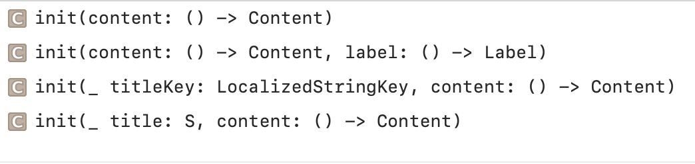
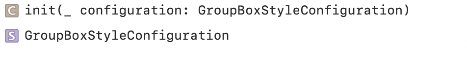
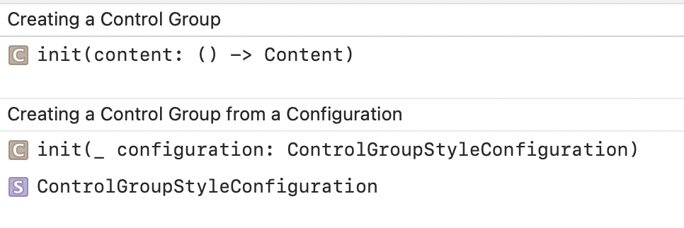
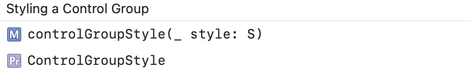

#### Form

```
init(content: () -> Content)
```

#### Group

```
init(content: () -> Content)
```

Grouping Table Content



Configuring a Group of Scenes



#### GroupBox

Creating a GroupBox | Creating a GroupBox from a Configuration
--- | ---
 | 


`func groupBoxStyle<S>(S) -> some View`

#### ControlGroup

Creating ControlGroup | Styling ControlGroup
--- | ---
 | 
