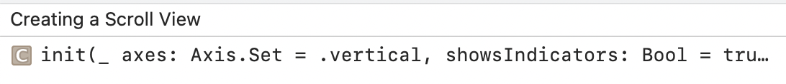
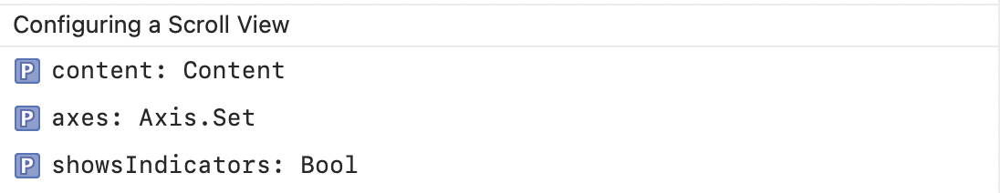
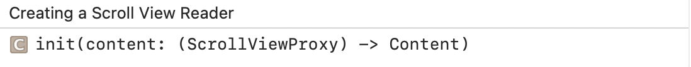
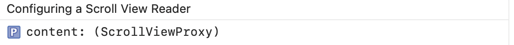

### ScrollView

Creating a ScrollView | Configuring a ScrollView
--- | ---
 | 

### ScrollViewReader

A view that provides programmatic scrolling, by working with a proxy to scroll to known child views.

Creating a ScrollViewReader | Configuring a ScrollViewReader
--- | ---
 | 

### ScrollViewProxy

A proxy value that supports programmatic scrolling of the scrollable views within a view hierarchy.

```
func scrollTo<ID>(ID, anchor: UnitPoint?)
```
