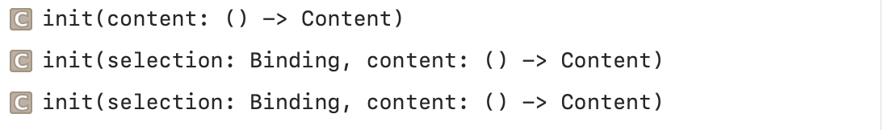
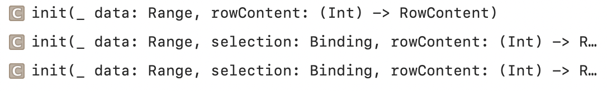
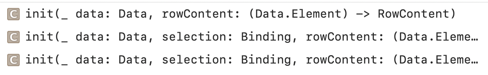
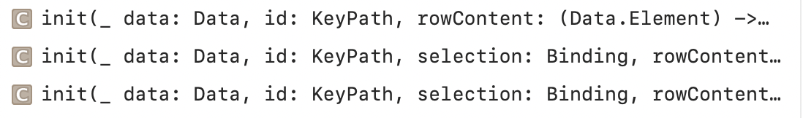
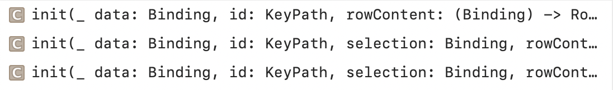
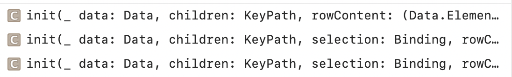
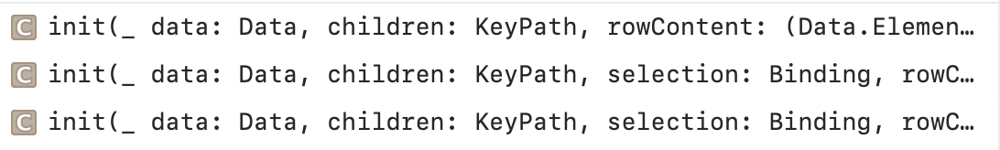
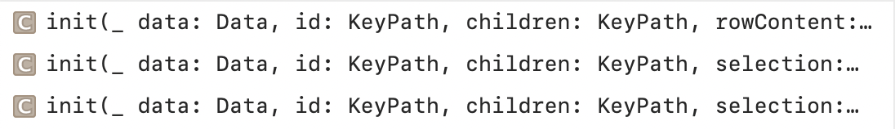

### List

A container that presents rows of data arranged in a single column, optionally providing the ability to select one or more members.

Creating a List with Arbitrary Content | Creating a List from a Range
--- | ---
 | 

Creating a List from Identifiable Data | Creating a List from Data and an Identifier
--- | ---
 | 

Creating a List from a Binding to Identifiable Data | Creating a List from a Binding to a Data and an Identifier
--- | ---
 | 

Creating a List from Hierarchical, Identifiable Data | Creating a List from Heirarchical Data and an Identifier
--- |---
 | 

`listStyle(_:)` modifier can be used to apply a different ListStyle to all lists within a view.
