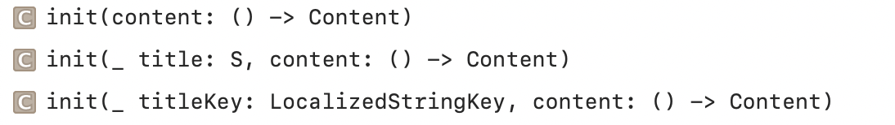
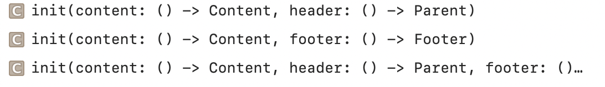
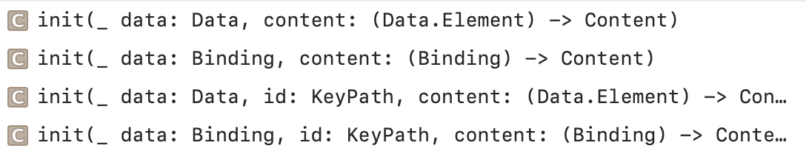
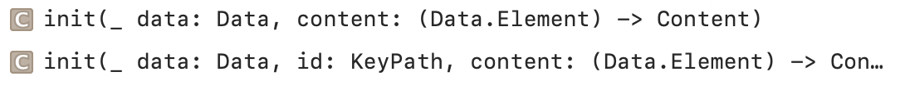
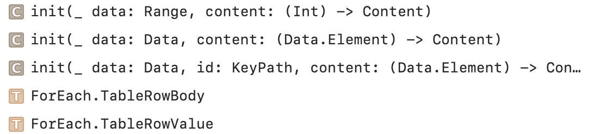
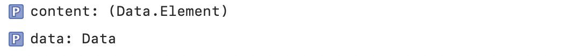
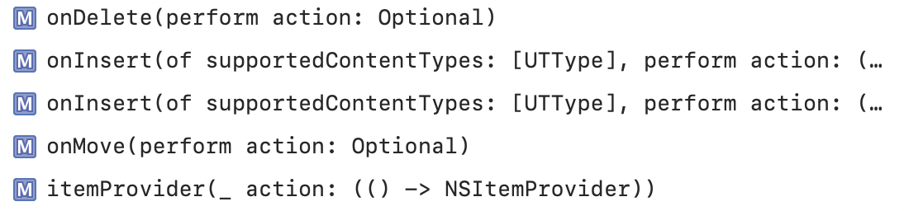
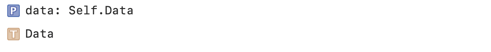
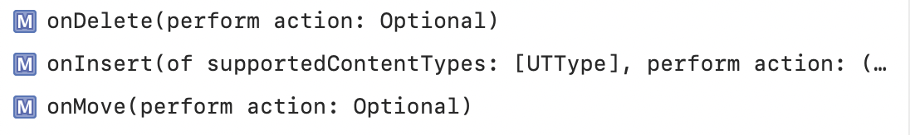

### Section

A container view that can be used to add hierarchy to certain collection views.

Creating a Section | Creating a Section with Headers and Foooters
--- | ---
 | 

`func collapsible(Bool) -> some View` sets whether a Section can be collapsed by the user.

### ForEach

A structure that computes views on demand from an underlying collection of identified data.

Creating a collection of Views from a Range | Creating a collection of Views from Data
--- | ---
 | 

Generating Rotor Data | Creating a Collection of Table Rows
--- | ---
 | 

Accessing Content | Performing Actions
--- | ---
 | 

### DynamicViewContent

A type of view that generates views from an underlying collection of data.

Managing the Data | Responding to Updates
--- | ---
 | 
