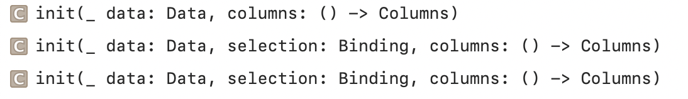
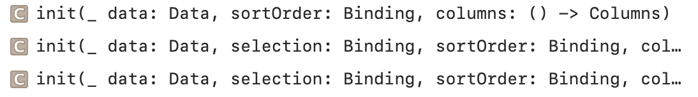
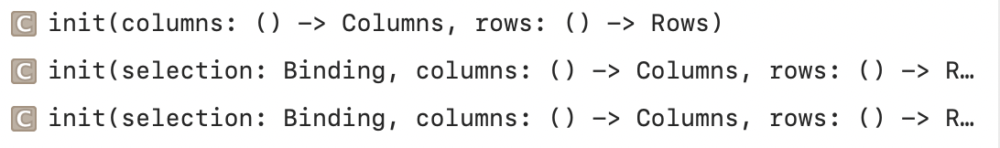
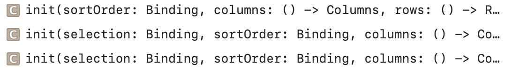

### Table

A container that presents rows of data arranged in one or more columns, optionally providing the ability to select one or more members.

Creating a Table from Columns | Creating a Sortable Table from Columns
--- | ---
 | 

Creating a Table from Columns and Rows | Creating a Sortable Table from Columns and Rows
--- | ---
 | 
