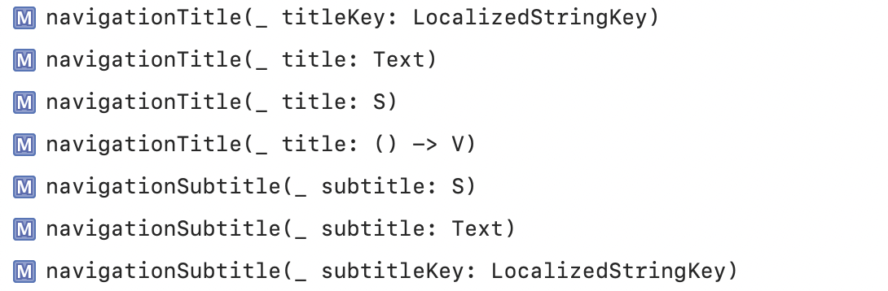
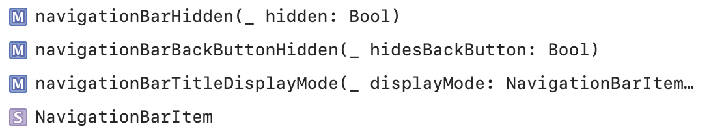
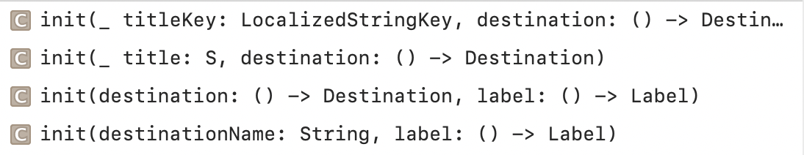
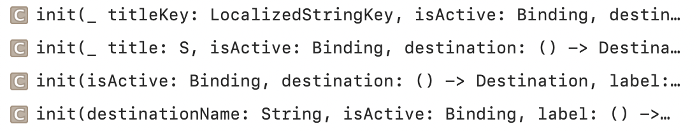
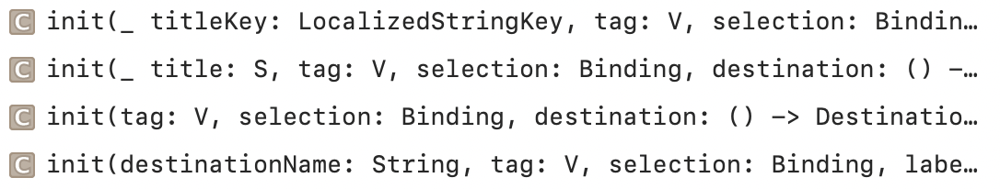
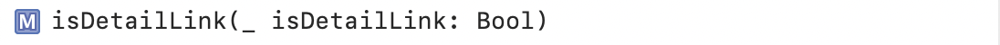

### NavigationView

A view for presenting a stack of views that represents a visible path in a navigation hierarchy.

`init(content:)` is used to create a NavigationView.

`navigationViewStyle(_:)` sets the style for navigation views within a view.

Adding Titles | Managing Navigation Bars
--- | ---
 | 

### NavigationLink

A view that controls a navigation presentation.

Presenting a Destination View | Presenting a Destination View with Programmatic Activation
--- | ---
 | 

Presenting a Selectable Destination View | Configuring the Link
--- | ---
 | 
