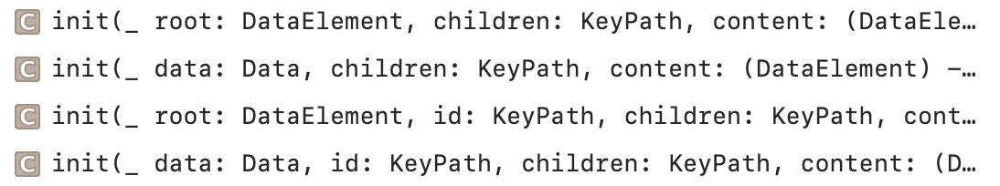
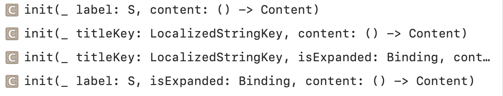
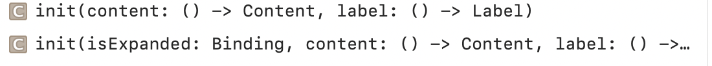

### OutlineGroup

A structure that computes views and disclosure groups on demand from an underlying collection of tree-structured, identified data.

Creating an OutlineGroup | Supporting Types
--- | ---
 | 

### DisclosureGroup

A view that shows or hides another content view, based on the state of a disclosure control.

Creating a DisclosureGroup with a Sring label | Creating a DisclosureGroup with a Custom Label View
--- | ---
 | 
