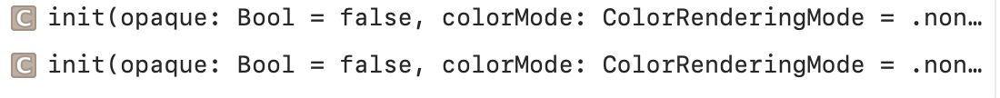
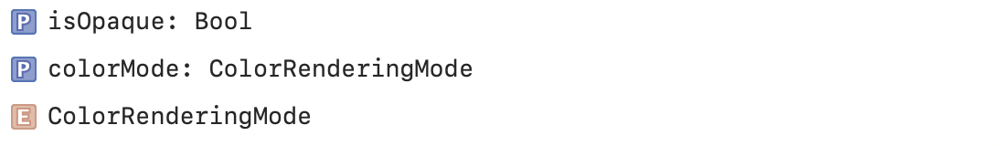

#### Canvas

A view type that supports immediate mode drawing. Used to draw rich and dynamic 2D graphics inside a SwiftUI view.

Creating a Canvas | Managing Opacity and Color
--- | ---
 | 

Referencing Symbols | Rendering
--- | ---
 | 
