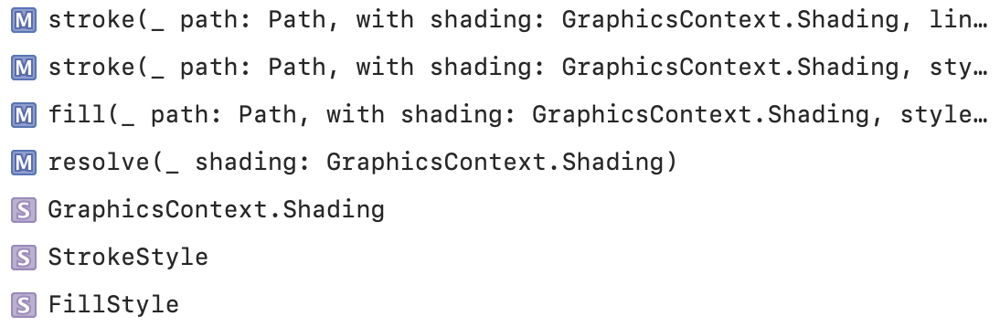
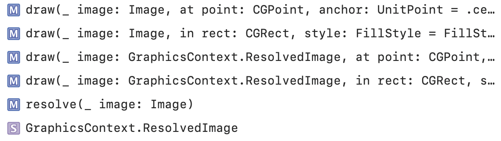
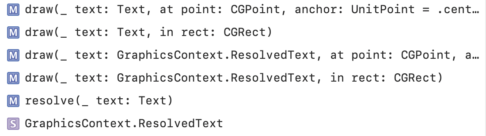
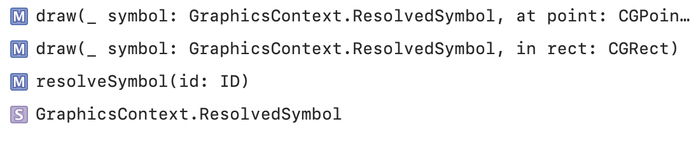
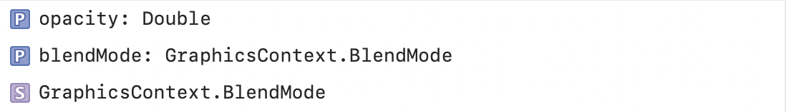
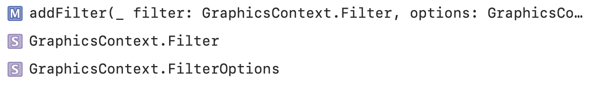
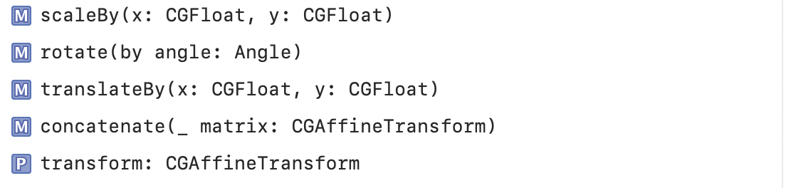

#### GraphicsContext

Drawing a Path | Drawing an Image
--- | ---
 | 

Drawing Text | Drawing a Child View
--- | ---
 | 

Drawing into a New Layer | Masking
--- | ---
 | 

Setting Opacity and Blend Mode | Filtering
--- | ---
 | 

Applying Transforms | Drawing with a CoreGraphics Context
--- | ---
 | 

Environment can be accessed using `environment` computed priority.
