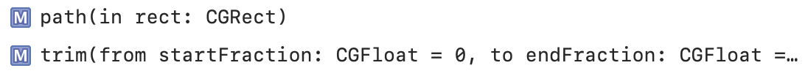
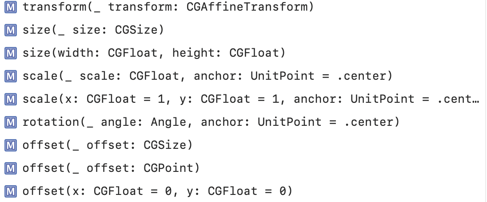
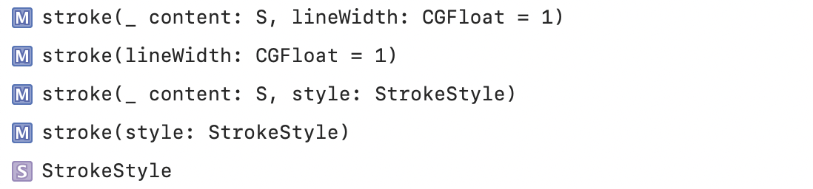
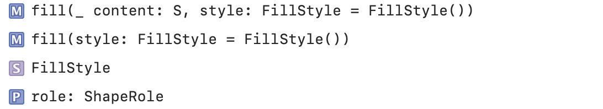
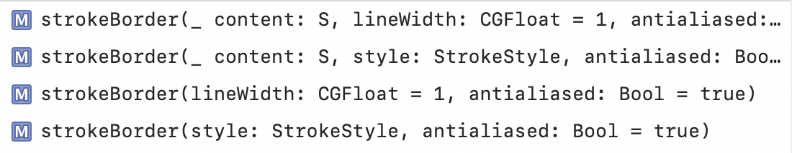
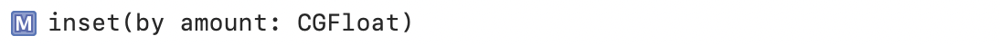

### Shape

`Shape` is a 2D shape that you can use when drawing a view.

Defining a Shape's path | Transforming a Shape
--- | ---
 | 

Setting the Stroke Characteristics | Filling a Shape
--- | ---
 | 

### InsettableShape

A shape type that is able to inset itself to produce another shape.

Setting the stroke border characteristics | Setting the inset
--- | ---
 | 

### Misc. shapes

`Rectangle`, `RoundedRectangle`, `Circle`, `Ellipse`, `Capsule`

A capsule shape is equivalent to a rounded rectangle where the corner radius is chosen as half the length of the rectangle’s smallest edge.
