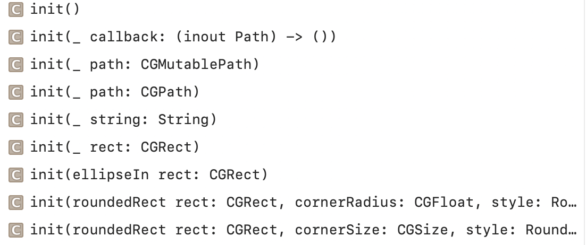

### Path



### Transformed Shapes

`ScaledShape` - A shape with a scale transform applied to it.

```
init(shape: Content, scale: CGSize, anchor: UnitPoint = .center)
```

`RotatedShape` - A shape with a rotation transform applied to it.

```
init(shape: Content, angle: Angle, anchor: UnitPoint = .center)
```

`OffsetShape` - A shape with a translation offset transform applied to it.

```
init(shape: Content, offset: CGSize)
```

`TransformedShape` - A shape with an affine transform applied to it.

```
init(shape: Content, transform: CGAffineTransform)
```

`ContainerRelativeShape` - A shape that is replaced by an inset version of the current container shape. If no container shape was defined, is replaced by a rectangle.
