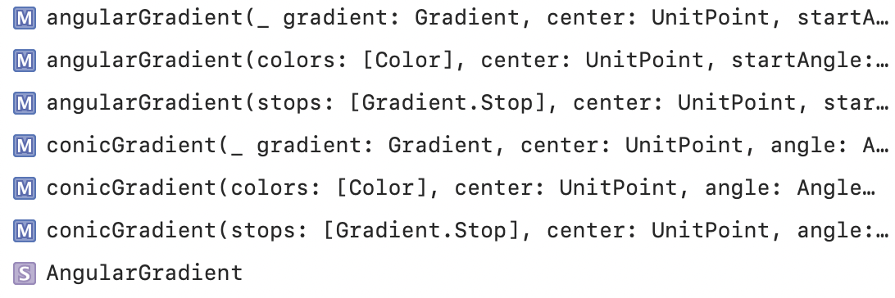
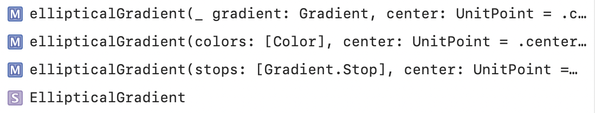
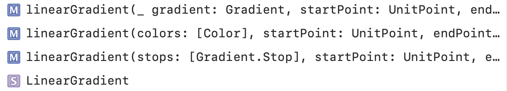
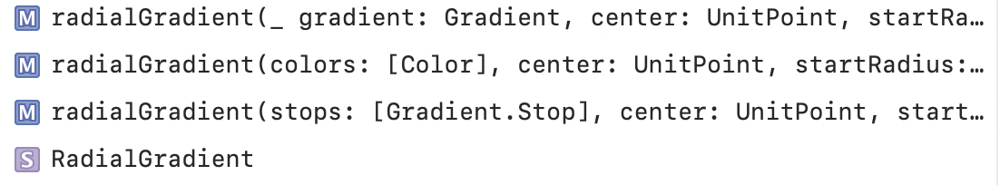
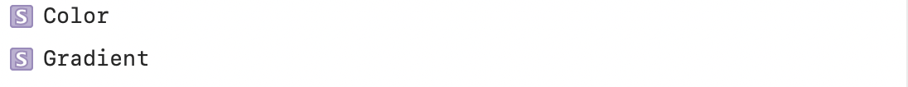
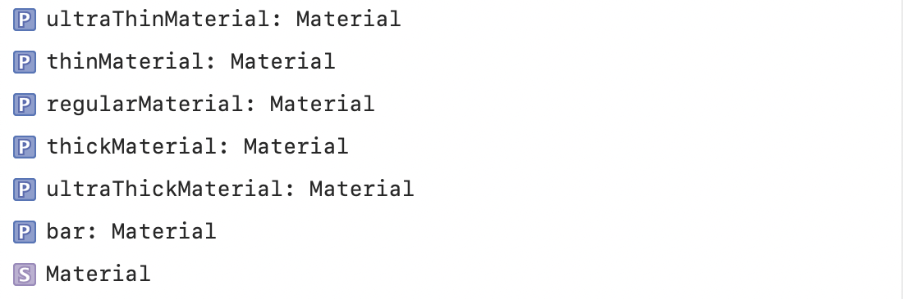
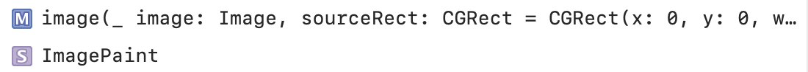
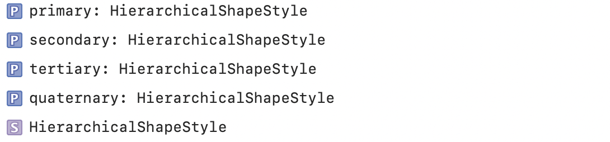
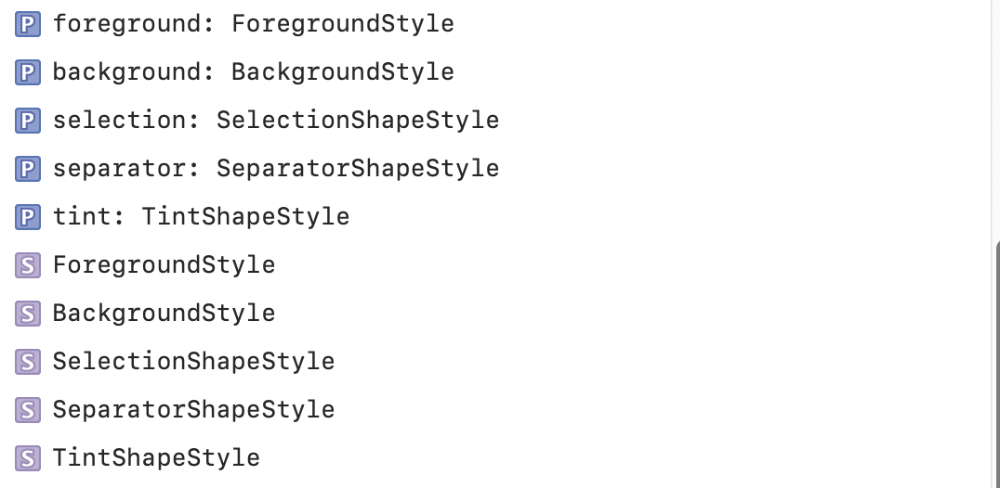

### ShapeStyle

A color or pattern to use when rendering a shape.

It has static properties for various system colors (blue, brown, etc.)

Getting Angular Gradients | Getting Elliptical Gardients
--- | ---
 | 

Getting Linear Gradients | Getting Radial Gradients
--- | ---
 | 

Customizing Colors and Gradients | Getting Materials
--- | ---
 | 

Getting Image Paint Styles | Getting Hierarchical Styles | Getting Semantic Styles
--- | --- | ---
 |  | 

Mapping to Absolute Coordinates | Using a Shape Style as a View
--- | ---
 | 
